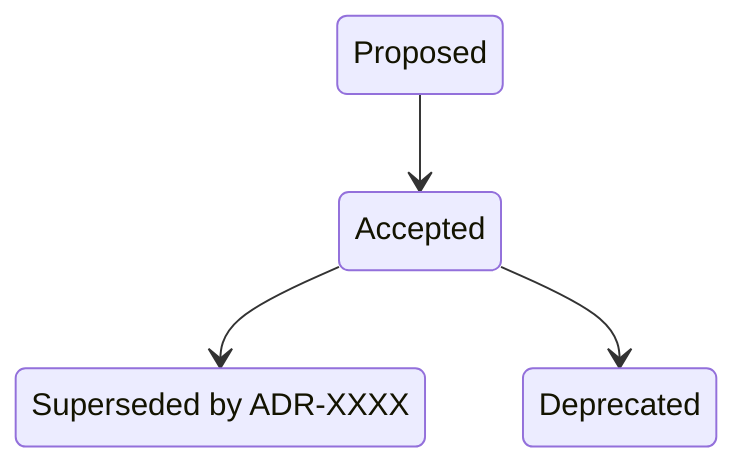

# ADR-0000: ADR Process and Template

- **Status**: Accepted
- **Date**: 2026-04-03
- **Deciders**: [@t11z](https://github.com/t11z)
- **Scope**: Project-wide governance; applies to all components.

## Context

This project makes architectural decisions continuously — technology choices, integration patterns, data models, deployment strategies. These decisions carry implicit rationale that exists only in the heads of the people (or AI sessions) that made them. When a contributor encounters an architectural pattern six months later, the options are: guess why it was done this way, ask someone who might remember, or re-derive the decision from scratch.

This problem is amplified by two characteristics of this project:

1. **AI-assisted development**: Significant portions of the architecture and implementation are developed in AI-assisted workflows (Claude Code, architecture consultants, coding agents). These workflows are session-based — context is lost when the session ends. Without explicit records, an AI agent in session N+1 has no access to the reasoning from session N and may re-derive or contradict earlier decisions.

2. **Open source collaboration**: Contributors arrive without oral history. They need to understand not just what the architecture looks like, but which parts are load-bearing decisions and which are incidental. Without decision records, every architectural pattern looks equally arbitrary or equally sacred.

The mechanism for recording decisions must be:
- **Lightweight**: Low enough overhead that decisions are actually recorded, not just theoretically required.
- **Versionable**: Decisions live alongside the code they govern, in the same repository, under the same version control.
- **Immutable**: Past decisions are never silently edited. Changes are explicit (supersession), creating a traceable history of architectural evolution.
- **Machine-readable enough**: AI agents can parse ADRs to understand existing constraints before proposing changes.

## Decision

We adopt Architecture Decision Records (ADRs) as the standard format for recording significant architectural decisions. Each ADR is a Markdown file in `docs/adr/`, numbered sequentially.

### Template

Every ADR follows this structure:

```
# ADR-[NUMBER]: [Title]

- **Status**: [Proposed | Accepted | Deprecated | Superseded by ADR-XXXX]
- **Date**: YYYY-MM-DD
- **Deciders**: [Who was involved — GitHub handles as Markdown links]
- **Scope**: [Which components, services, or areas of the system are affected]

## Context
What situation prompted this decision? What forces are at play?
Include enough detail that a reader with no oral history can understand
why a decision was needed at all.

## Decision
What was decided? Be specific. Include configuration values, schema
definitions, protocol choices — anything that makes the decision
concrete and verifiable rather than aspirational.

## Rationale
Why this option over the alternatives? What trade-offs were accepted?
Each rejected alternative should have a reason tied to a specific
project constraint, not a generic preference.

## Alternatives Considered
What else was evaluated? Why was it rejected?
A decision without rejected alternatives is either obvious (and
probably does not need an ADR) or under-analyzed.

## Consequences
What becomes easier? What becomes harder? What new constraints does
this create? Be honest about costs — an ADR that lists only benefits
is advocacy, not architecture.

## Review Trigger
Under what conditions should this decision be revisited? Name specific,
observable thresholds — not "when requirements change."
```

### Template design decisions

**`Scope` field**: ADRs accumulate. Without a scope marker, finding all decisions that affect a given component requires reading every ADR. Scope is the primary search axis after title.

**`Review Trigger` as a required field**: Most ADR templates treat decisions as permanent unless someone spontaneously questions them. Explicit review triggers encode the conditions under which the original deciders believed the decision might not hold. This is especially valuable for AI agents, which can check triggers against current project state.

**`Rationale` and `Alternatives Considered` as separate sections**: Rationale explains *why this*; Alternatives explain *why not that*. Collapsing them into one section consistently leads to either shallow rationale or missing alternatives.

**No `Priority` or `Category` fields**: These add metadata overhead that provides marginal value below ~30 ADRs. The review trigger on this ADR covers when to reconsider.

## Lifecycle Rules

### Status transitions



- **Proposed**: Open for discussion. A pull request exists but is not yet merged. Not binding. Contributors may act contrary to a Proposed ADR.
- **Accepted**: Merged. Binding. The project follows this decision. Contributions that contradict an Accepted ADR must either conform or include a superseding ADR in the same PR.
- **Deprecated**: The decision is no longer relevant because the component, feature, or context it governed no longer exists. The ADR itself is not changed beyond updating the status line.
- **Superseded**: A newer ADR replaces this one. The superseded ADR's status line references the new ADR number. The superseding ADR's Context section explains what changed.

### Immutability

Once an ADR reaches `Accepted`, its content is not edited — not for typos, not for clarifications, not for "we actually meant something slightly different." If the decision needs correction, the correct action is a new ADR that supersedes it. This rule exists because retroactive edits destroy the traceability that ADRs exist to provide.

**Exception**: Formatting fixes (broken Markdown rendering, table alignment) that do not alter meaning are permitted.

### Numbering

- `0000` is reserved for this meta-ADR.
- Project-specific decisions start at `0001`.
- Numbers are never reused, even if an ADR is deprecated or superseded.
- Numbers are assigned at PR creation time, not at merge time. If two PRs race on the same number, the second PR to merge must renumber. This is a manual process; automating it adds complexity disproportionate to the frequency of ADR collisions.

### Storage

All ADRs live in `docs/adr/` in the project's primary repository. ADRs are not split across repositories — a decision that spans multiple components still lives in one place with a Scope field that names the affected components.

## When to Write an ADR

The threshold: **a decision, if reversed later, would require significant rework.** "Significant" means more than a find-and-replace — it means changing interfaces, data models, deployment topology, or user-facing behavior.

Examples:
- Technology stack choices (language, framework, database, message broker).
- Build vs. buy decisions.
- Data model patterns (entity relationships, storage strategy, encoding).
- Authentication and authorization approach.
- Integration patterns and protocols (REST vs. gRPC, sync vs. async).
- Multi-tenancy strategy (shared schema, schema-per-tenant, database-per-tenant).
- Deployment topology (container structure, self-hosted constraints).
- API versioning strategy.
- Event schemas and event-driven architecture patterns.

**Not ADR-worthy:**
- Library version choices (unless the library is a core dependency with lock-in implications).
- Code style decisions (these belong in linter configuration).
- Naming conventions (unless they encode architectural semantics, e.g., event type naming).
- Bug fixes, refactors that don't change interfaces, performance optimizations within an existing architecture.

## Governance: When and How ADRs Are Required

An ADR must be proposed whenever a contribution — regardless of whether it originates from a human contributor or an AI-assisted workflow — introduces or implies a significant architectural decision.

### Process

1. **Detection**: Any contributor, reviewer, or automated tool that identifies an unrecorded architectural decision during development or review should flag it. Detection is a shared responsibility — it is not solely the author's job.
2. **Proposal**: The person or workflow that introduced the decision drafts an ADR with status `Proposed` and opens a pull request against `docs/adr/`. The ADR PR may be standalone or bundled with the implementation PR. Bundling is preferred when the implementation and the decision are inseparable.
3. **Review**: Proposed ADRs follow the same review process as code changes. Reviewers evaluate both the decision itself and the quality of the rationale and alternatives analysis. A Proposed ADR with missing alternatives or vague rationale should be sent back, not merged with a "we'll improve it later."
4. **Acceptance**: Once merged, the ADR status becomes `Accepted` and the decision is binding.
5. **Conflict resolution**: If a PR contradicts an Accepted ADR, the PR author has two options: (a) modify the PR to conform, or (b) include a superseding ADR in the same PR. Option (b) requires the superseding ADR to pass review on its own merits. "The old decision was wrong" is not sufficient rationale — the superseding ADR must explain what changed.

### AI-assisted contributions

When AI tooling (coding agents, architecture consultants, AI-generated pull requests) proposes changes that carry architectural implications:

- **Accountability stays with humans.** The human maintainer responsible for merging is accountable for ensuring a corresponding ADR exists or is created as part of the same PR. An AI agent cannot accept its own ADR.
- **AI-generated ADR drafts are welcome** but must pass the same review process as any other contribution. AI-generated ADRs tend toward completeness at the expense of specificity — reviewers should push back on generic rationale.
- **Existing ADRs are constraints, not suggestions.** AI agents operating on this codebase should read `docs/adr/` as a constraint set before proposing architectural changes. Contributions that contradict an accepted ADR must either conform to the existing decision or include a superseding ADR in the same PR. Silent architectural drift — where an AI agent makes a decision that implicitly overrides an ADR without acknowledging it — is the primary failure mode this governance section exists to prevent.

### Retroactive ADRs

Decisions made before this process was adopted, or decisions that were made informally and later recognized as significant, should be captured as retroactive ADRs. Retroactive ADRs use the same template but note in the Context section that the decision was made prior to formal ADR adoption. The Date field reflects when the decision was actually made, not when the ADR was written.

## Rationale

**ADRs over wiki pages**: Wiki pages lack status tracking, supersession chains, and version control. They drift out of sync with the codebase because they are not co-located with the code or reviewed in the same PR workflow.

**ADRs over no formal records**: The cost of not recording decisions — repeated discussions, inconsistent choices, AI agents re-deriving settled questions — exceeds the ~15 minutes per ADR investment. This cost is especially acute in AI-assisted development where session continuity does not exist.

**ADRs over an RFC process**: RFCs are designed for decisions that require broad consensus across a large organization. This project is in early phase with a small contributor base. An RFC process would add review ceremony without proportional value. If the contributor base grows significantly, an RFC layer above ADRs may become appropriate (and that transition would itself be an ADR).

**Flat Markdown files over a database or tool**: Markdown files in Git are universally readable, diffable, and require no additional tooling. They degrade gracefully — even if every tool built on top of them breaks, the files remain human-readable.

**Single repository over distributed ADRs**: Cross-component decisions are the most important ones to record and the hardest to find if they are scattered across repositories. A single `docs/adr/` directory is the simplest structure that avoids this problem.

## Alternatives Considered

**MADR (Markdown Any Decision Records) template**: MADR provides a more structured template with explicit fields for pros/cons per alternative. Rejected because the additional structure adds friction without proportional benefit at the current project scale. The template defined here is compatible with MADR's philosophy but lighter.

**Log4brains or other ADR management tools**: These provide indexing, search, and visualization on top of ADR files. Rejected for now — the tooling overhead is not justified below ~20 ADRs. Can be adopted later without changing the ADR format itself.

**Embedding decisions in code comments**: Rejected. Code comments explain *how*; ADRs explain *why*. Code comments are also invisible to contributors who don't read every file, and they lack status tracking and supersession.

**Decision log in a single file**: A single `DECISIONS.md` with one entry per decision. Rejected because it creates merge conflicts when multiple ADRs are proposed concurrently, cannot represent supersession cleanly, and becomes unwieldy beyond ~10 entries.

## Consequences

### What becomes easier
- New contributors (human and AI) can understand architectural context without oral history or reading the entire codebase.
- Architectural discussions have a defined resolution format — the outcome is an ADR, not an informal agreement.
- AI agents can be instructed to read `docs/adr/` as a constraint set before proposing changes, reducing silent architectural drift.
- Supersession chains make architectural evolution visible: you can trace why a decision changed, not just what it changed to.

### What becomes harder
- Every significant decision requires ~15 minutes of documentation effort. This is friction by design — if a decision is not worth 15 minutes of writing, it is probably not architecturally significant.
- Reviewers carry an additional responsibility to detect unrecorded architectural decisions in PRs. This requires architectural awareness, not just code review.
- The immutability rule means typos and inaccuracies in accepted ADRs persist unless a superseding ADR is created. This is the cost of traceability.
- Contributors unfamiliar with ADRs need onboarding on the format and process. This ADR serves as that onboarding.

### New constraints
- The `docs/adr/` directory must be present in the repository before the first project-specific ADR is written.
- PR reviewers must check whether a PR introduces or implies an architectural decision that lacks a corresponding ADR.
- AI agents operating on this codebase must be configured to read existing ADRs as constraints. This is a setup step that must be part of the agent onboarding documentation.

## Review Trigger

- If the ADR volume exceeds 50 and the flat-file structure becomes unwieldy for navigation, evaluate indexing tooling (Log4brains or similar) or a categorization scheme.
- If the project adopts a tool that manages decision records natively (e.g., an architecture management platform), evaluate whether ADRs should migrate or coexist.
- If ADR numbering collisions become frequent (more than 2 per month), evaluate automated number assignment via CI.
- If the contributor base grows beyond 10 active contributors and the single-reviewer acceptance process becomes a bottleneck, evaluate a lightweight RFC layer above ADRs for cross-cutting decisions.