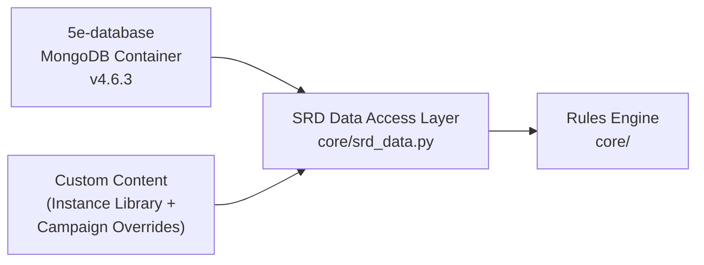

# ADR-0001: SRD Rules Engine

- **Status**: Accepted
- **Date**: 2026-04-02
- **Deciders**: [@t11z](https://github.com/t11z)
- **Scope**: `backend/tavern/core/` (Rules Engine), `docker-compose.yml` (5e-database container)

## Context

Tavern is an SRD 5e-compatible RPG engine. The SRD defines hundreds of interdependent mechanical rules — combat resolution, spell interactions, character progression, condition tracking, action economy. These rules have a shared characteristic: they are deterministic. A d20 + 5 against AC 16 is a hit. Fireball deals 8d6 fire damage in a 20-foot radius, Dexterity save for half. There is no ambiguity, no interpretation, no creativity involved.

The project also uses an LLM (currently Claude) for narration. The naive approach would be to let the LLM handle both narration and rules — include the relevant SRD sections in the prompt and ask the model to resolve mechanics alongside storytelling. This is how most AI-powered RPG tools work today, and it fails in predictable ways:

**Non-determinism**: Language models are probabilistic. Asking Claude "does 14 hit AC 16?" will produce the correct answer most of the time — but not always, and never verifiably. In a solo session, an occasional miscalculation is annoying. In multiplayer, it creates disputes that the software cannot arbitrate because there is no authoritative mechanical layer. In an open source project, "the AI decided" is not an acceptable answer to "why did my character die?"

**Cost**: The SRD 5.2 is ~361 pages. Even selectively including relevant sections adds thousands of input tokens per request. At ~2,400 tokens base input per turn and 40 turns per session, adding even 500 tokens of SRD context per turn increases session cost by ~20%. This directly undermines the project's core promise of sub-dollar session costs.

**Auditability**: An open source game engine must be verifiable. Contributors and players need to confirm that combat resolution, spell slot tracking, and level-up math are correct. Python functions with unit tests are verifiable. LLM outputs are not — they cannot be diffed, regression-tested, or bisected.

**Coupling**: If rules interpretation lives in the prompt, every change to the narration layer risks breaking mechanics, and vice versa. The SRD data, the narration strategy, and the rules logic become a single entangled system that cannot be maintained independently.

These are not theoretical concerns. AI Dungeon demonstrated all four failure modes at scale — inconsistent mechanics, high API costs, unverifiable game state, and an inability to improve one aspect without degrading another.

## Decision

### 1. Deterministic Rules Engine in Python

All SRD mechanics that produce a binary or numerical outcome are implemented as Python code in `backend/tavern/core/`. The Rules Engine is the sole authority on mechanical outcomes. No other component — including the LLM layer — may override, reinterpret, or second-guess a Rules Engine result.

The engine is organised by mechanical domain:

**`core/dice.py`** — Dice rolling and probability:
- Standard dice (d4, d6, d8, d10, d12, d20, d100)
- Advantage / disadvantage (roll twice, take higher / lower)
- Modifier application and threshold comparison
- Deterministic seed support for replay and testing (critical for debugging and for reproducing reported bugs)

**`core/combat.py`** — Combat resolution:
- Attack rolls against AC (melee, ranged, spell attack)
- Damage calculation (base dice + ability modifier + bonuses, critical hit doubling)
- Initiative ordering (Dexterity modifier, tie-breaking rules)
- Death saving throws (tracking successes / failures across rounds)
- Condition application and resolution (full SRD condition list)
- Opportunity attack trigger detection

**`core/characters.py`** — Character mechanics:
- Ability score modifiers
- Proficiency bonus by level
- Spell slot tables for all caster progressions (full, half, third, pact magic)
- Hit dice by class
- Level-up HP calculation (fixed or rolled, per class)
- Multiclass spell slot calculation
- Skill proficiency and expertise modifiers

**`core/spells.py`** — Spell mechanics (data-driven):
- Spell slot consumption and recovery (long rest, short rest for Warlocks)
- Concentration tracking (one spell active, Constitution save on damage)
- Area-of-effect geometry (sphere, cone, cube, line, cylinder — target resolution)
- Spell data itself is loaded from the SRD database, not hardcoded

**`core/conditions.py`** — Condition state machine:
- Active conditions per character with duration tracking (rounds, minutes, concentration-dependent)
- Condition interaction rules (e.g., Petrified implies Incapacitated)
- Automatic condition expiry at end-of-turn / start-of-turn per SRD

**Not in the Rules Engine** (narrative layer's domain):
- NPC decision-making (which spell to cast, whether to flee, dialogue choices)
- Environmental storytelling (weather, atmosphere, descriptions)
- Plot progression and quest logic
- Social encounter resolution (persuasion outcomes, NPC reactions)
- Improvisation and homebrew rulings

### 2. SRD data from 5e-bits/5e-database

The Rules Engine operates on structured data — spell definitions, monster stat blocks, class feature tables — that lives in a MongoDB database. The engine implements *mechanics*; the data provides *parameters*.

Tavern adopts the [5e-bits/5e-database](https://github.com/5e-bits/5e-database) project (MIT license) as its SRD data source. This community-maintained database provides the complete SRD 5.2.1 dataset — species, classes, spells, monsters, equipment, backgrounds, feats, conditions — as a MongoDB image. Tavern does not maintain its own SRD extraction pipeline, its own SRD schemas, or its own SRD data files.



The 5e-database Docker image is pinned to version **v4.6.3** in `docker-compose.yml`. Version upgrades are explicit — a PR that bumps the tag, verified against the Rules Engine test suite before merge.

New SRD content is always a data concern, never a code change — unless the content introduces a new *mechanic* (a new type of action, a new condition, a new casting progression).

### 3. Layered data resolution with custom content

SRD data is the baseline, not the ceiling. Game Masters customise — they add homebrew monsters, modify existing creatures, create custom spells and magic items. This is how pen-and-paper works: the GM has the last word.

Tavern implements this through a three-tier data resolution model:

```
Lookup order (first match wins):

1. Campaign Override    — scoped to a single campaign
2. Instance Library     — custom content shared across campaigns on this Tavern instance
3. SRD Baseline         — 5e-database, identical for all Tavern deployments
```

**SRD Baseline**: The `5e-database` container, seeded from the upstream image. Upstream updates arrive by bumping the image tag.

**Instance Library**: Custom content created by the server operator or players, stored in separate MongoDB collections (e.g., `custom_monsters`, `custom_spells`). Available to all campaigns on this Tavern instance. Reusable — create a homebrew monster once, use it in every campaign.

**Campaign Override**: Per-campaign modifications that override SRD or Instance Library entries for a specific campaign. A campaign where Goblins have 50 HP does not affect other campaigns. Overrides reference the original entry by index and replace specific fields or the entire document.

The SRD Data Access Layer (`core/srd_data.py`) encapsulates this lookup chain. All other modules in `core/` call `srd_data` functions (e.g., `get_monster(index, campaign_id=None)`) — they never query MongoDB directly and are unaware of the layering.

### 4. Test coverage as a non-negotiable constraint

The Rules Engine is the mechanical authority. If it is wrong, the game is wrong. Therefore:

- Every public function in `core/` must have unit tests covering normal cases, edge cases, and boundary conditions.
- Combat resolution tests must cover: hit, miss, critical hit, critical miss, advantage, disadvantage, and every condition that modifies attack rolls.
- Spell slot tests must cover all caster progressions including multiclass.
- Dice tests must use deterministic seeds for reproducibility.
- Untested mechanics are unshipped mechanics. A mechanic without tests does not exist in the engine — it must not be used by any other component.

Test coverage is enforced in CI. PRs that add or modify `core/` without corresponding test changes are flagged by the review workflow.

## Rationale

**Code over prompts for deterministic logic**: Language models are the wrong tool for arithmetic and binary logic. They excel at ambiguity, nuance, and creativity — none of which apply to "does 14 beat AC 16?" Implementing mechanics in code makes them testable, reproducible, and auditable — three properties that an open source game engine requires and that LLM outputs cannot provide.

**Data-driven over hardcoded**: Separating mechanics (code) from parameters (data) means SRD updates are data updates, not code changes. A new spell is a database document, not a Python function. This reduces maintenance burden and makes community contributions to the data layer accessible to non-programmers.

**5e-database over custom import pipeline**: The SRD contains hundreds of spells, monsters, and class features. Building a custom extraction pipeline — PDF parsing, Claude-assisted extraction, schema validation, human review — is substantial infrastructure that solves a problem the 5e-bits community has already solved. Their dataset is complete, actively maintained (861 stars, regular releases), schema-validated, and available as a ready-to-run Docker image. Adopting it eliminates an entire workstream and removes the Anthropic API key dependency from the import process.

**Layered resolution over flat data**: Pen-and-paper RPGs live on customisation. A Rules Engine that only supports unmodified SRD data forces players into a rigid experience that contradicts the spirit of tabletop gaming. The three-tier model (campaign → instance → SRD) mirrors how GMs actually work: house rules override the book, and the book is always the fallback.

**MongoDB for SRD data over PostgreSQL transformation**: The 5e-database is a MongoDB dataset. Transforming its document-oriented data into PostgreSQL relational tables would require building exactly the kind of import and transformation pipeline that adopting 5e-database was meant to eliminate. MongoDB serves the SRD data in its native format; PostgreSQL serves Tavern's relational application data. Each database does what it is good at.

## Alternatives Considered

**LLM-interpreted rules at runtime**: Include relevant SRD sections in every prompt and let Claude resolve mechanics. Rejected — non-deterministic, expensive (thousands of extra tokens per request), unauditable, and creates tight coupling between narration and mechanics. AI Dungeon's inconsistent game state demonstrates this failure mode at scale.

**RAG over SRD at runtime**: Retrieve relevant SRD sections per request via embedding search, include in prompt. Rejected — reduces token cost compared to full SRD inclusion but retains the non-determinism problem. The model still interprets the rules, which means outcomes are still probabilistic. Also adds retrieval latency (~100-200ms per lookup) without eliminating the fundamental issue.

**Custom SRD import pipeline (Claude-assisted PDF extraction)**: Build a pipeline that extracts structured data from the SRD PDF using Claude, validates against custom JSON schemas, and seeds the database after human review. Rejected — this is substantial infrastructure (PDF chunking, LLM extraction, schema design, validation tooling, GitHub Actions workflow) that duplicates work the 5e-bits community has already done. It introduces an Anthropic API key dependency in the development workflow and requires ongoing maintenance as SRD formats and Claude APIs evolve. The 5e-database provides the same data, pre-extracted, pre-validated, and community-maintained.

**Manual SRD transcription (no pipeline, no external database)**: Hand-code all spell data, monster stats, and class features as Python constants. Rejected — feasible for a small subset but does not scale to the full SRD. Manual transcription of ~400 spells and ~300 monsters is error-prone and creates a maintenance burden when errata are released.

**Hybrid approach (engine + LLM fallback for edge cases)**: Rules Engine handles common mechanics, LLM handles unusual interactions by receiving relevant SRD context. Deferred to V2 — this is a reasonable approach for genuinely ambiguous rules interactions (e.g., "does Counterspell work on a spell cast from a magic item?"), but adding a fallback path in V1 introduces decision logic for when to fall back that is itself a source of bugs. V1 treats unimplemented edge cases as the DM's responsibility — consistent with how kitchen-table D&D handles DM rulings.

## Consequences

### What becomes easier
- Rules correctness is verifiable — unit tests, CI enforcement, community review. A bug report like "Fireball should do 8d6, not 6d6" can be confirmed, fixed, and regression-tested.
- SRD data is available immediately — no extraction pipeline to build, no schemas to design, no human review workflow. The data arrives ready-to-query in a Docker container.
- SRD updates are a version bump. New 5e-database release = bump tag in `docker-compose.yml` = run test suite = merge.
- Custom content is a first-class feature. GMs can add homebrew monsters, modify SRD creatures, and create custom items — matching the pen-and-paper experience where the GM's word is final.
- The Rules Engine can be extracted and reused independently — it has no dependency on any LLM layer, any specific narrator, or any specific frontend. It is a standalone SRD 5e rules library.
- Community contributions to SRD data corrections go to 5e-bits upstream, where they benefit the entire ecosystem — not just Tavern.

### What becomes harder
- Significant upfront implementation effort for the engine itself. The SRD defines hundreds of interacting mechanics. Reaching 80% combat coverage requires implementing conditions, opportunity attacks, death saves, multiclass interactions, and area-of-effect geometry — each with edge cases.
- Edge cases in rules interactions require human judgment to implement. "What happens when a Stunned creature is also Prone and then gets Frightened?" has a correct SRD answer, but finding and implementing it requires careful reading, not code generation.
- Tavern depends on an external project (5e-bits/5e-database) for its SRD baseline data. If that project is abandoned or diverges from the SRD, Tavern must fork or find an alternative. Mitigated by the project's size (861 stars, 411 forks), MIT license, and the fact that forking a MongoDB dataset is trivial.
- Contributors must understand the boundary: mechanical logic belongs in `core/`, never in the narrative layer. PRs that blur this boundary must be caught in review.
- Two databases (PostgreSQL + MongoDB) increase the operational surface compared to a single database. Mitigated by both being Docker containers in the same Compose file — the operator never interacts with MongoDB directly.

### New constraints
- Every mechanical outcome in the game must originate from the Rules Engine. If a feature requires a dice roll, damage calculation, or condition check, the engine must implement it before the feature can ship.
- SRD data must never be hardcoded in Python. All game parameters (spell data, monster stats, class tables) are read from MongoDB through the SRD Data Access Layer.
- Test coverage for `core/` is enforced in CI. PRs without tests for new or changed mechanics are not mergeable.
- The 5e-database image version is pinned in `docker-compose.yml`. Upgrades require a PR with passing tests. No `latest` tag.
- Custom content must conform to the 5e-database document schema for its entity type. The Rules Engine does not validate arbitrary document shapes — it expects the schema it knows.

## Review Trigger

- If the Rules Engine covers fewer than 80% of SRD combat mechanics after 6 months of active development, evaluate whether the scope is too ambitious and consider a reduced mechanical core with narrative-layer fallback for uncovered cases (the deferred hybrid approach).
- If SRD 5.3 or a successor introduces mechanics that are fundamentally non-deterministic (e.g., narrative-driven resolution systems), evaluate whether the deterministic engine model still applies.
- If 5e-bits/5e-database is abandoned (no commits for 12+ months, unresolved data errors), evaluate forking the dataset or building a minimal import pipeline as a replacement.
- If the test suite for `core/` exceeds 2,000 tests and CI runtime becomes prohibitive (>10 minutes), evaluate test parallelisation or a tiered test strategy (fast unit tests in CI, slow integration tests nightly).
- If the layered resolution model (campaign → instance → SRD) creates performance issues due to multi-collection lookups, evaluate caching strategies or denormalisation into a merged read collection.