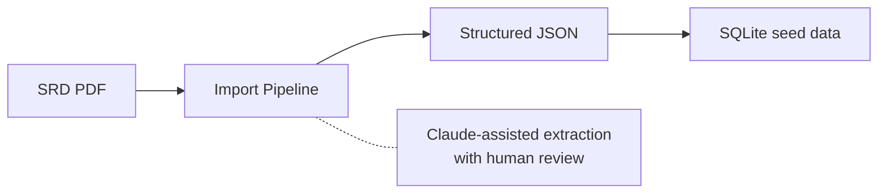
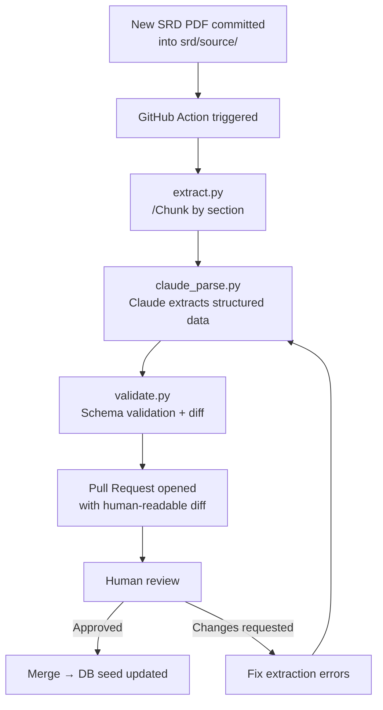

# ADR-0001: SRD Rules Engine

- **Status**: Accepted
- **Date**: 2026-04-02
- **Deciders**: [@t11z](https://github.com/t11z)
- **Scope**: `backend/tavern/core/` (Rules Engine), `scripts/srd_import/` (Import Pipeline), `scripts/schemas/` (Data Schemas)

## Context

Tavern is an SRD 5e-compatible RPG engine. The SRD defines hundreds of interdependent mechanical rules — combat resolution, spell interactions, character progression, condition tracking, action economy. These rules have a shared characteristic: they are deterministic. A d20 + 5 against AC 16 is a hit. Fireball deals 8d6 fire damage in a 20-foot radius, Dexterity save for half. There is no ambiguity, no interpretation, no creativity involved.

The project also uses an LLM (currently Claude) for narration. The naive approach would be to let the LLM handle both narration and rules — include the relevant SRD sections in the prompt and ask the model to resolve mechanics alongside storytelling. This is how most AI-powered RPG tools work today, and it fails in predictable ways:

**Non-determinism**: Language models are probabilistic. Asking Claude "does 14 hit AC 16?" will produce the correct answer most of the time — but not always, and never verifiably. In a solo session, an occasional miscalculation is annoying. In multiplayer, it creates disputes that the software cannot arbitrate because there is no authoritative mechanical layer. In an open source project, "the AI decided" is not an acceptable answer to "why did my character die?"

**Cost**: The SRD 5.2 is ~361 pages. Even selectively including relevant sections adds thousands of input tokens per request. At ~2,400 tokens base input per turn and 40 turns per session, adding even 500 tokens of SRD context per turn increases session cost by ~20%. This directly undermines the project's core promise of sub-dollar session costs.

**Auditability**: An open source game engine must be verifiable. Contributors and players need to confirm that combat resolution, spell slot tracking, and level-up math are correct. Python functions with unit tests are verifiable. LLM outputs are not — they cannot be diffed, regression-tested, or bisected.

**Coupling**: If rules interpretation lives in the prompt, every change to the narration layer risks breaking mechanics, and vice versa. The SRD import pipeline, the narration strategy, and the rules logic become a single entangled system that cannot be maintained independently.

These are not theoretical concerns. AI Dungeon demonstrated all four failure modes at scale — inconsistent mechanics, high API costs, unverifiable game state, and an inability to improve one aspect without degrading another.

## Decision

### 1. Deterministic Rules Engine in Python

All SRD mechanics that produce a binary or numerical outcome are implemented as Python code in `backend/tavern/core/`. The Rules Engine is the sole authority on mechanical outcomes. No other component — including the LLM layer — may override, reinterpret, or second-guess a Rules Engine result.

The engine is organised by mechanical domain:

**`core/dice.py`** — Dice rolling and probability:
- Standard dice (d4, d6, d8, d10, d12, d20, d100)
- Advantage / disadvantage (roll twice, take higher / lower)
- Modifier application and threshold comparison
- Deterministic seed support for replay and testing (critical for debugging and for reproducing reported bugs)

**`core/combat.py`** — Combat resolution:
- Attack rolls against AC (melee, ranged, spell attack)
- Damage calculation (base dice + ability modifier + bonuses, critical hit doubling)
- Initiative ordering (Dexterity modifier, tie-breaking rules)
- Death saving throws (tracking successes / failures across rounds)
- Condition application and resolution (full SRD condition list)
- Opportunity attack trigger detection

**`core/characters.py`** — Character mechanics:
- Ability score modifiers
- Proficiency bonus by level
- Spell slot tables for all caster progressions (full, half, third, pact magic)
- Hit dice by class
- Level-up HP calculation (fixed or rolled, per class)
- Multiclass spell slot calculation
- Skill proficiency and expertise modifiers

**`core/spells.py`** — Spell mechanics (data-driven):
- Spell slot consumption and recovery (long rest, short rest for Warlocks)
- Concentration tracking (one spell active, Constitution save on damage)
- Area-of-effect geometry (sphere, cone, cube, line, cylinder — target resolution)
- Spell data itself is loaded from the SRD import pipeline, not hardcoded

**`core/conditions.py`** — Condition state machine:
- Active conditions per character with duration tracking (rounds, minutes, concentration-dependent)
- Condition interaction rules (e.g., Petrified implies Incapacitated)
- Automatic condition expiry at end-of-turn / start-of-turn per SRD

**Not in the Rules Engine** (narrative layer's domain):
- NPC decision-making (which spell to cast, whether to flee, dialogue choices)
- Environmental storytelling (weather, atmosphere, descriptions)
- Plot progression and quest logic
- Social encounter resolution (persuasion outcomes, NPC reactions)
- Improvisation and homebrew rulings

### 2. SRD data as structured imports, not hardcoded tables

The Rules Engine operates on structured data — spell definitions, monster stat blocks, class feature tables — that is imported from the SRD, not manually transcribed. This is a critical distinction: the engine implements *mechanics*, the data provides *parameters*.



Data schemas are defined as JSON Schema files in `scripts/schemas/` (e.g., `spell.json`, `monster.json`, `class_feature.json`). These schemas serve as the contract between the import pipeline and the engine — extracted data must validate against the schema before it enters the database. The schemas themselves are derived from the SRD structure and refined iteratively as the engine implementation progresses. Schema design is a modelling task, not an architecture decision — changes to schemas are normal PRs, not ADR-level events.

New SRD content is always a data import, never a code change — unless the content introduces a new *mechanic* (a new type of action, a new condition, a new casting progression).

### 3. SRD Import Pipeline

The import pipeline converts SRD source documents into schema-validated JSON, assisted by Claude for extraction and validated by humans before merge:

```
scripts/srd_import/
├── extract.py        # Chunk SRD PDF by section (spells, monsters, classes)
├── claude_parse.py   # Claude extracts structured data per schema
├── validate.py       # Schema validation + diff against current data
└── review/           # Generated JSONs staged for human review
    └── *.json
```

**Workflow for initial import:**
```bash
python scripts/srd_import/extract.py --input srd/SRD_CC_v5.2.pdf --section spells
python scripts/srd_import/claude_parse.py --section spells --schema scripts/schemas/spell.json
python scripts/srd_import/validate.py --output review/spells.json
# Human reviews review/spells.json, then imports to DB
```

**Workflow for SRD updates:**
A GitHub Actions workflow (`srd-update.yml`) automates the parse-and-diff step. When a new SRD source file is committed to `srd/source/`, the action runs the pipeline, generates a human-readable diff summary, and opens a pull request. The PR shows exactly what changed (e.g., "Fireball: damage_dice changed from 8d6 to 7d6") and requires human approval before merge.



Claude is a dev tool in this pipeline — it assists extraction, it does not make decisions. Every extracted data point passes through schema validation and human review. No SRD data enters the engine without a merged PR.

### 4. Test coverage as a non-negotiable constraint

The Rules Engine is the mechanical authority. If it is wrong, the game is wrong. Therefore:

- Every public function in `core/` must have unit tests covering normal cases, edge cases, and boundary conditions.
- Combat resolution tests must cover: hit, miss, critical hit, critical miss, advantage, disadvantage, and every condition that modifies attack rolls.
- Spell slot tests must cover all caster progressions including multiclass.
- Dice tests must use deterministic seeds for reproducibility.
- Untested mechanics are unshipped mechanics. A mechanic without tests does not exist in the engine — it must not be used by any other component.

Test coverage is enforced in CI. PRs that add or modify `core/` without corresponding test changes are flagged by the review workflow.

## Rationale

**Code over prompts for deterministic logic**: Language models are the wrong tool for arithmetic and binary logic. They excel at ambiguity, nuance, and creativity — none of which apply to "does 14 beat AC 16?" Implementing mechanics in code makes them testable, reproducible, and auditable — three properties that an open source game engine requires and that LLM outputs cannot provide.

**Data-driven over hardcoded**: Separating mechanics (code) from parameters (data) means SRD updates are data imports, not code changes. A new spell is a JSON entry, not a Python function. This reduces maintenance burden and makes community contributions to the data layer accessible to non-programmers.

**Claude-assisted import over manual transcription**: The SRD contains hundreds of spells, monsters, and class features. Manual transcription is error-prone and tedious. Claude extracts structured data from the PDF with high accuracy — but not perfect accuracy, which is why human review is mandatory. The import pipeline is a productivity tool, not an automation.

**Schema validation over trust**: The import pipeline produces JSON that is validated against a schema before it enters the database. This catches extraction errors (missing fields, wrong types, implausible values) before they reach the engine. The schema is the contract — if Claude's extraction doesn't match it, the import fails, not the game.

## Alternatives Considered

**LLM-interpreted rules at runtime**: Include relevant SRD sections in every prompt and let Claude resolve mechanics. Rejected — non-deterministic, expensive (thousands of extra tokens per request), unauditable, and creates tight coupling between narration and mechanics. AI Dungeon's inconsistent game state demonstrates this failure mode at scale.

**RAG over SRD at runtime**: Retrieve relevant SRD sections per request via embedding search, include in prompt. Rejected — reduces token cost compared to full SRD inclusion but retains the non-determinism problem. The model still interprets the rules, which means outcomes are still probabilistic. Also adds retrieval latency (~100-200ms per lookup) without eliminating the fundamental issue.

**Manual SRD transcription (no import pipeline)**: Hand-code all spell data, monster stats, and class features. Rejected — feasible for a small subset but does not scale to the full SRD. Manual transcription of ~400 spells and ~300 monsters is error-prone and creates a maintenance burden when errata are released. The import pipeline is less work upfront and dramatically less work on updates.

**Third-party SRD databases (e.g., 5e-database on GitHub)**: Use an existing open source SRD data set instead of building an import pipeline. Considered and kept as a fallback — existing databases are useful references and may serve as seed data, but they have their own schemas that may not align with Tavern's engine requirements. The import pipeline ensures the data matches the engine's schema exactly. If a suitable third-party source exists, the pipeline can ingest it instead of the raw PDF.

**Hybrid approach (engine + LLM fallback for edge cases)**: Rules Engine handles common mechanics, LLM handles unusual interactions by receiving relevant SRD context. Deferred to V2 — this is a reasonable approach for genuinely ambiguous rules interactions (e.g., "does Counterspell work on a spell cast from a magic item?"), but adding a fallback path in V1 introduces decision logic for when to fall back that is itself a source of bugs. V1 treats unimplemented edge cases as the DM's responsibility — consistent with how kitchen-table D&D handles DM rulings.

## Consequences

### What becomes easier
- Rules correctness is verifiable — unit tests, CI enforcement, community review. A bug report like "Fireball should do 8d6, not 6d6" can be confirmed, fixed, and regression-tested.
- SRD updates are a data pipeline, not a rewrite. New errata = new import run = PR with diff = human review = merge. An afternoon, not a sprint.
- Community contribution to game data (spell corrections, missing monsters, new class features) requires JSON editing, not Python expertise. Lower barrier to entry.
- The Rules Engine can be extracted and reused independently — it has no dependency on any LLM layer, any specific narrator, or any specific frontend. It is a standalone SRD 5e rules library.

### What becomes harder
- Significant upfront implementation effort. The SRD defines hundreds of interacting mechanics. Reaching 80% combat coverage requires implementing conditions, opportunity attacks, death saves, multiclass interactions, and area-of-effect geometry — each with edge cases.
- Edge cases in rules interactions require human judgment to implement. "What happens when a Stunned creature is also Prone and then gets Frightened?" has a correct SRD answer, but finding and implementing it requires careful reading, not code generation.
- The import pipeline must be maintained as a dev tool — schema evolution, SRD format changes, and Claude API changes can all break it.
- Contributors must understand the boundary: mechanical logic belongs in `core/`, never in the narrative layer. PRs that blur this boundary must be caught in review.

### New constraints
- Every mechanical outcome in the game must originate from the Rules Engine. If a feature requires a dice roll, damage calculation, or condition check, the engine must implement it before the feature can ship.
- SRD data must never be hardcoded in Python. All game parameters (spell data, monster stats, class tables) live in the database, seeded by the import pipeline.
- Test coverage for `core/` is enforced in CI. PRs without tests for new or changed mechanics are not mergeable.
- The import pipeline requires an Anthropic API key for the Claude extraction step. This runs only in the maintainer's environment or CI — not in production, not on the player's machine.

## Review Trigger

- If the Rules Engine covers fewer than 80% of SRD combat mechanics after 6 months of active development, evaluate whether the scope is too ambitious and consider a reduced mechanical core with narrative-layer fallback for uncovered cases (the deferred hybrid approach).
- If SRD 5.3 or a successor introduces mechanics that are fundamentally non-deterministic (e.g., narrative-driven resolution systems), evaluate whether the deterministic engine model still applies.
- If a third-party SRD data library emerges that matches Tavern's schema requirements, evaluate replacing the import pipeline with a dependency on that library.
- If the test suite for `core/` exceeds 2,000 tests and CI runtime becomes prohibitive (>10 minutes), evaluate test parallelisation or a tiered test strategy (fast unit tests in CI, slow integration tests nightly).