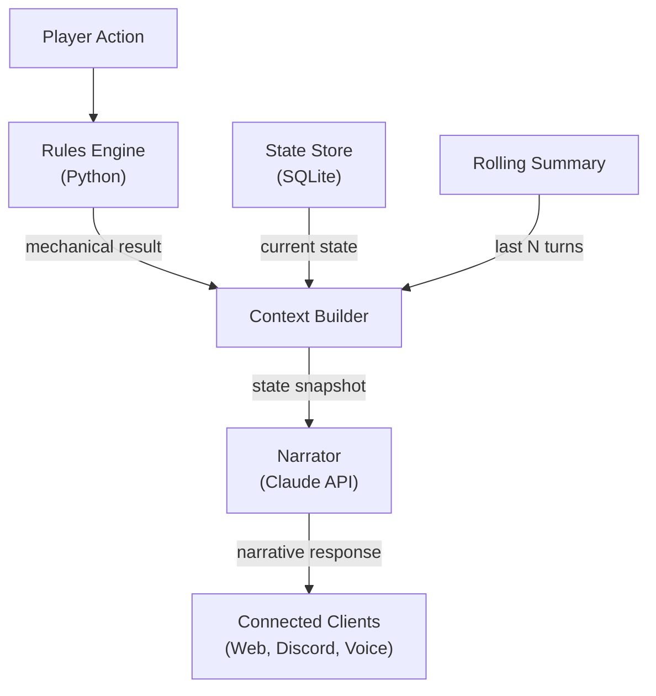
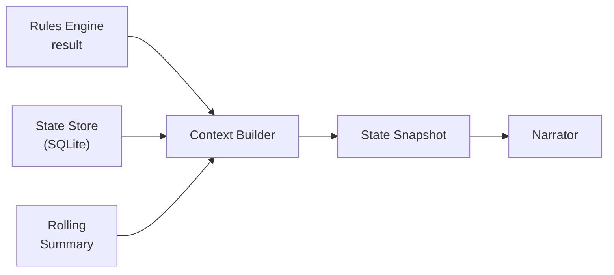

# ADR-0002: Claude as Narrator

- **Status**: Accepted
- **Date**: 2026-04-02
- **Deciders**: [@t11z](https://github.com/t11z)
- **Scope**: `backend/tavern/dm/` (Context Builder, Narrator), Claude API integration, prompt architecture

## Context

Tavern's Rules Engine (ADR-0001) handles deterministic game mechanics — dice, combat, spell slots, conditions. What it cannot do is tell a story. A combat result like "Your attack hits. 14 slashing damage to the Goblin. Goblin HP: 0" is mechanically complete but narratively dead. The game needs a layer that transforms mechanical outcomes into immersive fiction: describes the arc of the sword, the goblin's final snarl, the blood on the dungeon floor. It also needs a layer that drives NPC behaviour, reacts to player improvisation, advances the plot, and makes the world feel alive.

This is what a human Dungeon Master does — and it is precisely what language models are good at. The question is not *whether* to use an LLM for narration, but *how*: what information it receives, how it is constrained, which model handles which task, and how the interface between the mechanical and narrative layers is designed.

The design must satisfy several constraints simultaneously:

**Cost predictability**: The project promises sub-dollar session costs. The LLM layer is the only variable cost component — the Rules Engine, database, and frontend are effectively free to run. Every architectural choice in this layer directly affects the per-session price tag.

**Latency tolerance**: Players expect near-instant mechanical resolution but tolerate 2-5 seconds for narrative responses. This asymmetry creates an opportunity for model routing — not every response needs the most capable (and slowest) model.

**Context window discipline**: A 3-hour session with 40 turns generates thousands of tokens of conversation history. Naively appending all history to every request will exceed context limits and inflate costs. The layer must manage context aggressively.

**Model independence**: Claude is the current best fit, but the architecture should not be welded to a single provider. If a future model offers better narration at lower cost, switching should be a configuration change, not a rewrite.

**Narrative consistency**: The DM must remember that the innkeeper is named Marta, that the party promised to return the stolen amulet, and that it's raining. This information lives in the state store, not in the model's memory — the layer must inject it reliably.

**Client-agnostic output**: Narrative responses are consumed by multiple client types — a web browser rendering styled text, a Discord bot posting messages, a voice client converting text to speech. The narrator must produce plain text without formatting assumptions. Clients decide how to present it.

## Decision

### 1. Claude's role: Narrator, not rules authority

Claude's authority is strictly narrative. It receives mechanical results from the Rules Engine and transforms them into fiction. It decides *how* to describe an outcome, never *what* the outcome is.

**Claude decides:**
- How a hit looks, sounds, and feels
- What NPCs say, think, and do (within plot constraints)
- How the environment reacts to player actions
- When to introduce new plot elements, encounters, or twists
- The emotional tone and pacing of the scene
- Social encounter outcomes (persuasion, deception, intimidation — these are narrative, not mechanical, in Tavern's model)

**Claude does not decide:**
- Whether an attack hits or misses
- How much damage is dealt
- Whether a spell slot is available
- Whether a saving throw succeeds
- Character HP, AC, or any mechanical stat
- Initiative order
- Condition application or removal

This boundary is absolute. If a player says "I cast Fireball," the Rules Engine resolves the spell slot consumption, the damage roll, and the Dexterity saves for all targets. Claude receives: "Fireball hits 3 goblins for 28 fire damage. 2 failed their save, 1 succeeded (half damage). Goblin A: dead. Goblin B: dead. Goblin C: 6 HP remaining." Claude then narrates the inferno.

### 2. State snapshots, not conversation history

Claude never receives raw conversation history. Every request contains a **state snapshot** — a structured, purpose-built representation of the current game state, assembled by the Context Builder (`dm/context_builder.py`).



**Snapshot structure:**

| Component | Content | Approx. tokens | Cacheable |
|---|---|---|---|
| System prompt | DM persona, campaign tone, narrative constraints, output format rules | ~800 | Yes — static across session |
| Character snapshot | Per-PC: name, class, level, current HP/max HP, active conditions, key inventory, spell slots remaining | ~400 | Yes — changes only on state transitions |
| Scene context | Current location description, present NPCs (name, disposition, agenda), environmental conditions, active threats, time of day | ~600 | Partially — stable within a scene |
| Rolling summary | Compressed narrative of the last N turns (default: 10), capturing key events and decisions without verbatim dialogue | ~500 | No — updates every turn |
| Current turn | Player's action (verbatim) + Rules Engine result (human-readable description) | ~100 | No |
| **Total** | | **~2,400** | **~50%** |

**Why not conversation history:**

A 40-turn session generates ~28,000 tokens of raw history (player inputs + Claude responses). Including all of it in every request would cost ~$0.08 per turn in input tokens alone — more than the entire session should cost. It would also hit context window limits within 20-30 turns, causing hard failures.

The rolling summary solves this: after each turn, the summary is updated to include the new event and drop the oldest if it exceeds the token budget. Summary compression is a Haiku task (see model routing below) — cheap, fast, and mechanical.

**What the rolling summary contains:**

```
Turn 31: The party entered the Sunken Crypt through the eastern passage.
          Kira detected a pressure plate (Perception 18). Disarmed successfully.
Turn 32: Combat initiated — 4 skeletons. Aldric went first (Initiative 19).
Turn 33: Aldric's greatsword destroyed Skeleton A. Kira cast Burning Hands,
          damaged Skeletons B and C. Skeleton D attacked Milo, missed.
Turn 34: Milo healed Kira (Cure Wounds, 8 HP). Skeleton B struck Aldric
          for 5 slashing damage. Aldric now at 28/38 HP.
```

This is ~100 tokens for 4 turns — the full history would be ~2,800 tokens for the same information. The compression ratio is roughly 25:1, and Claude still has enough context to narrate coherently.

### 3. Context Builder as sole interface

The Context Builder (`dm/context_builder.py`) is the only component that communicates with the Narrator. It assembles the state snapshot from three sources — the Rules Engine result, the state store (SQLite), and the rolling summary — and serialises it into the prompt format.



The snapshot is assembled as a structured dataclass, then serialised into the prompt. The Context Builder is the sole component that knows both the state store schema and the prompt format. Neither the Rules Engine nor the Narrator need to know about each other's internals.

The Context Builder also enforces **token budgets**: if the scene context or character state exceeds its allocation, it truncates intelligently (drops least-relevant inventory items, abbreviates NPC descriptions) rather than allowing the snapshot to grow unboundedly.

Changes to the snapshot format are breaking changes — both the Context Builder and the Narrator's system prompt must be updated together.

### 4. Model routing

Not every Claude call needs the same model. The Narrator routes requests to different models based on the type of response:

| Request type | Model | Rationale |
|---|---|---|
| Narrative response to player action | Sonnet | Creativity, coherence, emotional tone |
| NPC dialogue (extended) | Sonnet | Character consistency, voice |
| New scene description | Sonnet | Atmospheric detail, world-building |
| Short acknowledgment ("You open the door.") | Haiku | Low complexity, fast response |
| Rolling summary compression | Haiku | Mechanical text transformation |
| Rules edge case clarification | Haiku | Factual lookup, low creativity |

**Default is Sonnet.** Haiku is selected only when the Narrator determines the response is low-complexity. The routing decision is made in `dm/narrator.py` based on the request type, not configurable by the player.

**Cost impact**: Haiku is ~20x cheaper than Sonnet. At an estimated 30% Haiku routing rate:

| Scenario | Without routing | With routing | Savings |
|---|---|---|---|
| Solo, 3 hours | ~$0.33 | ~$0.28 | 15% |
| 4 players, 3 hours | ~$0.85 | ~$0.70 | 18% |

The savings are modest in absolute terms but meaningful at the project's price point — they are the difference between "cheaper than a coffee" being literally true or aspirationally true.

### 5. System prompt design

The system prompt defines Claude's DM persona and constraints. It is static across a session and fully cacheable (cache reads cost 0.1x normal input price).

**The system prompt contains:**
- DM persona definition (tone, narrative style, vocabulary level)
- Campaign-specific instructions (setting, active plot threads, tone — injected from the campaign record)
- Hard constraints: "Never output mechanical results. Never contradict the Rules Engine. Never reveal information the characters would not know."
- Output format rules: plain text only — no Markdown, no HTML, no emoji. Response length guidance (2-4 paragraphs for narrative, 1-2 sentences for acknowledgments). Dialogue in quotation marks.
- Multiplayer instructions: address the acting player by character name, acknowledge other present characters naturally, give brief reaction opportunities for non-acting players. In combat, narrate only the current turn's action — do not narrate other players' future actions.

**The system prompt does not contain:**
- SRD rules text (Claude already knows 5e from training; mechanical resolution is the engine's job)
- Character sheets (these are in the character snapshot, which changes per turn)
- Full campaign history (this is in the rolling summary)

**Plain text output is a hard constraint.** The narrator produces text that must work in every client context: rendered as styled HTML in a browser, posted as a Discord message, spoken aloud by a TTS engine, displayed in a terminal. Markdown, HTML, or any formatting in the narrative output would require every client to parse and strip it. Plain text is universally consumable.

### 6. Prompt caching strategy

Anthropic's prompt caching reduces cost for repeated context. The snapshot is structured to maximise cache hits:

```
Prompt structure (top = most cacheable, bottom = most volatile):

+--------------------------------------------------+
| System prompt            ~800 tok   # cached      |
| Character snapshot       ~400 tok   # cached      |
| Scene context            ~600 tok   ~ partially   |
| Rolling summary          ~500 tok   - not cached  |
| Current turn             ~100 tok   - not cached  |
+--------------------------------------------------+
```

Cache-eligible tokens: ~1,200 out of ~2,400 (50%). At cache read pricing of 0.1x, this reduces effective input cost by ~45% on cached portions.

The ordering is intentional — Anthropic caches from the top of the prompt. The most stable components (system prompt) are first; the most volatile (current turn) are last. Reordering these components would break cache efficiency.

### 7. Model independence

The Narrator communicates with the LLM through a provider abstraction in `dm/narrator.py`. The abstraction exposes two methods: one for narration (given a state snapshot and a model tier) and one for summary compression (given recent turn history). `model_tier` is "high" (Sonnet-class) or "low" (Haiku-class). The provider maps tiers to concrete model identifiers.

Switching providers (e.g., to OpenAI, to a local model) requires implementing this interface — two methods, no framework lock-in.

This is not premature abstraction. The project explicitly positions itself as open source and self-hosted — contributors will want to run it with their own preferred provider. The abstraction cost is two methods and a protocol class. The lock-in cost of not having it would be a rewrite of the entire DM layer.

## Rationale

**State snapshots over conversation history**: Raw history is expensive (25x more tokens for the same information), hits context limits in long sessions, and contains noise (previous Claude responses that don't inform the current turn). Snapshots are cheap, predictable, and contain exactly what Claude needs.

**Model routing over single-model**: Using Sonnet for "You open the door" wastes capability and money. Haiku handles low-complexity responses indistinguishably from Sonnet at a fraction of the cost. The routing logic is a few conditionals — the implementation cost is trivial relative to the per-session savings.

**Context Builder as sole interface over direct access**: If the Narrator could query the state store or the Rules Engine directly, the three components would entangle over time. The Context Builder is a deliberate bottleneck that keeps the layers independent. It is the only component that knows both the state store schema and the prompt format.

**Provider abstraction over direct API calls**: An open source project that only works with one API provider is a product demo, not a community tool. The abstraction is two methods — the cost of implementing it is lower than the cost of explaining to contributors why they can't use their preferred provider.

**Explicit narrative boundaries over implicit trust**: Without hard constraints ("never output mechanical results"), Claude will occasionally produce damage numbers, HP totals, or rule interpretations that contradict the Rules Engine. The system prompt constraints are not optional guardrails — they are part of the mechanical contract between the two layers.

**Plain text output over formatted text**: Narrative responses are consumed by web browsers, Discord bots, TTS engines, and future clients. Any formatting assumption that works for one client breaks another. Plain text is the universal denominator.

## Alternatives Considered

**No LLM — pure text templates**: Pre-written narrative templates filled with mechanical results ("You hit the [MONSTER] for [DAMAGE] damage"). Rejected — this is a choose-your-own-adventure book, not a DM. The entire value proposition of Tavern is that Claude provides genuine narrative improvisation, NPC personality, and reactive world-building. Templates cannot do this.

**Full conversation history in every request**: Append all prior turns to every Claude call. Rejected — hits context limits within 20-30 turns, costs 25x more in input tokens, and most of the history is irrelevant to the current turn. The rolling summary provides the same narrative continuity at 4% of the token cost.

**Client-side LLM (local model)**: Run a local LLM on the player's machine for narration, eliminating API costs entirely. Deferred, not rejected — local models are currently inferior to Claude for narrative quality, but this gap is closing. The provider abstraction (Decision 7) explicitly supports this future. When a local model provides acceptable narrative quality, it should be offered as a zero-cost alternative.

**Single model (Sonnet for everything)**: No routing logic, simpler implementation. Rejected — the cost difference is 15-18% per session, which matters at the project's price point. The routing logic is minimal (a few conditionals based on request type), and the quality difference for summary compression and short acknowledgments is imperceptible.

**Fine-tuned model for DM narration**: Fine-tune a model on D&D campaign transcripts for higher narrative quality. Deferred indefinitely — fine-tuning is expensive, requires training data curation, and creates a model maintenance burden. Sonnet's zero-shot DM performance is already strong. If narrative quality becomes a differentiator against competitors, reconsider.

## Consequences

### What becomes easier
- Adding narrative features (new DM styles, campaign tones, NPC personality templates) is a system prompt change, not a code change. Contributors can improve the DM experience without touching the Rules Engine.
- Session costs are predictable and transparent — the token budget is fixed by the snapshot structure, not variable based on session length.
- Switching LLM providers is a configuration change. Contributors with OpenAI keys, local models, or AWS Bedrock access can participate without an Anthropic account.
- Narrative quality can be improved independently of mechanical correctness. Better prompts make a better DM without risking rules regressions.
- Every client receives the same plain text narrative. No client-specific rendering logic on the server, no format negotiation.

### What becomes harder
- The rolling summary is lossy — details from early turns are compressed or dropped. If a player asks "what did the innkeeper say 20 turns ago?" the answer may not be in the summary. Mitigation: the full turn log is in the state store and can be retrieved on demand, but is not routinely included in the snapshot.
- The Context Builder is a maintenance point that must stay in sync with both the state store schema and the prompt format. Schema changes in either direction require Context Builder updates.
- Model routing introduces a decision point that can produce inconsistent narrative voice if the boundary between "Sonnet tasks" and "Haiku tasks" is drawn incorrectly. The default-to-Sonnet policy mitigates this.
- The system prompt must be carefully maintained — constraints that are too tight produce robotic narration; constraints that are too loose produce mechanical hallucinations. This is a tuning problem, not a solved problem.
- Plain text narration means the web client cannot rely on Markdown formatting from Claude for emphasis, lists, or structure. Any text styling in the web client must be applied client-side based on semantic analysis of the plain text.

### New constraints
- Claude must never output mechanical results (damage numbers, HP, spell slots, dice rolls). The system prompt enforces this, but enforcement is probabilistic — monitoring and correction logic should be added as a safety net.
- Claude must never output Markdown, HTML, or any formatting. The system prompt enforces this. Clients that want formatting apply it themselves.
- The snapshot format is a contract. Changes to it are breaking changes that require updating both the Context Builder and the system prompt. These changes should be treated as ADR-level decisions if they alter the information available to Claude.
- The rolling summary must be updated after every turn. If summary compression fails (API error, timeout), the session must handle the failure gracefully — either retry or use the last valid summary.
- Prompt caching depends on component ordering in the snapshot. Reordering components (e.g., putting the rolling summary before the system prompt) would break cache efficiency and increase costs.

## Review Trigger

- If a Claude model release provides substantially cheaper narration at equivalent quality (>50% cost reduction), re-evaluate whether model routing still provides sufficient savings to justify the routing complexity.
- If Anthropic changes prompt caching behaviour (pricing, eviction policy, ordering requirements), re-evaluate the snapshot ordering strategy.
- If multiplayer sessions with 5+ players push per-turn token counts above 4,000 due to character snapshot growth, evaluate a compressed character representation or selective inclusion (only the acting player's full sheet, summaries for others).
- If narrative quality complaints from players consistently trace to Haiku-routed responses, increase the Sonnet routing percentage or eliminate Haiku routing for player-facing responses entirely.
- If a local model achieves narrative quality within 80% of Sonnet (subjective evaluation by 3+ testers), add it as a supported provider and document the quality trade-off.