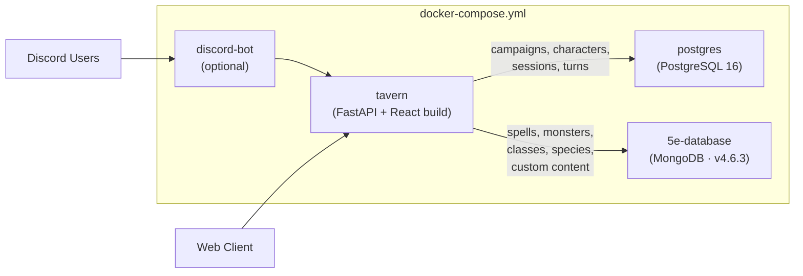
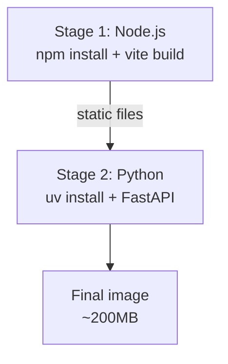

# ADR-0003: Technology Stack

- **Status**: Accepted
- **Date**: 2026-04-02
- **Deciders**: [@t11z](https://github.com/t11z)
- **Scope**: All repositories and components — game server, web client, Discord bot, database, deployment, tooling

## Context

Tavern is an open source, self-hosted RPG engine with an LLM-powered narrator. The server is a headless game server (ADR-0005) consumed by multiple client types — a web application, a Discord bot, and future mobile or voice clients. The technology choices must satisfy constraints that pull in different directions:

**Contributor accessibility**: This is an open source project. The stack must be approachable for hobbyist developers who want to contribute a spell fix, a UI improvement, or a Discord bot feature — not just for senior engineers. Every technology choice that raises the barrier to contribution reduces the project's viability as a community effort.

**Self-hosted simplicity**: The target deployment is `docker compose up` on a hobbyist's machine — a NAS, a VPS, a spare laptop. No Kubernetes, no managed services, no cloud provider accounts (beyond the LLM API key). The stack must run in a single Docker Compose file with minimal resource requirements.

**LLM integration**: The backend orchestrates Claude API calls, manages prompt construction, handles streaming responses, and implements provider abstraction (ADR-0002). The Anthropic SDK is Python-first. The backend language must have first-class SDK support.

**Multi-client support**: The game server exposes a client-agnostic API (ADR-0005). The web client and Discord bot are the two reference clients maintained by the core team. The stack must support both without architectural contortions — the Discord bot's technology choices must be compatible with the game server.

**Future complexity**: The web client in V1 is a chat interface with a character sheet sidebar. V2 may include a visual tabletop with tokens, maps, fog-of-war, and drag-and-drop interactions. The frontend framework must support both without a rewrite.

**Data model complexity**: The game state is deeply relational — campaigns contain sessions, sessions contain turns, characters have inventories with items that have properties, spells have per-class availability and per-level scaling, conditions interact with other conditions. The ORM must handle nested relations without fighting the developer. Separately, SRD reference data (spell definitions, monster stat blocks, class features) is document-oriented and sourced from an external project — it has different access patterns than the relational game state.

## Decision

### 1. Backend: Python 3.12+ / FastAPI

Python is the backend language. FastAPI is the web framework.

**Why Python:**
- The Anthropic SDK is Python-first. Streaming, prompt caching, tool use — all features are available in Python before other languages. Building the narrator layer (ADR-0002) in any other language means either using a less mature SDK or maintaining raw HTTP calls.
- The tabletop RPG community has a strong Python affinity — character sheet generators, dice bots, SRD parsers, campaign tools. Contributors are more likely to know Python than Go, Rust, or TypeScript-backend.
- The Rules Engine (ADR-0001) implements mathematical game logic — ability score modifiers, spell slot tables, area-of-effect geometry. Python's readability makes this logic auditable by non-expert contributors, which matters for an open source game engine where rules correctness is community-verified.
- The Discord bot is written in Python (discord.py), sharing the same language and dependencies as the game server. This allows the bot to import game server modules directly rather than duplicating logic.

**Why FastAPI:**
- Native async support — required for non-blocking Claude API calls (2-5 second latency per narrative response) and WebSocket connections (multiplayer and real-time event streaming to all client types).
- Native WebSocket support — no additional library or server needed for real-time communication with web clients and the Discord bot.
- Pydantic integration — request/response validation shares types with the game state models, reducing boilerplate.
- Automatic OpenAPI documentation — serves as the API contract for all client developers, whether building the web client, the Discord bot, or a community-built mobile app.

**Why 3.12+:**
- TaskGroups (3.11+) for structured concurrent API calls (e.g., parallel Haiku calls for summary compression while Sonnet handles narration).
- Improved error messages and performance improvements in 3.12.
- `type` keyword for simpler type aliases (3.12+).
- Projects started in 2026 should not target EOL Python versions.

### 2. Databases: PostgreSQL + MongoDB

Tavern uses two databases, each for a distinct data domain:

**PostgreSQL** is the database for all Tavern-owned application data — campaigns, sessions, turns, characters, inventory, character conditions. This data is relational, transactional, and unique per deployment. PostgreSQL is deployed as a container in Docker Compose.

**Why not SQLite for application data:**
SQLite's appeal is "zero configuration, one file, no extra container." In a Docker Compose deployment, this advantage is illusory — PostgreSQL is equally invisible to the end user. `docker compose up` starts everything regardless. The user never configures, tunes, or even knows about the database.

What SQLite's limitations cost in practice:
- **Single-writer lock**: Multiplayer sessions with concurrent player actions serialise all writes through one lock. At Tavern's expected load (turns per minute, not per second) this is tolerable but architecturally fragile — a slow write (complex state update with multiple relations) blocks all other writes.
- **No concurrent connections from external tools**: During development, you cannot have the application and a database inspector open simultaneously without risking lock contention.
- **Migration tooling**: Alembic supports SQLite but with limitations (no ALTER COLUMN, limited transaction support for migrations). PostgreSQL has full Alembic support.
- **JSON querying**: Tavern's flexible game data (world state, NPC dispositions, quest progress) benefits from JSONB queries. SQLite has JSON support but PostgreSQL's is more mature and performant.

**What PostgreSQL costs:**
- One additional container (~30-50MB RAM baseline).
- A volume mount for data persistence.
- A healthcheck in Docker Compose to ensure the backend waits for PostgreSQL readiness.

This is a single `docker-compose.yml` entry. The operational overhead is near zero.

**Connection pooling**: FastAPI connects to PostgreSQL via asyncpg (async driver) through SQLAlchemy's async engine. Connection pooling is handled by SQLAlchemy's built-in pool. No external connection pooler (PgBouncer) is needed at Tavern's scale.

**MongoDB** is the database for SRD reference data — spells, monsters, classes, species, backgrounds, feats, equipment, conditions, magic items. This data originates from the [5e-bits/5e-database](https://github.com/5e-bits/5e-database) project (see ADR-0001) and is document-oriented by nature. MongoDB also stores custom content (Instance Library and Campaign Overrides) that extends or modifies SRD data.

**Why MongoDB for SRD data instead of transforming into PostgreSQL:**
The 5e-database project provides a complete, community-maintained SRD dataset as a MongoDB image. Transforming this document-oriented data into relational PostgreSQL tables would require an import and transformation pipeline — exactly the kind of infrastructure that adopting 5e-database was meant to eliminate. MongoDB serves the data in its native format. The Rules Engine accesses it through an async data access layer (motor) with aggressive caching, since SRD data rarely changes at runtime.

**Why two databases instead of one:**
Application data and SRD reference data have fundamentally different characteristics. Application data is relational, transactional, migration-managed, and unique per deployment. SRD data is document-oriented, upstream-maintained, versioned by release tag, and identical across deployments (before customisation). Forcing both into one storage engine means either giving up PostgreSQL's relational strengths or rebuilding 5e-database's data model from scratch. Two purpose-matched containers in the same Compose file are simpler than one database doing two jobs poorly.

### 3. ORM: SQLAlchemy 2.x / Alembic

SQLAlchemy 2.x is the ORM for PostgreSQL. Alembic handles schema migrations. MongoDB access uses motor (async driver) directly — no ODM.

**Why SQLAlchemy 2.x over SQLModel:**
SQLModel combines SQLAlchemy with Pydantic models — one class is simultaneously a database model, an API schema, and a validation layer. This is elegant for simple CRUD applications. Tavern's data model is not simple: campaigns contain sessions, characters have inventories with items that have properties and enchantments, spells have per-class availability with per-level scaling, conditions form a state machine with interaction rules.

When queries involve multiple joins, subqueries, or conditional eager loading, SQLModel's abstraction becomes transparent — you write SQLAlchemy through SQLModel, debugging SQLAlchemy errors through an additional layer. SQLAlchemy 2.x directly gives the same power without the indirection. Its 2.x API is significantly less verbose than 1.x, narrowing SQLModel's readability advantage.

**Why SQLAlchemy 2.x over raw SQL:**
Raw SQL (asyncpg + query strings) provides maximum control but no schema management, no migration support, no relationship loading, and no protection against SQL injection beyond manual parameterisation. The productivity trade-off is not justified for Tavern's data model complexity.

**Why no ODM for MongoDB:**
The MongoDB access pattern is simple: read-only lookups by index with a three-tier fallback (campaign → instance → SRD). This does not justify an ODM like MongoEngine or Beanie. Motor (async pymongo) with typed wrapper functions in `core/srd_data.py` is sufficient and keeps the dependency surface small.

### 4. Web Client: React (Vite)

React is the frontend framework. Vite is the build tool.

**Why React over Svelte:**
React's ecosystem depth matters for Tavern's future. V1 is a chat interface with a character sheet sidebar — achievable in any framework. V2 may include a visual tabletop with tokens, fog-of-war, drag-and-drop, and Canvas/WebGL rendering. React's ecosystem provides mature libraries for all of these (react-dnd, react-three-fiber, Konva). Svelte's ecosystem is growing but not yet comparable for complex interactive applications. The decision is driven by the project's future, not its present.

**Why Vite over Next.js:**
Tavern's web client is a client-side SPA consuming a headless API (ADR-0005). SSR adds complexity (server components, hydration, routing conventions) without user-facing benefit. Vite builds static assets with minimal configuration — exactly what's needed.

### 5. Discord Bot: Python / discord.py

The Discord bot is a Python application using `discord.py`, sharing the backend's language and dependencies. It connects to the Tavern API as a client (ADR-0005) — it does not embed game logic.

**Why discord.py over discord.js:**
A JavaScript bot would prevent direct import of game server types and models, creating duplication and synchronisation overhead. The shared Python ecosystem outweighs discord.js's larger community.

### 6. Dependency Management: uv / npm

**Python:** uv (by Astral, creators of Ruff). Fast dependency resolution (10-100x faster than pip/Poetry), standard `pyproject.toml` format, lock file for reproducible builds. For a project starting in 2026, uv is the forward-looking choice.

**Why uv over pip + requirements.txt:**
pip lacks lock files, dependency groups (dev/test/prod separation), and reproducible resolution. For a project with contributors on different platforms, reproducible installs are not optional.

**Frontend dependencies:**
npm with a `package-lock.json`. No yarn, no pnpm — npm is universal and sufficient. The frontend dependency footprint is small (React, Vite, a few UI libraries).

### 7. Deployment: Single Docker Compose File

The entire application runs from a single `docker-compose.yml`:



**Services:**
- `tavern`: FastAPI application serving both the API and the static web client. Multi-stage build (Node.js for frontend build → Python for runtime). Exposes port 3000.
- `postgres`: PostgreSQL 16 (official image). Data persisted via named volume. Healthcheck ensures readiness before `tavern` starts.
- `5e-database`: MongoDB with SRD data (t11z/5e-database fork, published to GHCR). Fork of 5e-bits/5e-database with completed 2024-* collections. See ADR-0010.
- `discord-bot` (optional): Discord bot client. Connects to the Tavern API. Only starts if `DISCORD_BOT_TOKEN` is set in the environment.

**User-facing configuration:**
```bash
git clone https://github.com/t11z/tavern
cd tavern
cp .env.example .env
# Add ANTHROPIC_API_KEY to .env
# Optionally add DISCORD_BOT_TOKEN for Discord integration
docker compose up
```

The `.env` file contains:
- `ANTHROPIC_API_KEY` — required, provided by the user
- `DATABASE_URL` — pre-configured, points to the Compose PostgreSQL instance
- `MONGODB_URI` — pre-configured, points to the Compose 5e-database instance
- `SECRET_KEY` — auto-generated on first run or manually set
- `DISCORD_BOT_TOKEN` — optional, enables the Discord bot

No other configuration is required for default operation.

**Multi-stage Dockerfile (tavern service):**



The final image contains Python, the application code, and the pre-built web client assets. No Node.js runtime in the final image — it is only needed at build time.

### 8. Code Quality Tooling

**Linter/Formatter**: Ruff (by Astral, same team as uv). Replaces both flake8 and black, runs in milliseconds. Configuration in `pyproject.toml`.

**Type Checking**: mypy in strict mode for `backend/tavern/core/` (Rules Engine). The Rules Engine implements SRD mechanics — type errors in combat resolution or spell slot calculation are game-breaking bugs. Strict typing catches them at development time.

**Frontend Linting**: ESLint + Prettier, standard React configuration.

**Pre-commit**: pre-commit hooks for Ruff, mypy, and ESLint. Ensures CI never fails on formatting or trivial type errors.

## Rationale

**Python over Go/Rust**: Performance is irrelevant — the bottleneck is Claude API latency (2-5 seconds), not server-side computation. Python's readability, SDK support, community familiarity, and shared language with the Discord bot outweigh any performance advantage that would be invisible to users.

**Python over TypeScript (full-stack)**: A TypeScript monorepo (Bun/Deno + React) would unify the language across web client and backend. Rejected because the Anthropic SDK's TypeScript version lags the Python version in feature support, the Rules Engine's mathematical logic is more readable in Python than TypeScript, and the Discord bot ecosystem is stronger in Python. The cognitive cost of two languages is lower than the integration cost of a less mature SDK.

**PostgreSQL + MongoDB over single database**: Application data and SRD reference data have different shapes, different access patterns, and different ownership models. PostgreSQL excels at relational application state with transactions and migrations. MongoDB serves the 5e-database's document-oriented SRD data in its native format without transformation. Each database does what it is good at. The operational cost is one additional container in Docker Compose.

**React over Svelte**: Contributor reach and ecosystem depth for the anticipated tabletop features outweigh Svelte's cleaner syntax at low complexity. The decision is driven by the project's future, not its present.

**Vite over Next.js**: Tavern's web client is a client-side SPA consuming a headless API. Next.js's SSR capabilities are unused overhead. Vite builds static assets with minimal configuration — exactly what's needed.

**uv over Poetry**: Faster, standard-compatible, forward-looking. Poetry is not wrong, but uv is better for a new project in 2026.

**Single Compose file over multi-repo / microservices**: Tavern is a single application with two client types, not a platform. Splitting it into microservices would add network boundaries, deployment complexity, and operational overhead without providing value at the expected scale (tens of concurrent users, not thousands).

## Alternatives Considered

**Go backend**: Excellent performance, single binary deployment, strong concurrency model. Rejected — the Anthropic Go SDK is less mature, the tabletop community is not Go-native, the Discord bot would need to be a separate Go service (losing shared types with the game server), and the Rules Engine's game logic is less readable in Go than Python. Performance is not the bottleneck.

**Rust backend**: Maximum performance, memory safety. Rejected — the learning curve for contributors is prohibitive for an open source hobby project. The same performance and ecosystem arguments as Go apply.

**TypeScript full-stack (Bun/Deno + React)**: Language unification across web client and backend. Rejected — the Anthropic TypeScript SDK lags Python in feature support, the Rules Engine benefits from Python's readability for mathematical game logic, and the Discord bot ecosystem is Python-centric (discord.py is significantly more mature than discord.js for the features Tavern needs).

**SQLite with WAL mode**: SQLite's Write-Ahead Logging mode enables concurrent readers during writes. Considered — this mitigates but does not eliminate the single-writer limitation. It would be acceptable for V1 but creates a known migration path to PostgreSQL for multiplayer. Starting with PostgreSQL avoids the migration entirely at negligible cost.

**Single database (PostgreSQL only)**: Store SRD data in PostgreSQL by transforming 5e-database's document-oriented data into relational tables. Rejected — this requires building an import and transformation pipeline, which is exactly the infrastructure that adopting 5e-database as a ready-to-run container was meant to eliminate. The transformation must be re-run on every upstream update, and the relational schema must be maintained alongside the upstream document schema.

**SvelteKit**: Cleaner syntax, smaller bundles, excellent developer experience. Rejected for Tavern specifically because the anticipated tabletop features require an ecosystem (Canvas/WebGL libraries, drag-and-drop, complex state management) that React provides and Svelte does not — yet.

**Next.js**: Full-stack React framework with SSR. Rejected — Tavern's web client is a client-side SPA consuming a headless API (ADR-0005). SSR adds complexity (server components, hydration, routing conventions) without user-facing benefit. Vite is simpler and sufficient.

**Poetry**: Established Python dependency manager. Rejected in favour of uv for performance (10-100x faster resolution), standard compatibility (pyproject.toml), and ecosystem trajectory.

**SQLModel**: Unified Pydantic + SQLAlchemy models. Rejected — the abstraction breaks down at the complexity of Tavern's data model (deeply nested relations, complex queries). SQLAlchemy 2.x directly is more verbose but more honest about what's happening.

**JavaScript Discord bot (discord.js)**: discord.js has a larger community than discord.py. Rejected — using a different language for the bot would prevent direct import of game server types and models, creating duplication and synchronisation overhead. The shared Python ecosystem outweighs discord.js's larger community.

## Consequences

### What becomes easier
- Contributors with Python or React experience can contribute immediately — no exotic framework to learn. The Discord bot uses the same language as the server.
- `docker compose up` deploys everything — game server, databases, and optionally the Discord bot. No manual setup.
- The Anthropic SDK's full feature set (streaming, caching, tool use) is available without workarounds.
- PostgreSQL eliminates the SQLite single-writer concern before it becomes a problem.
- SRD data is immediately available from the 5e-database container — no extraction pipeline, no manual data entry.
- Ruff + uv provide a fast, modern Python toolchain that makes CI and local development pleasant.
- The Discord bot shares types and modules with the game server, avoiding duplication of game logic.

### What becomes harder
- Two languages (Python + TypeScript/JSX) require contributors to context-switch. Mitigated by the clear separation: server contributions are Python-only, web client contributions are React-only. The Discord bot is Python.
- PostgreSQL requires a running Docker daemon for local development. Contributors cannot simply `python main.py` without Docker. Mitigated by providing a `docker compose -f docker-compose.dev.yml up db srd` one-liner that starts only the databases.
- React's verbosity compared to Svelte means more boilerplate in the web client — more files, more imports, more explicit state management. Mitigated by Tavern's relatively simple UI requirements in V1.
- Multi-stage Docker builds are slower than single-stage builds (~2-3 minutes vs. ~30 seconds). Mitigated by Docker layer caching — only changed layers rebuild.
- The Discord bot is a separate deployable that must be version-compatible with the game server API. Breaking API changes require coordinated updates to both.
- Two databases (PostgreSQL + MongoDB) increase the operational surface. Mitigated by Docker Compose making both invisible to the operator — neither requires manual configuration or maintenance.

### New constraints
- Python 3.12+ is the minimum version. Contributors on older systems must upgrade or use Docker for development.
- All Python dependencies are managed via uv. `pip install` is not supported as a development workflow — lock file consistency requires uv.
- The web client must be buildable as static assets (no SSR, no server components). This constraint exists because FastAPI serves the built files directly.
- PostgreSQL 16+ is the minimum version. The Docker Compose file pins this — contributors do not choose the version.
- The 5e-database image is pinned to v4.6.3. Upgrades require a PR with passing tests.
- Every PR must pass Ruff, mypy (for `core/`), and ESLint checks. Pre-commit hooks are recommended but not enforced — CI is the gate.
- The Discord bot depends on discord.py, which must support the Discord API version in use. Discord API changes can break the bot independently of Tavern's release cycle.

## Review Trigger

- If the Anthropic SDK releases a TypeScript version with feature parity to Python, re-evaluate whether a full-stack TypeScript approach would reduce complexity.
- If the web client complexity grows beyond a chat interface + character sheet + basic tabletop, evaluate whether a dedicated frontend container (with its own dev server and hot reload) would improve the development experience.
- If PostgreSQL resource consumption becomes a concern for self-hosted deployments on constrained hardware (e.g., Raspberry Pi), evaluate SQLite as an optional lightweight mode with documented limitations.
- If uv's ecosystem trajectory stalls or the project encounters compatibility issues, fall back to Poetry.
- If the contributor base is predominantly TypeScript developers and Python is a barrier, reconsider the backend language — but only if the Anthropic SDK parity condition is met.
- If discord.py becomes unmaintained or falls behind Discord's API, evaluate alternative Python Discord libraries or a migration to discord.js (accepting the language split).