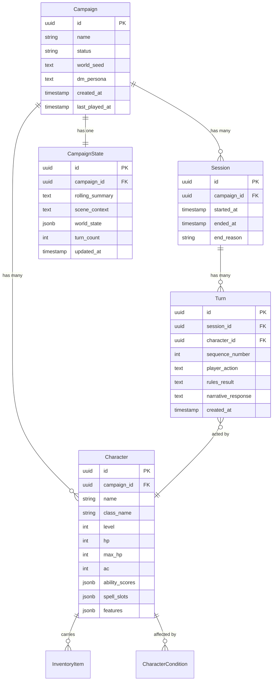
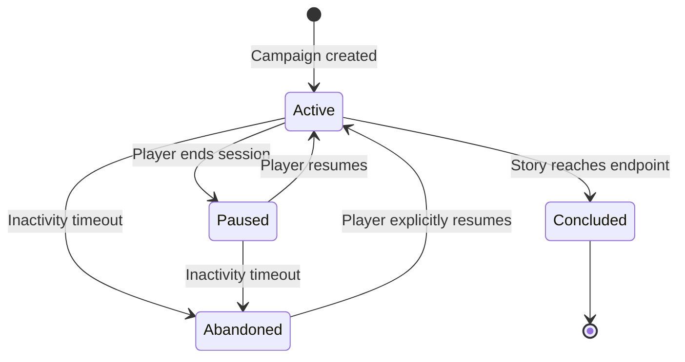

# ADR-0004: Campaign and Session Lifecycle

- **Status**: Accepted
- **Date**: 2026-04-03
- **Deciders**: [@t11z](https://github.com/t11z)
- **Scope**: Data model (`backend/tavern/models/`), Context Builder (`backend/tavern/dm/context_builder.py`), API layer, database schema

## Context

Tavern is designed for persistent, multi-session campaigns. A player starts a campaign on a Tuesday evening, plays for three hours, stops, and returns on Friday to continue exactly where they left off. The innkeeper is still named Marta, the stolen amulet is still in the rogue's pack, and the goblin camp is still two days' travel north.

This creates several architectural requirements that interact with each other:

**Session persistence**: The game state at the moment a player stops must be fully reconstructable when they return. "Fully" means: character state (HP, spell slots, conditions, inventory), campaign state (plot progress, NPC dispositions, world events), and narrative continuity (what happened recently enough that the DM should reference it). Claude has no memory between API calls — everything it needs must be injected via the state snapshot (ADR-0002). If the snapshot cannot be reconstructed from persisted data, the campaign is effectively lost.

**Multi-campaign support**: A single Tavern instance should host multiple independent campaigns. A household might run a solo campaign and a weekend group campaign on the same server. A community server might host dozens. Campaigns must be fully isolated — a state change in Campaign A must never leak into Campaign B, not in the database, not in the API, not in the narrative context.

**Session boundaries**: Players need to stop and resume without data loss. The system must handle both clean exits ("I'm done for tonight") and unclean exits (client disconnects, network lost, server restarted). In all cases, the last consistent state must be recoverable.

**Campaign lifecycle**: Campaigns are created, played, paused, resumed, and eventually concluded or abandoned. The system must track where each campaign is in this lifecycle and handle each state correctly — a concluded campaign should be readable (review past adventures) but not writable (no new turns).

## Decision

### 1. Data model

The core entities and their relationships:

**Key design decisions in the model:**

**`CampaignState` as a separate entity**: The campaign's mutable narrative state — rolling summary, current scene, world state (NPC dispositions, quest progress, time of day, weather) — is stored in a dedicated table, not spread across the campaign or session records. This makes snapshot reconstruction a single query: load `CampaignState` + `Character`s for the campaign, and the Context Builder (ADR-0002) has everything it needs.

**`world_state` as JSONB**: The world state is semi-structured — NPC locations, quest flags, faction relationships, environmental conditions. These evolve unpredictably as the campaign progresses. A rigid relational schema would require migrations every time Claude introduces a new NPC or quest. JSONB provides flexibility for world data while keeping structured data (characters, turns) in proper relational tables.

**Every turn is persisted**: The `Turn` table stores every player action, rules result, and narrative response — the complete play-by-play. This serves three purposes: session replay (a player can review what happened), rolling summary reconstruction (if the summary is corrupted, it can be rebuilt from turns), and debugging (if the DM behaves unexpectedly, the full context is inspectable).

**`Session` tracks calendar sessions, not game sessions**: A `Session` represents one real-world play period — from when the player sits down to when they stop. It is not a game concept (like a "chapter" or "encounter"). Sessions are bookkeeping for the player's convenience ("last played 3 days ago") and for state recovery ("what was the last consistent state?").

### 2. Campaign lifecycle

**`Active`**: A session is in progress. The campaign accepts turns.

**`Paused`**: The player has ended a session (cleanly or uncleanly). The campaign state is fully persisted. No turns are accepted until the player resumes.

**`Concluded`**: The campaign has reached a narrative endpoint — the final boss is defeated, the quest is complete, or the player explicitly marks the campaign as finished. Concluded campaigns are read-only: the turn history and character sheets are accessible, but no new turns can be submitted. Conclusion is triggered by the player, not by Claude — Claude may suggest that the story has reached a natural endpoint, but the decision to conclude is always human.

**`Abandoned`**: A campaign that has been `Paused` for longer than a configurable inactivity period (default: 90 days). Abandoned campaigns are functionally identical to Paused — they can be resumed at any time by explicit player action. The distinction exists for housekeeping: abandoned campaigns can be excluded from dashboard listings and, on resource-constrained servers, their detailed turn history may be archived to cold storage.

**No deletion**: Campaigns are never deleted through the application. A player who wants to remove a campaign can do so via direct database access or an admin tool. The application does not provide a delete endpoint — accidental deletion of a 50-hour campaign is an unacceptable failure mode.

### 3. Session boundaries and state persistence

**Clean exit** (player explicitly ends session — via web UI, Discord command, or any other client):
1. The current `CampaignState` is already up to date (it is updated after every turn).
2. The `Session` record is closed: `ended_at` is set, `end_reason` is `"player_ended"`.
3. The campaign status transitions to `Paused`.

**Unclean exit** (client disconnects, network lost, server restart):
1. The `CampaignState` is still consistent — because it is updated after every turn, not at session end. The worst case is losing the *current* turn that was in progress when the connection dropped.
2. On the next server start or connection re-establishment, the system detects open sessions (no `ended_at`) and closes them: `end_reason` is `"connection_lost"`, `ended_at` is set to the `created_at` of the last turn in that session.
3. The campaign transitions to `Paused`.

**The critical invariant**: `CampaignState` is always consistent after every completed turn. There is no "save" action — the game autosaves on every turn. This means:
- The rolling summary is updated after every turn (compressed by Haiku per ADR-0002).
- Character state changes (HP, spell slots, conditions, inventory) are committed to the database as part of the turn resolution.
- Scene context updates (new location, NPC changes, time progression) are committed alongside the turn.

If any of these writes fail, the entire turn is rolled back — the player sees an error and can retry. A partially persisted turn is worse than a lost turn.

### 4. Session resumption

When a player resumes a paused campaign:

1. Load `CampaignState` (rolling summary, scene context, world state).
2. Load all `Character`s for the campaign (current state, not historical).
3. Construct the state snapshot per ADR-0002.
4. Add a **resumption context** to the current turn: "The party resumes their adventure. Last session ended [N days ago]. The party is currently [scene context summary]."
5. Claude receives this snapshot and narrates the resumption — a brief "Previously on..." recap followed by an invitation to act.

The resumption context is generated from persisted data, not from Claude's memory (which does not exist between sessions). The rolling summary and scene context provide enough information for Claude to narrate coherently without replaying the entire campaign history.

**Long gaps between sessions** (weeks or months): The rolling summary may be too compressed to capture all relevant plot threads. For campaigns with `last_played_at` more than 14 days ago, the resumption logic loads the last N turns (default: 20) from the `Turn` table and generates a more detailed recap summary before injecting it into the snapshot. This is a one-time Haiku call at session start — not a recurring cost.

### 5. Multi-campaign isolation

A single Tavern instance supports multiple concurrent campaigns. Isolation is enforced at every layer:

**Database**: Every query includes a `campaign_id` filter. There are no cross-campaign queries in the application code. SQLAlchemy query helpers enforce this — a `get_characters()` function always requires a `campaign_id` parameter, never returns characters across campaigns.

**API**: Every API endpoint that operates on campaign data includes the `campaign_id` in the URL path (`/api/campaigns/{campaign_id}/turns`). Middleware validates that the authenticated user has access to the requested campaign (ADR-0006). There is no "global" endpoint that exposes data from multiple campaigns (except a campaign list endpoint that returns only metadata — name, status, last played).

**Context Builder**: The state snapshot (ADR-0002) is assembled per campaign. The Context Builder loads state for exactly one campaign — it has no mechanism to access data from another campaign, even accidentally.

**WebSocket connections**: Each WebSocket connection is bound to a campaign ID at connection time. Messages are routed only within the campaign's connection pool. A message from Campaign A's WebSocket never reaches Campaign B's connections. This applies equally to web clients and the Discord bot — each client type connects to the same campaign-scoped WebSocket endpoint.

**No shared state between campaigns**: Campaigns do not share characters, NPCs, world state, or narrative history. If a player wants the same character in two campaigns, they create the character twice. This is a deliberate simplification — shared character rosters across campaigns introduce synchronisation complexity (what happens when the character levels up in Campaign A but not Campaign B?) that is not justified by the use case.

### 6. Concurrent sessions within a campaign

In multiplayer, multiple players are connected to the same campaign simultaneously — that is one session with multiple participants, not multiple sessions.

**Multiple simultaneous sessions in the same campaign are not supported.** If a campaign is `Active` (a session is in progress), another session cannot be started for the same campaign. This prevents state conflicts — two sessions writing to the same `CampaignState` would corrupt the rolling summary and character state.

If a player opens a second client connection to the same campaign (a second browser tab, or connecting via Discord while the web client is open), the second connection joins the existing session, it does not create a new one.

### 7. Player presence within a session

In multiplayer campaigns, individual players may join and leave independently of the session itself. A session continues as long as at least one player is connected.

**Character presence states:**

| State | Meaning |
|---|---|
| `present` | Player is connected (via any client). Character acts normally. |
| `absent` | Player has left mid-session. Character is narratively passive. |
| `offline` | Player has not joined this session (yet). |

When a player leaves mid-session:
1. Their character transitions to `absent`.
2. Claude is informed via the scene context: "[Character name] fades into the background" — the character travels with the party but does not act, speak, or take damage. They are narratively present but mechanically inert.
3. The character's state (HP, conditions, inventory, spell slots) is frozen at the moment of departure.

When an absent player returns (same session or a later session):
1. Their character transitions to `present`.
2. Claude is informed: "[Character name] rejoins the action."
3. The character's state is unfrozen — they resume with the HP, conditions, and spell slots they had when they left, not the party's current state.
4. The rolling summary provides enough context for the returning player's Claude narration to acknowledge what happened in their absence.

**Mechanically inert means:**
- The character is not a valid target for enemies (they are "in the background," not on the battlefield).
- The character does not participate in initiative order.
- The character's concentration spells end when they become absent.
- The character's inventory is not accessible to other players.

This is a simplification over realistic tabletop behaviour (where a DM might run an absent player's character as an NPC). The simplification exists because AI-controlled party members introduce complexity — Claude would need to make tactical decisions for the absent character, which blurs the boundary between narrator and rules authority (ADR-0001/ADR-0002). If the community requests AI-controlled absent characters, that is a feature addition, not a core architecture change.

## Rationale

**CampaignState as a separate entity over embedded state**: Embedding mutable state in the Campaign table would mix slowly-changing data (name, DM persona, world seed) with rapidly-changing data (rolling summary, scene context, turn count). Separating them keeps the Campaign table stable and the CampaignState table optimised for frequent updates.

**JSONB for world state over relational modelling**: NPC relationships, quest progress, and environmental conditions are inherently dynamic — Claude may introduce a new NPC at any time, create a new quest, or change the weather. A relational model for world state would require schema migrations every time the narrative introduces something new. JSONB accommodates this flexibility. The trade-off is weaker query capabilities for world state — but world state is only ever loaded in full (for the snapshot), never queried selectively.

**Per-turn persistence over end-of-session save**: End-of-session persistence assumes clean exits. Real users close browser tabs, lose network connections, kill apps, and restart servers. Per-turn persistence guarantees that at most one turn is lost in any failure scenario, at the cost of one additional database write per turn (negligible given turn frequency of ~1 per minute).

**No campaign deletion over soft delete**: Soft delete (a `deleted_at` flag) is the usual compromise. For Tavern, even soft delete is risky — a misclick that marks a 50-hour campaign as deleted, even reversibly, is a bad user experience. The application simply does not offer the action. Users who want to clean up can use direct database access, which is an intentional action, not an accidental one.

**No cross-campaign character sharing over shared rosters**: Shared characters create a synchronisation problem that adds complexity disproportionate to its value. Most tabletop RPG players expect characters to be campaign-specific — a Level 5 fighter in one campaign and a Level 12 wizard in another are not the same entity. The simplification aligns with user expectations.

## Alternatives Considered

**Event-sourced campaign state**: Store every state change as an immutable event and reconstruct current state by replaying events. Rejected — event sourcing provides perfect auditability and temporal queries, but the implementation complexity (event store, projection logic, snapshot optimisation) is disproportionate to the use case. Tavern's audit needs are served by the Turn table (full play-by-play), and current state reconstruction from a single `CampaignState` row is simpler and faster.

**File-based campaign persistence (JSON export/import)**: Save campaign state as a JSON file that players can download and re-import. Considered as a supplementary feature, not a primary persistence mechanism — JSON export is useful for backups and server migration, but it cannot handle unclean exits and does not support multiplayer. May be added as a convenience feature later without architectural impact.

**Campaign templates (pre-built campaigns)**: Pre-authored campaign structures that guide Claude's narrative. Deferred — V1 relies on Claude's ability to generate campaigns dynamically. Pre-built templates are a content feature, not an architecture decision, and can be added as `world_seed` presets without schema changes.

**Shared character roster across campaigns**: A global character pool that campaigns draw from. Rejected — synchronisation complexity (level discrepancies, inventory conflicts, condition state) outweighs the convenience. Campaign-scoped characters are simpler and match tabletop conventions.

**Campaign archival to cold storage**: Move old campaign data to a separate, cheaper storage layer (S3, compressed files). Deferred — at the expected scale (dozens of campaigns per instance, not thousands), PostgreSQL handles the data volume without issue. If self-hosted instances on constrained hardware report storage pressure, archival can be added as an optional maintenance operation.

## Consequences

### What becomes easier
- Players can stop and resume without any explicit "save" action. Every turn is persisted automatically. The worst-case data loss is one turn in progress during an unclean exit.
- Multiple campaigns run on the same instance without interference. A household can host a solo campaign and a group campaign on the same server.
- Campaign history is fully inspectable — every turn, every dice roll, every narrative response is stored. Players can review past sessions, and contributors can debug DM behaviour against the full context.
- Session resumption works even after weeks of inactivity — the persisted state and turn history provide enough context for Claude to narrate a coherent recap.
- The lifecycle model is client-agnostic — web clients, Discord bots, and future clients all interact with the same session and campaign state.

### What becomes harder
- Every turn requires a database transaction that updates multiple tables (Turn, CampaignState, Character). This must be atomic — partial updates corrupt the campaign state. The transaction logic must be carefully implemented and tested.
- The `CampaignState.world_state` JSONB field is schema-less. There is no validation on its structure beyond what the Context Builder expects. If Claude produces world state updates that don't match the expected format, the error surfaces at snapshot assembly time, not at write time.
- Rolling summary quality degrades over very long campaigns (100+ sessions). The summary is lossy by design — details from early sessions are compressed away. For long campaigns, the recap on resumption may miss plot threads that were important but not recent.

### New constraints
- Every function that modifies campaign state must operate within a database transaction that includes the Turn record, CampaignState update, and all Character state changes. Partial writes are not acceptable.
- The `campaign_id` filter must be present in every database query that touches campaign-scoped data. This is enforced by code review and by structuring query helpers to require the parameter.
- WebSocket connections must be scoped to a single campaign. The connection handler must validate campaign access at connection time, not per message. This applies to all client types.
- Campaign status transitions must follow the state machine defined above. An `Active` campaign cannot transition directly to `Concluded` without the player's explicit decision — Claude cannot conclude a campaign unilaterally.

## Review Trigger

- If self-hosted instances report database storage pressure from turn history accumulation, evaluate turn archival or compression strategies (e.g., aggregate old turns into session summaries and discard individual turn records).
- If multiplayer campaigns with 6+ players create write contention on `CampaignState`, evaluate per-character state separation (each player's state in its own row) rather than a single campaign-level state row.
- If campaign resumption quality is consistently poor after gaps of 30+ days, evaluate storing a richer resumption context (key plot points, major NPC relationships, unresolved quests) alongside the rolling summary.
- If the community requests cross-campaign character portability, evaluate a character export/import mechanism (JSON-based, player-initiated) rather than a shared roster — this preserves campaign isolation while enabling the use case.
- If campaign count per instance exceeds 100 and list/query performance degrades, evaluate database indexing strategy and consider pagination for campaign listing endpoints.