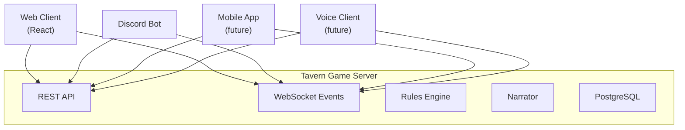
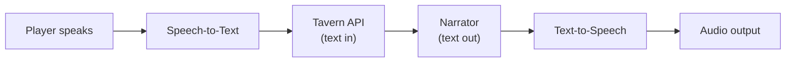

# ADR-0005: Client Architecture

- **Status**: Accepted
- **Date**: 2026-04-03
- **Deciders**: [@t11z](https://github.com/t11z)
- **Scope**: API design (`backend/tavern/api/`), WebSocket event model, client-server contract, frontend architecture

## Context

Tavern is a headless game server. The product is the API — a client-agnostic protocol for playing persistent, LLM-narrated RPG campaigns. How a player experiences the game depends on their client: a web browser at a desk, a smartphone at a kitchen table, a Discord bot in a voice channel, or a voice client on a smart speaker.

Two play scenarios define the design requirements:

**The table**: A group sits around a table. A laptop or TV at the head shows the shared game view — narration, battle status, party overview. Each player holds a smartphone, sees their personal character sheet, and submits actions by typing or speaking. A speaker plays Claude's narration aloud. Everyone is physically together, but each player has a personal device.

**The Discord session**: Five friends in different cities join a Discord voice channel. A Tavern bot sits in the channel. Players speak their actions or type them in the text channel. Claude narrates back through voice in the channel and text in the chat. The character sheets are accessible via slash commands or embeds. No web browser is needed.

Both scenarios are first-class play experiences, not edge cases. The architecture must support them equally, which means the server cannot privilege any single client. A web-first server that returns HTML or assumes browser capabilities makes every non-browser client a second-class citizen. A headless server that returns structured data lets each client present the game in whatever way suits its medium.

The platform play compounds over time: the web client is maintained by the core team. The Discord bot is maintained by the core team. A native mobile app can follow. A voice-only client becomes possible. Each new client expands the player base without requiring server-side changes — because the server speaks a universal protocol, not a web-specific one.

## Decision

### 1. Headless game server architecture

Tavern's backend is a **headless game server**. It exposes a client-agnostic API that any client can consume. The server has no knowledge of how the client renders the game — it does not produce HTML, does not assume a visual interface, and does not embed presentation logic.



The server exposes two communication channels:

**REST API** — For request-response operations: creating campaigns, submitting turns, managing characters, retrieving campaign state. Every action that has a clear request and response is REST.

**WebSocket** — For real-time events: narrative responses (streamed token by token), turn notifications in multiplayer, player presence changes, character state updates. Every event that other connected clients need to see in real-time is WebSocket.

### 2. Client-agnostic API design principles

The API follows these principles to ensure any client can consume it:

**Structured data, not formatted text.** API responses return structured objects, not pre-formatted strings. A narrative response is:

```json
{
  "turn_id": "uuid",
  "narrative": "The goblin snarls and lunges...",
  "mechanical_results": [
    {"type": "damage", "target": "Goblin A", "amount": 14, "damage_type": "slashing"},
    {"type": "condition_removed", "target": "Goblin A", "condition": "alive"}
  ],
  "character_updates": [
    {"character_id": "uuid", "field": "hp", "old_value": 38, "new_value": 38}
  ],
  "scene_updates": {
    "threats_removed": ["Goblin A"],
    "environment_change": null
  }
}
```

The web client renders this as styled HTML. The Discord bot posts the narrative as a message and the mechanical results as an embed. A voice client speaks the narrative and ignores the mechanical details. Each client decides how to present the same data.

**No HTML, no Markdown assumptions.** The `narrative` field is plain text. No HTML tags, no Markdown formatting, no emoji. Clients that want formatting apply it themselves. This prevents the server from making presentation decisions that work in a browser but break in Discord or a TTS engine.

**Events, not polls.** State changes are pushed via WebSocket, not discovered by polling. When a player submits a turn, all connected clients for that campaign receive the narrative response, the mechanical results, and any character state updates as WebSocket events — simultaneously. The web client updates the chat. The Discord bot posts a message. No client needs to poll for changes.

**Streaming narrative.** Claude's narrative responses are streamed token by token. The WebSocket event model supports streaming — a `narrative_start` event followed by `narrative_chunk` events followed by `narrative_end`. Clients that support streaming (web, Discord) can show the text as it generates. Clients that do not (SMS, email, future push notifications) wait for `narrative_end` and use the complete text.

### 3. WebSocket event model

All real-time communication uses a structured event model over WebSocket. Every event has a type, a campaign scope, and a payload:

```json
{
  "event": "turn.narrative_chunk",
  "campaign_id": "uuid",
  "payload": {
    "turn_id": "uuid",
    "chunk": "The goblin snarls ",
    "sequence": 3
  }
}
```

**Event categories:**

| Category | Events | Purpose |
|---|---|---|
| `turn.*` | `submitted`, `rules_resolved`, `narrative_start`, `narrative_chunk`, `narrative_end` | Turn lifecycle |
| `player.*` | `joined`, `left`, `presence_changed` | Player presence in session |
| `character.*` | `updated`, `condition_added`, `condition_removed` | Character state changes |
| `campaign.*` | `session_started`, `session_ended`, `status_changed` | Campaign lifecycle |
| `system.*` | `error`, `reconnect` | Connection management |

Clients subscribe to events by connecting to the campaign's WebSocket endpoint. All events for a campaign are broadcast to all connected clients for that campaign. Clients filter for events they care about — the web client handles all events, a minimal notification client might only handle `turn.narrative_end`.

### 4. Reference clients

Tavern ships with two reference clients, both maintained by the core team:

**Web client (React)** — A client-side SPA served as static files by FastAPI. Provides the full visual experience: campaign management, character sheets, real-time chat, turn history. Supports two display modes:
- **Player mode** (smartphone/desktop): Personal character sheet, action input, chat view. Interactive.
- **Shared display mode** (laptop/TV at the table): Party overview, narration display, battle status. Read-only, optimised for readability at distance. Activated by URL parameter or session role.

These are not separate applications — they are the same React app in different modes.

**Discord bot** — Connects to the Tavern API and translates between the game server protocol and Discord's interaction model:

| Tavern concept | Discord equivalent |
|---|---|
| Campaign | Discord channel (text) + voice channel |
| Turn submission | Message in text channel or voice input |
| Narrative response | Bot message in text channel + TTS in voice channel |
| Character sheet | Embed or slash command response |
| Player presence | Voice channel membership |
| DM voice | TTS or pre-rendered audio in voice channel |

The Discord bot is a separate deployable — it runs alongside the Tavern server, connects to both the Tavern API and the Discord API. It is optional: a Tavern instance works without it.

**Future clients** (not built in V1 but architecturally supported):
- Native mobile app (iOS/Android) — consumes the same API
- Voice-only client — Speech-to-Text for input, Text-to-Speech for output, minimal or no visual interface
- CLI client — for the determined minimalist

### 5. Voice as an input/output channel

Voice is not a separate architecture — it is an I/O transformation layer that sits in front of the same API:



**Speech-to-Text** options (client-side decision, not server-side):
- Browser Web Speech API (free, decent quality, Chrome-only)
- Whisper API (high quality, API cost per minute of audio)
- Local Whisper model (free, requires compute, higher latency)

**Text-to-Speech** options (client-side decision, not server-side):
- Browser SpeechSynthesis API (free, robotic quality)
- ElevenLabs or similar (high quality, API cost per character)
- Local TTS model (free, variable quality)

The server does not perform STT or TTS. The client receives text and decides whether to display it, speak it, or both. This keeps the server simple and lets each client optimise for its own capabilities and cost constraints.

In the Discord context, the Discord bot handles voice: it listens in the voice channel (Discord's audio stream → STT → text action → Tavern API → narrative text → TTS → Discord audio stream). The Tavern server never touches audio.

### 6. The table scenario

The "laptop at the game table" scenario is a specific multi-device configuration:

**Shared display** (laptop/TV): Runs the web client in shared display mode showing the current narration, battle map (future), and party status. No input controls. Optimised for readability at distance.

**Player devices** (smartphones): Each player opens the web client on their phone, authenticates (QR code scan or short join code — see ADR-0006), and sees their personal character sheet and action input. Each phone is bound to one character.

**Voice** (optional): A microphone at the table captures player speech, a Bluetooth speaker outputs Claude's narration. This can be the laptop's mic/speaker, a dedicated device, or the Discord voice channel if the group prefers Discord audio routing even when physically together.

## Rationale

**Headless server over web-first architecture**: A web-first architecture (server renders HTML, API is an afterthought) makes every non-browser client a second-class citizen. A headless server treats all clients equally. The additional cost is discipline: the API must be self-sufficient, the server cannot take shortcuts by assuming browser capabilities. This cost is paid once; the flexibility compounds with every new client.

**Structured responses over formatted text**: Returning pre-formatted text (Markdown, HTML) couples the server to presentation assumptions. Structured responses let each client present data appropriately — a web client renders styled HTML, a Discord bot uses embeds, a voice client reads plain text. The narrative is always plain text because it must work in all contexts.

**WebSocket events over polling**: Real-time multiplayer requires push semantics. Polling introduces latency (how often to poll?), wasted requests (most polls return nothing), and complexity (client-side diffing to detect changes). WebSocket events are immediate, efficient, and naturally model the "something happened in the game" pattern.

**Streaming narrative over complete responses**: Claude's narrative responses take 2-5 seconds. Waiting for the complete response before displaying anything feels sluggish. Streaming token by token creates a natural "the DM is speaking" experience — especially important for voice output, where the TTS can start speaking before Claude finishes generating.

**Discord bot as core client over community extension**: Discord is where tabletop RPG communities already live. Treating the Discord bot as a community afterthought means the most natural play environment gets the worst integration. Maintaining it as a core client ensures quality and signals that Tavern takes the Discord experience seriously.

**Server-side text, client-side audio over server-side TTS**: Centralising TTS on the server would add latency, cost (TTS API calls per narrative response), and a hard dependency on a TTS provider. Client-side TTS lets each deployment choose its own quality/cost trade-off — free browser TTS for casual play, premium ElevenLabs for immersive sessions.

## Alternatives Considered

**Web-first with API as secondary interface**: Build the React app first, extract an API later when other clients are needed. Rejected — "extract an API later" is a euphemism for "rewrite the backend later." APIs designed after the fact inherit the web frontend's assumptions and are painful for non-browser clients. Designing API-first costs nothing extra upfront and prevents a rewrite.

**GraphQL over REST + WebSocket**: GraphQL would allow clients to request exactly the data they need, reducing over-fetching. Rejected — the game server's data model is not complex enough to justify GraphQL's tooling overhead (schema definition, resolver implementation, client-side query management). The API has a manageable number of endpoints with predictable response shapes. REST is simpler and sufficient. If the API grows beyond ~30 endpoints with highly variable response needs, reconsider.

**Server-Sent Events (SSE) over WebSocket**: SSE is simpler than WebSocket for server-to-client streaming. Rejected — SSE is unidirectional (server to client only). Multiplayer requires bidirectional communication: clients send actions, the server sends events. WebSocket supports both directions on a single connection.

**gRPC over REST**: gRPC provides streaming, type safety, and efficient binary serialization. Rejected — gRPC is not natively supported in browsers (requires grpc-web proxy), which would complicate the web client. The performance benefits of binary serialization are irrelevant at Tavern's data volumes (kilobytes per request, not megabytes). REST is universally supported across all potential client platforms.

**Embedded TTS/STT on the server**: The server performs speech-to-text on audio input and text-to-speech on narrative output. Rejected — this centralises audio processing cost and latency on the server, creates a hard dependency on a specific TTS/STT provider, and prevents clients from choosing their own quality/cost trade-off. Voice is a client concern.

**Single monolithic client (web only, no headless)**: Build only the web app, add other clients later "if needed." Rejected — this is the path that makes every future client a painful retrofit. The headless architecture costs almost nothing extra (structured JSON responses instead of HTML-coupled responses) and enables the full product vision from day one.

## Consequences

### What becomes easier
- New clients can be built without server changes. A mobile app, a CLI client, a voice interface — all consume the same API. The community can build clients the core team never anticipated.
- The table scenario (shared display + smartphones) works with the existing web client in different modes, not with a separate application.
- Voice input and output are client-side decisions. Different deployments can use different TTS/STT solutions based on their quality and cost preferences, without server changes.
- API documentation (auto-generated by FastAPI's OpenAPI) serves as the contract for all client developers. There is no undocumented web-only interface.
- The Discord bot consumes the exact same API as the web client. No special server-side handling, no bot-specific endpoints.

### What becomes harder
- The API must be rigorously client-agnostic. Every endpoint, every response, every event must make sense without assuming a browser. This requires discipline in code review — it is easy to slip a browser-assumption into a response format.
- The Discord bot is a meaningful maintenance commitment. It must handle Discord API changes, rate limits, voice channel management, and the translation between Discord's interaction model and Tavern's game model. This is not a weekend project.
- Streaming narrative over WebSocket adds complexity compared to simple request-response. The client must handle partial state (narrative in progress), connection drops mid-stream, and out-of-order chunks.
- The web client cannot take shortcuts that are unavailable to other clients. If a feature requires data that is not in the API, the API must be extended — the web client cannot query the database directly or use server-side rendering as a workaround.

### New constraints
- Every piece of game data that a client might need must be available through the REST API or WebSocket events. There is no server-rendered HTML, no template engine, no SSR. The server produces JSON, the client produces UI.
- Narrative text must be plain text — no Markdown, no HTML, no formatting assumptions. Clients that want formatting apply it themselves.
- WebSocket events must be self-contained — a client that misses an event must be able to recover by fetching the current state via REST. Events are notifications, not the source of truth.
- The web client must function as both a full interactive client (player view on phone) and a passive display client (shared screen at the table). These are modes of the same application, not separate builds.
- Audio processing (STT/TTS) must never be a server-side dependency. Clients handle their own audio. The server's input is text, the server's output is text.

## Review Trigger

- If the Discord bot's maintenance burden exceeds the core team's capacity, evaluate whether it should transition to a community-maintained project with clear API stability guarantees.
- If more than 3 distinct clients are actively maintained and the WebSocket event model becomes a coordination bottleneck, evaluate a formal event schema versioning strategy (similar to API versioning).
- If the table scenario reveals that the responsive web client is insufficient for the shared display (too small text, wrong layout, missing features), evaluate a dedicated display-mode client rather than stretching the responsive design further.
- If voice quality expectations from players consistently require server-side TTS (for consistent DM voice across clients), re-evaluate the client-side-only audio constraint — but only if a cost-effective, self-hostable TTS solution exists.
- If the API grows beyond 30 endpoints and clients complain about over-fetching or under-fetching, evaluate GraphQL or a BFF (Backend for Frontend) pattern for specific client needs.