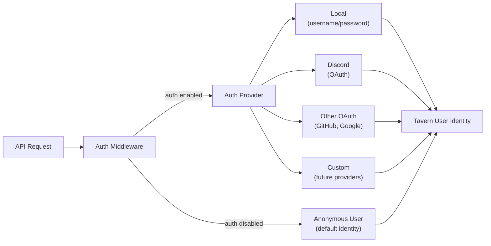

# ADR-0006: Authentication and Authorization

- **Status**: Accepted
- **Date**: 2026-04-03
- **Deciders**: [@t11z](https://github.com/t11z)
- **Scope**: `backend/tavern/auth/`, API middleware, Campaign access control, deployment configuration

## Context

Tavern is a headless game server (ADR-0005) consumed by multiple client types — a web application and a Discord bot in V1, with mobile and voice clients anticipated. These clients operate in different trust environments, which creates different authentication requirements:

**Solo / household**: One player on a laptop, or a family sharing a server on the local network. Everyone who can reach the port is trusted. Authentication is unnecessary friction — the player wants to `docker compose up` and play, not create an account on their own machine.

**Friend group at a table**: 4-6 players, each with a smartphone, connected to a shared Tavern instance. Each player needs to be associated with their character, but the group trusts each other. Onboarding must be frictionless — a QR code scan or a short join code, not a registration form.

**Friend group on Discord**: The same group, but remote. Players are already authenticated through Discord. Their Discord identity should be their Tavern identity — no separate account, no separate password. The Discord bot maps Discord users to Tavern users transparently.

**Multi-group server**: Multiple independent groups on a shared instance. Groups must not see or interfere with each other's campaigns. This requires real user accounts, campaign-scoped access control, and the guarantee that one group's data is invisible to another.

These scenarios require different levels of authentication — from none to full identity management. A system that forces account creation on a solo player is over-engineered. A system that cannot support multi-group isolation is under-engineered. The architecture must support the full range without requiring a different codebase for each scenario.

## Decision

### 1. Authentication is optional and adapter-based

Authentication is controlled by a configuration flag. When disabled (the default for self-hosted deployments), the API accepts all requests without identity verification. When enabled, the API requires a valid identity token on every request.

The authentication layer uses a **provider abstraction** — a pluggable adapter that translates external identity into a Tavern user identity:



**When auth is disabled**: All requests are attributed to a single default user. All campaigns are visible and accessible. This is the zero-friction path for solo play and trusted groups.

**When auth is enabled**: Each request must carry a valid session token or OAuth bearer token. The auth middleware resolves it to a Tavern user identity before the request reaches the API handler. Unauthenticated requests receive a 401.

The provider interface is minimal:

```python
class AuthProvider(Protocol):
    async def authenticate(self, request: Request) -> UserIdentity | None: ...
    async def get_user(self, user_id: uuid.UUID) -> User | None: ...
```

Two methods. Adding a new provider (LDAP, SAML, a custom SSO) means implementing this interface. No framework lock-in, no auth library dependency in the core application.

**V1 ships with three providers:**
- **Anonymous** (auth disabled): Single default user, zero friction.
- **Local**: Username/password, for self-hosted instances that want user separation without external dependencies.
- **Discord OAuth**: For groups that play via Discord. The player's Discord identity becomes their Tavern identity. This is the natural onboarding path for the Discord bot client (ADR-0005) — players who interact through Discord never need to create a separate Tavern account.

### 2. User model

The user model is deliberately simple:

| Field | Type | Purpose |
|---|---|---|
| `id` | UUID | Primary key, referenced by all user-scoped data |
| `display_name` | string | Shown to other players in multiplayer |
| `auth_provider` | string | Which provider created this user ("local", "discord", "anonymous") |
| `external_id` | string, nullable | Provider-specific identifier (OAuth subject ID, local username) |
| `created_at` | timestamp | Account creation |
| `last_seen_at` | timestamp | Last API request |

The user model does not contain email addresses, password hashes, or profile data. These are provider concerns:
- **Local provider**: Stores password hashes in a separate `local_credentials` table. The user model itself is auth-mechanism-agnostic.
- **Discord provider**: Stores only the Discord user ID as `external_id`. Display name is synced from Discord at login time.
- **Other OAuth providers**: Store only the external subject ID. Profile data (email, avatar) is fetched from the provider at login time, not persisted.
- **Anonymous provider** (auth disabled): Creates a single user record with `auth_provider = "anonymous"` on first startup. All requests are attributed to this user.

### 3. Authorization: campaign-scoped access control

Authorization is separate from authentication. Authentication answers "who are you?" Authorization answers "can you access this campaign?"

The access model is simple: a **campaign membership** table associates users with campaigns and defines their role:

| Field | Type | Purpose |
|---|---|---|
| `campaign_id` | UUID FK | Which campaign |
| `user_id` | UUID FK | Which user |
| `role` | string | "owner" or "player" |
| `joined_at` | timestamp | When the user joined |

**Roles:**

**Owner**: The user who created the campaign. Can invite players, remove players, configure campaign parameters, end the campaign. One owner per campaign. Ownership is not transferable in V1 — this is a simplification that avoids complexity around ownership disputes.

**Player**: A participant in the campaign. Can submit actions for their character(s), view the campaign state, view the turn history. Cannot modify campaign configuration or remove other players.

**Access enforcement:**

Every API endpoint that touches campaign data checks membership. The middleware resolves the user identity, the API handler verifies that the user is a member of the requested campaign with sufficient role. Non-members receive a 403.

When auth is disabled, this check is skipped — the anonymous user is implicitly a member of all campaigns with owner role.

### 4. Campaign invitations

In multiplayer, the campaign owner must invite other players. Two onboarding paths are supported, matching the two primary play scenarios:

**At the table (QR code / join code)**: The owner generates a short-lived join code or QR code from the web client. Players scan the code on their smartphone, which opens the web client and associates their device with a character in the campaign. If auth is enabled, this triggers account creation (local) or OAuth login (Discord). If auth is disabled, each device gets a temporary session identity.

**On Discord**: The campaign owner links a Discord channel to a campaign via the bot. Players who are in the Discord channel are automatically eligible to join the campaign. The bot handles identity mapping — Discord user ID → Tavern user. No separate invitation flow needed.

No friend lists, no player search, no social features. Tavern is a game engine, not a social platform. Players coordinate invitations through whatever channel they already use — Discord, Signal, email, shouting across the room at the game table.

### 5. API key management

The Anthropic API key is a server-level configuration, not a per-user configuration. All players on a Tavern instance share the same API key — the server operator provides it.

This is a deliberate decision: asking each player to bring their own API key would reduce server operator costs but create an onboarding barrier for multiplayer ("everyone needs to sign up at Anthropic before we can play"). The server operator bears the API cost. In the solo case, the operator and the player are the same person.

The API key is stored as an environment variable (`ANTHROPIC_API_KEY`), never in the database, never exposed through the API, never visible in any client.

### 6. Session management

Authenticated users receive a session token after successful login. The token is:
- A signed JWT with the user ID, issued-at time, and expiration (default: 7 days).
- Stored client-side (httpOnly cookie for the web client, in-memory for the Discord bot).
- Validated by the auth middleware on every request.
- Stateless — no server-side session store. The JWT is self-contained. Revocation is not supported in V1; if a token must be invalidated, the user's `id` is added to a short deny list that is checked at middleware level.

Stateless sessions keep the deployment simple — no Redis, no session table, no shared state between potential future application replicas.

## Rationale

**Optional auth over mandatory auth**: A solo player on localhost should not create an account on their own machine. Mandatory auth optimises for the multi-group case at the expense of the solo case, which is the primary deployment scenario. Optional auth serves both — the zero-friction default for self-hosted, the secure path for shared instances.

**Provider abstraction over a single auth mechanism**: Different deployment scenarios require different identity sources. A local gaming group uses local accounts. A Discord-based community uses Discord OAuth. An institutional deployment might require SAML. The abstraction cost is one interface with two methods — trivial relative to the flexibility it provides.

**Discord OAuth as a first-class provider**: Discord is where tabletop RPG communities live. The Discord bot is a core client (ADR-0005). If the bot is first-class, its authentication path must be first-class — players who play via Discord should never encounter a separate Tavern registration flow.

**Minimal user model over a rich profile**: Tavern is not a social platform. The user model exists to associate actions with identities and to scope campaign access. Storing email, avatar, bio, or preferences in the user model would create data protection obligations (GDPR), increase the attack surface, and add features that are not part of the game experience.

**Campaign membership over global roles**: A global "admin" role that can access all campaigns would simplify management but violate the principle that campaigns are isolated units (ADR-0004). Campaign-scoped roles ensure that access is granted per campaign, not per server. Server administration (starting/stopping the instance, managing the API key) is an operational concern handled through infrastructure access, not through the application.

**Server-level API key over per-user keys**: Per-user API keys would distribute costs but create friction for multiplayer onboarding. The target experience is "join a campaign and play," not "sign up at Anthropic, create an API key, configure it in your profile, then join a campaign." The server operator accepts the API cost as part of hosting — analogous to a DM buying the adventure module.

**Stateless JWT over server-side sessions**: Server-side sessions require a session store (database table or Redis) that must be available on every request. For a self-hosted application that might run on a Raspberry Pi, eliminating this dependency is meaningful. The trade-off is limited revocation capability — acceptable for a gaming application where token theft is not a primary threat model.

## Alternatives Considered

**Mandatory authentication for all deployments**: Every user must create an account, even solo players. Rejected — this optimises for the minority case (multi-group servers) at the expense of the majority case (solo/household). The friction of account creation before playing a single-player game is disproportionate.

**Per-user API keys**: Each player provides their own Anthropic API key. Rejected for the default configuration — the onboarding friction for multiplayer is too high. However, the architecture does not prevent this as a future option: a per-user API key field could be added to the user model, and the narrator could prefer the user's key over the server key if present. This would be a feature addition, not an architecture change.

**OAuth only (no local provider)**: Require an external OAuth provider, no local accounts. Rejected — this creates a hard dependency on an external service for a self-hosted application. A Tavern instance behind a corporate firewall or on an air-gapped network must be able to function without internet access (beyond the LLM API). Local accounts ensure this.

**Role-based access control (RBAC) with granular permissions**: Fine-grained permissions (can_edit_character, can_view_map, can_manage_npcs). Rejected — the complexity is disproportionate to the use case. D&D campaigns have two natural roles: the person who runs the game (owner) and the people who play (players). Adding granular permissions solves a problem that does not exist in tabletop RPG group dynamics.

**Passkeys / WebAuthn**: Modern passwordless authentication. Deferred — the technology is excellent but browser support and user familiarity are still uneven. Local username/password is universally understood. Passkey support can be added as an additional local provider option without changing the auth architecture.

## Consequences

### What becomes easier
- Solo players and trusted groups deploy with zero auth configuration. No accounts, no passwords, no friction.
- Adding a new identity provider is implementing a two-method interface. LDAP for an institutional deployment, Google OAuth for a specific community — all plug in without touching the core application.
- Discord players authenticate through Discord. No separate Tavern account, no separate password. The bot handles identity mapping transparently.
- Campaign isolation is enforced at the data model level. Even if the auth layer has a bug, campaigns are still scoped by membership — there is no API endpoint that returns cross-campaign data.
- The server operator controls the API key centrally. Players do not need Anthropic accounts to play.

### What becomes harder
- The optional auth pattern means the application must work correctly in two modes — authenticated and unauthenticated. Every API handler must behave sensibly in both cases. This is a testing burden: every endpoint needs tests with and without auth enabled.
- Token revocation is limited in V1 (no server-side session store). If a JWT is compromised, the only remediation is adding the user ID to a deny list or waiting for expiration. Acceptable for a gaming application, but the limitation must be documented.
- Campaign ownership is not transferable. If the owner leaves, the campaign has no owner. This is a known limitation — transferability adds complexity (confirmation flow, abuse prevention) that is not justified until the need is demonstrated.
- Local provider password management (reset, complexity requirements, hashing algorithm) must be implemented and maintained. This is unglamorous but necessary work.

### New constraints
- Every API endpoint must pass through the auth middleware, even when auth is disabled. The middleware resolves to the anonymous user in that case — it does not skip. This ensures that user identity is always available downstream, regardless of auth configuration.
- The `user_id` field must be present on every user-scoped database record. When auth is disabled, all records reference the anonymous user's ID. This allows enabling auth later without migrating existing data — the anonymous user's campaigns simply become owned by whoever claims them.
- The API key must never appear in API responses, database records, or client code. It is an environment variable only.
- OAuth provider configuration (client ID, client secret, redirect URL) is deployment-specific. These are environment variables, not database configuration. Adding a new OAuth provider to a running instance requires a restart.

## Review Trigger

- If the community requests campaign ownership transfer, implement it as a feature addition (owner-initiated transfer with recipient confirmation). No architecture change needed — the membership table already supports role updates.
- If token revocation becomes a real concern (e.g., a hosted deployment with untrusted users), evaluate adding a server-side session store (database-backed, not Redis — keeping the single-database constraint from ADR-0003).
- If more than two roles are needed (e.g., "co-DM" or "spectator"), extend the role enum in the membership table. The access control logic must be updated but the model supports it.
- If a hosted multi-tenant deployment requires tenant-level isolation beyond campaign-scoped access (e.g., separate databases per tenant, tenant-specific configuration), evaluate whether the current model is sufficient or whether a dedicated multi-tenancy ADR is needed.