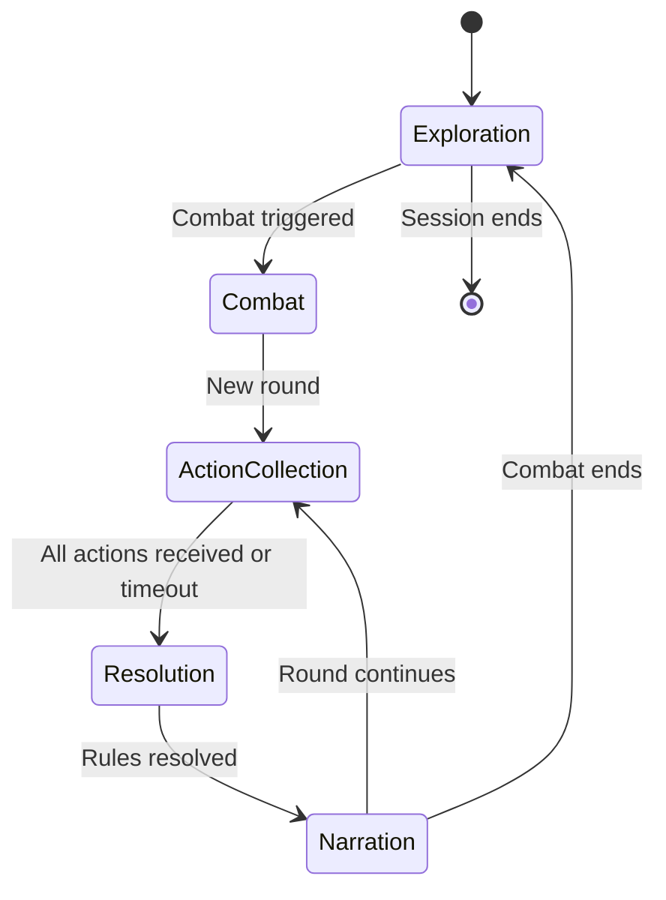
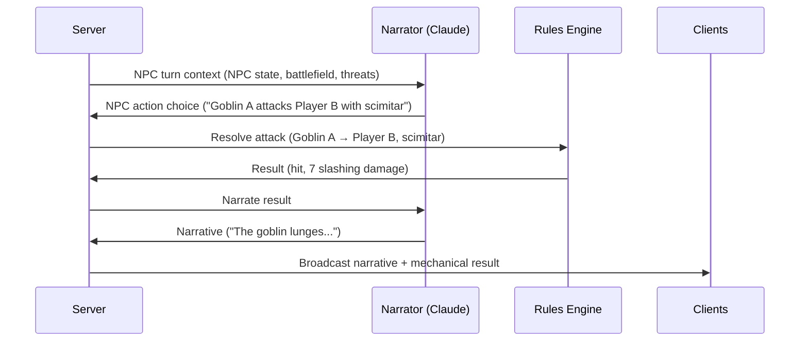
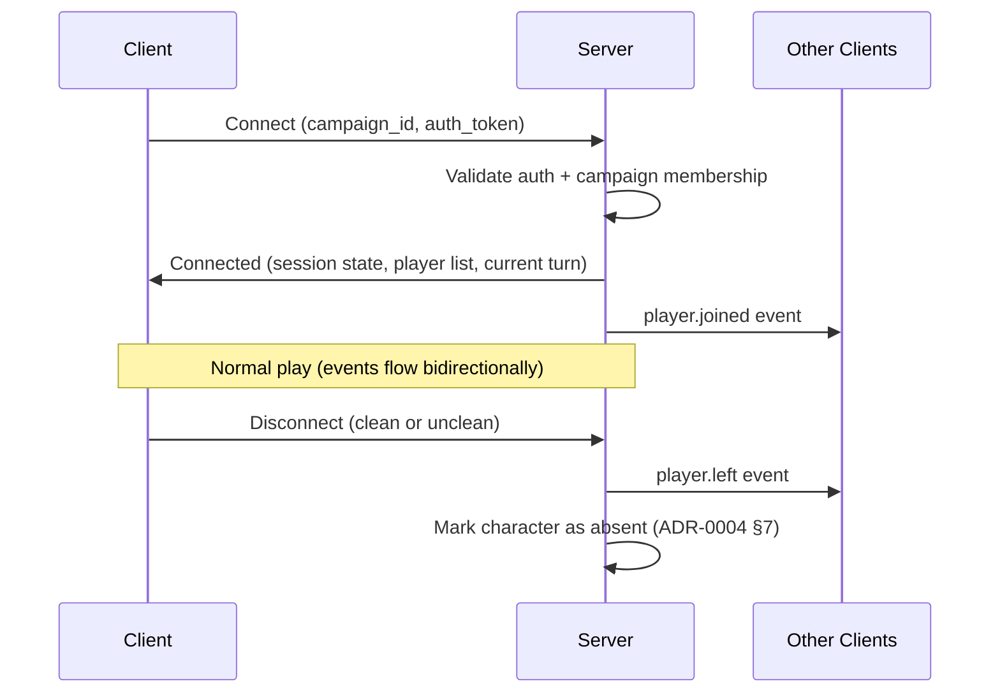

# ADR-0007: Multiplayer and Real-Time Communication

**Status**: Accepted
**Date**: 2026-04-03
**Deciders**: [@t11z](https://github.com/t11z)
**Scope**: `backend/tavern/api/` (WebSocket layer), `backend/tavern/multiplayer/` (session coordination), turn ordering, client synchronization

## Context

Tavern supports both solo and multiplayer campaigns (ADR-0004). Solo is architecturally simple: one player, one connection, strict request-response. Multiplayer introduces problems that do not exist in solo play:

**Concurrent input**: Four players sit at a table. Two of them type an action at the same time. Who goes first? What happens to the second action — is it queued, rejected, or processed in parallel? In a turn-based game, "at the same time" must resolve to a sequence.

**State synchronization**: When Player A attacks a goblin and kills it, Players B, C, and D must see that the goblin is dead before they submit their actions. If Player B is already typing "I attack the goblin" while A's attack is resolving, the UI must handle the stale state gracefully.

**Partial presence**: Players join and leave mid-session (ADR-0004, Section 7). The system must handle a turn that was started with 4 players but finishes with 3 because one disconnected. It must also handle a player reconnecting mid-turn and catching up on what happened.

**Narrative coherence**: Claude narrates for the group, not for individual players. When Player A attacks and Player B casts a spell in the same combat round, Claude should narrate both actions in a coherent scene — not as two isolated responses. This means the system must batch actions within a turn before sending them to the narrator.

**Client diversity**: Per ADR-0005, clients include web browsers, Discord bots, and potentially mobile apps. The real-time communication layer must work for all of them. A web client maintains a WebSocket. A Discord bot maintains a WebSocket to Tavern *and* a connection to Discord's API. The multiplayer protocol cannot assume browser-specific capabilities.

The central tension is between tabletop RPG conventions (informal, flexible, DM-mediated turn order) and software requirements (deterministic, serialized, conflict-free state transitions). A human DM handles concurrent player actions through social coordination — "hold on, let's resolve Alice's attack first." The system must replicate this coordination without a human mediator.

## Decision

### 1. Turn model: rounds and phases

Multiplayer combat and exploration use a structured turn model inspired by D&D's round-based initiative system, but adapted for asynchronous digital input:

**Exploration mode**: Free-form, one player at a time. Any player can submit an action. The action is resolved immediately (Rules Engine + Narrator) and the result is broadcast to all clients. There is no formal turn order — the game proceeds at conversation pace, similar to how a tabletop group explores a dungeon. If two players submit actions simultaneously, they are processed sequentially in arrival order.

**Combat mode**: Round-based with initiative order. When combat is triggered (by a player action, an NPC ambush, or a narrative event), the system transitions to combat mode:

1. **Initiative**: The Rules Engine rolls initiative for all participants (PCs and NPCs). The initiative order is broadcast to all clients.
2. **Action collection**: Each player, in initiative order, is prompted to submit their action. They have a configurable timeout (default: 120 seconds). Other players can see who is currently deciding.
3. **Resolution**: Once the active player submits their action (or the timeout expires — see below), the Rules Engine resolves it.
4. **Narration**: Claude narrates the result of the action.
5. **Next turn**: The next player in initiative order is prompted. NPC turns are handled by Claude (narrative decision) and the Rules Engine (mechanical resolution) without player input.
6. **Round end**: When all participants have acted, a new round begins at the top of the initiative order.

### 2. Action collection and conflict resolution

**In exploration mode**: Actions are processed in FIFO order. If Player A and Player B submit actions within the same 100ms window, the server processes whichever arrives first. The second action is queued and processed after the first completes (including narration). This is simple, deterministic, and mirrors the tabletop convention of "whoever speaks first goes first."

**In combat mode**: Only the active player (per initiative order) can submit an action. Actions from non-active players are rejected with a clear error ("It's not your turn. Current turn: [character name]"). This prevents race conditions entirely — there is exactly one valid action source at any time.

**Timeout handling**: If the active player does not submit an action within the timeout:
- The character takes the Dodge action (a safe default that requires no player decision).
- The system broadcasts a timeout notification to all clients.
- The turn advances to the next player in initiative order.
- The timed-out player can act normally on their next turn.

The Dodge default is a deliberate choice over "skip turn" — skipping a turn is mechanically punishing (the character does nothing and may be attacked without defense). Dodging is mechanically neutral (disadvantage on attacks against the character) and matches what a hesitating combatant would realistically do.

### 3. NPC turns in combat

NPCs act on their initiative count, between player turns. NPC decisions are made by Claude (which NPC attacks, which spell to cast, whether to flee) and resolved by the Rules Engine (attack rolls, damage, saves). This is the one exception to the strict "Claude does not decide mechanical outcomes" rule from ADR-0001 — Claude decides the NPC's *action choice*, the Rules Engine resolves the *action outcome*.

NPC action choices are constrained by the system prompt: NPCs act consistently with their intelligence, motivation, and tactical awareness as defined in the scene context. A goblin does not use optimal-play tactics. A dragon does not flee from a Level 1 party.

### 4. WebSocket connection management

Each client maintains one WebSocket connection per campaign session. The connection lifecycle:

**On connect**: The client receives the full current state — campaign status, all character states, the current scene context, the rolling summary, the initiative order (if in combat), and who is currently connected. This allows a joining or reconnecting client to render the current game state without replaying history.

**On disconnect**: Clean disconnects (player clicks "leave") and unclean disconnects (network loss, browser closed) are handled identically from the server's perspective. The character transitions to `absent` per ADR-0004 Section 7. Other clients are notified via a `player.left` event.

**Reconnection**: If a player reconnects to an active session, they receive the full current state (same as initial connect) plus a `missed_events` field containing events that occurred since their last seen event. This allows the client to show a "while you were away" summary. The `missed_events` buffer is limited (default: last 50 events or 10 minutes, whichever is smaller) — if the player was gone too long, they get only the current state.

### 5. Event ordering and consistency

All events within a campaign are assigned a monotonically increasing sequence number by the server. Clients use sequence numbers to detect missed events and request replay.

**Consistency guarantee**: The server processes actions serially per campaign. There is no parallel processing of actions within the same campaign. This is the simplest consistency model and is sufficient for the expected throughput (turns per minute, not per second). The PostgreSQL transaction per turn (ADR-0004) ensures that the database state and the event stream are always consistent.

**Cross-campaign independence**: Actions in Campaign A do not block actions in Campaign B. Each campaign has its own processing queue, its own WebSocket broadcast group, and its own sequence counter. A slow Claude response in one campaign does not affect another campaign on the same server.

### 6. The Discord multiplayer experience

In the Discord scenario, the Discord bot acts as a protocol bridge between Tavern's WebSocket events and Discord's interaction model:

| Tavern event | Discord action |
|---|---|
| `turn.narrative_end` | Post narrative as message in text channel |
| `turn.narrative_chunk` (streaming) | Edit message progressively, or post complete on `narrative_end` |
| `character.updated` | Update pinned character status embed |
| `player.joined` / `player.left` | Post join/leave message |
| Combat initiative prompt | Post embed with "Your turn" + action buttons or text prompt |
| Timeout warning | DM the active player |

**Player identification**: Discord users are mapped to Tavern users via Discord OAuth (ADR-0006). Each Discord user in the campaign's voice/text channel is associated with their character. The bot knows who is speaking and attributes actions to the correct character.

**Voice input in Discord**: The bot listens to the voice channel, performs STT (client-side, per ADR-0005), and submits the transcribed text as the player's action. The player can also type in the text channel. Both input methods produce the same API call.

**DM voice in Discord**: Claude's narrative response is converted to speech (TTS, client-side in the bot) and played in the voice channel. Players hear Claude as the DM. The text version is simultaneously posted in the text channel for reference.

**Turn management**: In combat, the bot posts "It's [character name]'s turn" in the text channel and optionally DMs the active player. The timeout applies as in the web client — if the player does not respond in time, the character Dodges.

## Rationale

**Serial processing per campaign over parallel action resolution**: Parallel resolution would allow multiple players' actions to process simultaneously, reducing latency in combat. Rejected — parallel resolution introduces race conditions (two players targeting the same enemy, the first kill invalidates the second attack), requires complex conflict resolution logic, and produces inconsistent state. Serial processing is simple, correct, and fast enough for turn-based gameplay.

**Initiative-based combat over free-form combat**: Free-form combat (anyone can act anytime) mirrors the chaos of real combat but creates an unplayable race condition in a digital environment — the fastest typist wins. Initiative order is the D&D standard, eliminates races, and gives every player equal opportunity to act.

**Dodge as timeout default over skip or AI control**: Skip penalises disconnected players unfairly. AI control for a timed-out player (Claude decides the action) blurs the player agency boundary. Dodge is mechanically neutral and narratively justifiable — the character hesitates.

**Full state on connect over event replay**: Sending all events since the session start would require maintaining a complete event log and force the client to reconstruct state locally. Sending the current state as a snapshot is simpler, faster, and consistent with the state snapshot model used for Claude (ADR-0002).

**Campaign-level serial processing over server-level locking**: A single global lock would block all campaigns when one campaign is processing. Per-campaign serialization ensures campaigns are independent — a slow Claude response in Campaign A does not block Campaign B.

## Alternatives Considered

**Simultaneous action declaration (everyone declares, then resolve)**: All players declare actions simultaneously, then the system resolves all actions at once and Claude narrates the combined result. Considered and kept as a potential future enhancement — this would produce more dynamic combat narration ("As Aldric swings his sword, Kira unleashes a fireball behind the goblin line"). However, it introduces declaration conflicts (two players target the same enemy, the first kill invalidates the second), requires a conflict resolution phase, and significantly complicates the Rules Engine (batch resolution vs. sequential resolution). Deferred to V2 if combat pacing feedback demands it.

**Player-elected turn order (no initiative roll)**: Players decide among themselves who goes next, like passing a talking stick. Rejected — this works at a physical table with social cues but creates coordination problems in a digital environment (who clicks first? what if no one acts? what about NPCs?). Initiative order provides a clear, fair, deterministic sequence.

**Optimistic concurrency (process actions, roll back conflicts)**: Accept all actions, process them optimistically, detect conflicts, and roll back the conflicting action. Rejected — rollbacks in a game with narrative output are impossible. You cannot un-narrate "Aldric kills the goblin" after Claude has already spoken it. Serial processing avoids conflicts entirely.

**WebRTC for peer-to-peer communication**: Clients communicate directly with each other for lower latency. Rejected — the server must be authoritative over game state. Peer-to-peer introduces state divergence, cheating vectors, and NAT traversal complexity. The server-centric model (all communication through the Tavern server) is simpler, more secure, and sufficient for the latency requirements of a turn-based game.

**Separate voice server**: Run a dedicated voice server (Janus, Mediasoup) alongside the Tavern server for voice communication between players. Rejected — Tavern is not a VoIP platform. Players already have voice communication through Discord, or through being in the same room. Building voice infrastructure is a massive scope expansion with no unique value. The voice features in Tavern (STT/TTS) are I/O transformations, not communication infrastructure.

## Consequences

### What becomes easier
- Multiplayer combat is deterministic and fair — initiative order eliminates race conditions, serial processing eliminates conflicts, timeouts prevent stalls.
- Reconnecting mid-session is seamless — the client receives the full current state and can render the game immediately without replaying history.
- The Discord experience maps naturally onto the turn model — initiative prompts become Discord messages, actions become text input, narration becomes bot messages and voice output.
- Adding new client types requires no changes to the multiplayer protocol — the WebSocket event model is the same for all clients.

### What becomes harder
- Combat pacing is limited by the slowest player. If one player consistently takes 90 seconds to decide, the other players wait. The timeout mitigates this but 120 seconds is still long. The timeout value must be tunable per campaign.
- NPC turns require Claude to make tactical decisions, which introduces latency (2-5 seconds per NPC action) that scales with the number of NPCs. A combat with 8 NPCs adds 16-40 seconds of NPC turns per round. Batching NPC actions (resolving all NPCs in one Claude call) could mitigate this but is not implemented in V1.
- The Discord bot must handle Discord's rate limits, API changes, and voice channel quirks. Discord is a moving target — API versions change, voice gateway behavior evolves, rate limits tighten. This is an ongoing maintenance burden.
- Exploration mode's FIFO ordering can feel unfair if one player consistently submits actions faster than others. This is a social problem, not a technical one — but the system could exacerbate it by rewarding speed.

### New constraints
- Actions within a campaign are processed serially. No parallel action processing, no optimistic concurrency. This is a performance ceiling that must be respected — if a campaign's action throughput exceeds one action per second sustained, the serial model may become a bottleneck. At the expected throughput of a tabletop RPG, this is not a concern.
- WebSocket events must include sequence numbers. Clients must handle missed events (via `missed_events` on reconnect or via REST state fetch). Events without sequence numbers are unorderable and will cause client-side state inconsistencies.
- The timeout default (Dodge) must be communicated clearly to players at the start of combat. A player who does not understand the timeout may be surprised when their character acts without their input.
- NPC action choices are a Claude responsibility. The system prompt must constrain NPC behavior to be consistent with their intelligence and motivation — otherwise Claude may play NPCs with player-level tactical optimization, which is unfun.

## Review Trigger

- If combat pacing complaints consistently cite the sequential turn model as too slow, evaluate simultaneous action declaration (the deferred batch resolution model).
- If NPC turn latency becomes disruptive (>30 seconds per round in combats with 6+ NPCs), evaluate batching all NPC actions into a single Claude call per round.
- If the exploration mode FIFO ordering creates consistent unfairness complaints, evaluate a round-robin prompting system for exploration (each player is prompted in sequence, similar to combat but without initiative).
- If WebSocket connection instability causes frequent reconnections and the `missed_events` buffer proves insufficient, evaluate a persistent event log per campaign (stored in PostgreSQL) with client-side replay.
- If the Discord bot's maintenance burden exceeds expectations, evaluate transitioning it to a community-maintained project with a stable API contract, per the review trigger in ADR-0005.