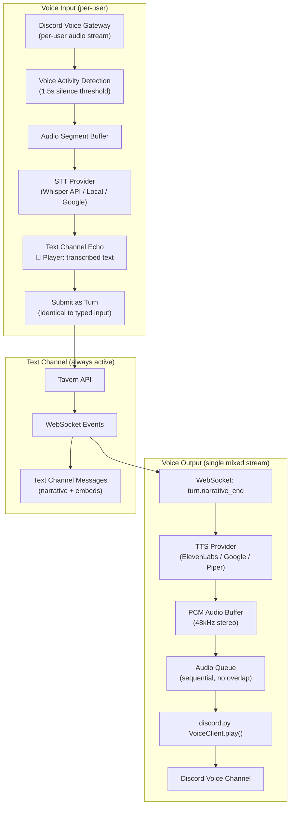

# ADR-0008: Discord Bot Voice Pipeline

- **Status**: Accepted
- **Date**: 2026-04-03
- **Deciders**: [@t11z](https://github.com/t11z)
- **Scope**: `backend/tavern/discord_bot/voice/` — STT/TTS provider abstraction, voice channel integration, audio dependency management, cost model

## Context

The Discord bot is Tavern's second reference client (ADR-0005). The Discord play scenario — friends in different cities joining a voice channel — is a first-class experience. ADR-0005 establishes that voice is an I/O transformation layer: Speech-to-Text converts player speech into text actions, Text-to-Speech converts Claude's narrative into audio. The Tavern server never touches audio.

What ADR-0005 does not specify is how the Discord bot implements this layer. The bot *is* the client, so "client-side audio" means "bot-side audio." This creates several decisions that ADR-0005 intentionally deferred:

**Provider selection**: Which STT and TTS services does the bot use? Each provider has different cost, quality, latency, and self-hostability characteristics. The choice directly affects the per-session cost promise ("cheaper than a coffee") and the self-hosting story ("just docker compose up").

**Optionality boundary**: Voice in a Discord RPG bot sounds like a core feature, but mandating it would exclude players who cannot or prefer not to speak — shy players, players in shared spaces, players with speech disabilities, players on unreliable mobile connections. The architecture must treat voice as an enhancement that adds capability without removing the text baseline.

**Dependency weight**: Voice support requires system-level audio libraries (opus, libsodium, libffi), the `discord.py[voice]` extra, and potentially large model files (local Whisper is ~1.5GB for the base model). These dependencies increase the Docker image size and the attack surface. For deployments that will never use voice, this cost is pure waste.

**Cost predictability**: STT and TTS introduce variable costs alongside the Anthropic API costs that ADR-0002 already manages. A 3-hour session with active voice could add $0.20-$2.50 depending on provider choice. This must be transparent and controllable — the server operator needs to understand what voice costs before enabling it.

**Mixed-mode sessions**: Not all players in a campaign will use voice. Some type, some speak, some switch between sessions. The architecture must handle mixed input seamlessly — a transcribed voice action and a typed text action must be indistinguishable to the Tavern API.

## Decision

### 1. Voice is optional at every level

Voice is optional at three independent levels:

**Deployment level**: The server operator decides whether voice dependencies are installed. The Docker image includes voice dependencies by default, but the `VoiceCog` is only loaded if voice libraries are importable. A minimal deployment can exclude voice entirely by using a slim image variant or not installing the `[voice]` extra.

**Instance level**: The server operator decides whether voice is enabled by setting `TTS_PROVIDER` and/or `STT_PROVIDER` environment variables. If neither is set, voice commands (`/tavern voice on`) return "Voice is not configured on this server."

**Session level**: Players decide whether to use voice per session. `/tavern voice on` activates voice for the current session. `/tavern voice off` deactivates it. Activation requires at least one player to be in a voice channel. Players who remain in the text channel only are unaffected — they see transcribed voice input echoed in text, and all narrative responses appear in the text channel regardless of voice status.

**Per-player level**: Within an active voice session, each player independently chooses their input mode. Players in the voice channel can speak; players not in the voice channel type. Both produce identical API calls. No player is ever prompted to join voice or informed that they are "missing" the voice experience.

### 2. Provider abstraction for STT and TTS

STT and TTS are implemented behind provider interfaces, following the same pattern as the narrator's model provider abstraction (ADR-0002).

**STT provider interface:**

```
class STTProvider(Protocol):
    async def transcribe(self, audio: bytes, sample_rate: int = 48000) -> str:
        """Transcribe audio bytes to text. Returns empty string on failure."""
        ...
```

**TTS provider interface:**

```
class TTSProvider(Protocol):
    async def synthesize(self, text: str) -> bytes:
        """Convert text to audio bytes (PCM, 48kHz, stereo). Returns empty bytes on failure."""
        ...
```

The interfaces are deliberately minimal. No streaming TTS in V1 — the entire narrative is synthesized as one audio segment and then played. This simplifies the pipeline at the cost of ~1-3 seconds additional latency before audio playback begins. Streaming TTS can be added later by extending the interface without breaking existing providers.

### 3. STT provider selection

Three STT providers are supported, selected via the `STT_PROVIDER` environment variable:

**`whisper_api`** (default when STT is enabled): OpenAI's Whisper API. High accuracy, ~1-2 second latency, ~$0.006/minute. Requires an OpenAI API key (`STT_API_KEY`). This is the recommended provider for most deployments — the cost is negligible relative to the Anthropic API costs that dominate session pricing.

**`whisper_local`**: Local Whisper inference via whisper.cpp (Python bindings). Free, high accuracy, but latency depends on hardware (2-5 seconds on CPU, ~1 second on GPU). The model file (~1.5GB for `base`, ~6GB for `large-v3`) must be downloaded on first use. Recommended for operators who want zero external API dependencies beyond Anthropic.

**`google_cloud_stt`**: Google Cloud Speech-to-Text. Comparable cost and quality to Whisper API. Included as an alternative for operators already in the Google Cloud ecosystem. Requires a Google Cloud service account key.

**Why not browser-based STT**: ADR-0005 lists the Web Speech API as a client-side option. This is inapplicable to the Discord bot — there is no browser. The bot receives raw audio from Discord's voice gateway and must process it server-side (where "server" is the bot container).

### 4. TTS provider selection

Four TTS providers are supported, selected via the `TTS_PROVIDER` environment variable:

**No default** — TTS is explicitly opt-in. If `TTS_PROVIDER` is not set, voice output is disabled. `/tavern voice on` enables STT input only; Claude's narrative appears as text in the text channel and is not spoken aloud. This is the conservative default because TTS is the expensive component.

**`elevenlabs`**: Highest quality, most natural-sounding voices. ~$0.18 per 1,000 characters. A 3-hour session with ~40 narratives averaging 300 characters costs ~$2.16 in TTS. This approaches the "cheaper than a coffee" ceiling on its own. Recommended only for groups that prioritize voice immersion and accept the cost.

**`google_cloud_tts`**: Good quality, significantly cheaper. ~$0.016 per 1,000 characters (WaveNet voices) or ~$0.004 (Standard voices). Same 3-hour session: ~$0.19 (WaveNet) or ~$0.05 (Standard). Recommended as the default paid option — the cost is proportional to the Anthropic API cost and keeps total session costs under $1.

**`piper`**: Local TTS via Piper (by Rhasspy). Free, decent quality, very low latency (~0.5 seconds). Voice models are ~50-100MB. Quality is noticeably below cloud providers but acceptable for casual play. Recommended for operators who want zero external costs beyond Anthropic.

**`discord_tts`**: Discord's built-in TTS (`/tts` message flag). Free, but quality is poor and behaviour varies across Discord clients. Not recommended but available as a zero-configuration fallback.

### 5. Audio pipeline architecture

The voice pipeline within the Discord bot follows a linear flow:



**Voice Activity Detection (VAD)**: The bot uses a simple energy-based VAD to detect when a player has finished speaking. The silence threshold is configurable (default: 1.5 seconds). This is not a solved problem — VAD in noisy environments or with background music is unreliable. The bot errs on the side of waiting longer (missing the end of speech is better than cutting off mid-sentence).

**Per-user audio**: Discord provides separate audio streams per user in a voice channel. The bot tracks which Discord user is speaking, transcribes their audio, and attributes the resulting text to the correct Tavern character. If two users speak simultaneously, their audio is processed independently — the first transcription to complete is submitted first (FIFO, consistent with ADR-0007's exploration mode).

**Audio queue**: TTS output is queued, not interrupted. If a new narrative arrives while the previous one is still playing, it waits. This prevents audio overlap but may create a backlog during rapid exchanges. If the queue exceeds 3 items, the oldest unplayed items are dropped and posted as text-only with a note: "⏩ Skipped voice playback to catch up."

### 6. Interaction with interactive rolling (ADR-0009)

Voice input feeds into the same interactive rolling pipeline as typed input. A spoken action ("I attack the goblin") is transcribed, echoed in the text channel, and submitted as a turn — which may trigger roll prompts, reaction windows, and the full turn lifecycle defined in ADR-0009.

**Critical constraint: rolls and reactions are always controlled via text channel UI, never via voice commands.** When a roll prompt appears, the player clicks the 🎲 button in the text channel embed or types `/roll` — regardless of whether they are in the voice channel. Spoken "roll" or "I roll" is not intercepted as a roll trigger. The reason: voice commands for game-mechanical actions are unreliable (false triggers, ambiguous phrasing), and the structured UI (buttons with pre-roll options, reaction choices) cannot be replicated in voice. The text channel is the control surface; the voice channel is the immersion layer.

Similarly, reaction windows present buttons in the text channel. A player in voice who wants to cast Shield clicks the 🛡️ button — they do not say "Shield." This ensures unambiguous, auditable interaction for mechanically significant decisions.

**TTS during roll sequences:** The bot speaks roll results and reaction outcomes via TTS in addition to posting them as text. The sequence "Roll for attack!" → "14 plus 5 equals 19 — hit!" → "Roll for damage!" is spoken aloud, creating an immersive audio experience. Reaction announcements ("Mira casts Shield!") are also spoken. This keeps voice-channel players engaged without requiring them to read the text channel during combat.

### 7. Cost transparency

The bot tracks voice-related costs per session and reports them alongside Anthropic API costs:

- STT cost: estimated from audio duration × provider rate.
- TTS cost: estimated from character count × provider rate.
- Reported in the session summary when the session ends (`/tavern stop`).

These are estimates, not billing records. The actual provider invoices are the source of truth. The estimates exist to help operators understand whether voice costs are acceptable for their group.

### 8. Graceful degradation

Voice failures must never block gameplay:

| Failure | Behaviour |
|---|---|
| STT transcription fails | Post "🎤 Couldn't understand that — please type your action or try again." Game continues. |
| STT provider unreachable | Disable STT for the session. Post warning. Players type instead. |
| TTS synthesis fails | Skip audio, post narrative as text only. Log the error. |
| TTS provider unreachable | Disable TTS for the session. Post warning. Narrative continues as text. |
| Voice channel disconnect | Attempt reconnect (3 retries, exponential backoff). If reconnect fails, disable voice for the session with a notification. Text continues. |
| Audio playback error | Skip the audio segment. Post narrative as text. |

The principle: text is the fallback for everything. If any voice component fails, the game degrades to text-only, which is a fully functional experience — not a degraded one.

## Rationale

**Voice-optional over voice-required**: The target audience includes shy players, players with disabilities, players in shared environments, and players on mobile with poor voice connectivity. Mandating voice would exclude these players from the Discord experience entirely. Text-first with voice-optional is strictly more inclusive.

**Provider abstraction over single-provider lock-in**: The TTS/STT landscape is evolving rapidly. ElevenLabs' pricing may change, a new open-source model may surpass Whisper, a cloud provider may offer a compelling bundle. The abstraction costs ~50 lines of interface code and pays for itself the first time a provider is swapped or added.

**No default TTS over defaulting to a paid provider**: Setting a default TTS provider would cause operators to incur unexpected costs. Voice output is the expensive component (~$0.19-$2.16 per session depending on provider). Making it opt-in ensures operators make a conscious decision about the cost.

**Local provider options (Whisper local, Piper) over cloud-only**: Tavern's value proposition is self-hosted and cheap. An operator who has hardware capable of running local inference should not be forced to pay for cloud APIs for voice. Local providers make the "zero marginal cost beyond Anthropic" promise achievable for voice too.

**Non-streaming TTS over streaming TTS in V1**: Streaming TTS (start playing audio before the full text is synthesized) reduces perceived latency by 1-3 seconds. However, it requires chunking the narrative text at natural boundaries (sentence-level), managing partial audio buffers, and handling provider-specific streaming APIs. The complexity is disproportionate for V1. The typing indicator + complete audio playback approach is good enough — players are already accustomed to 2-5 second waits for Claude's narrative.

**VAD silence detection over push-to-talk**: Push-to-talk would be more reliable (no false triggers, no cutting off speech) but requires players to hold a key while speaking. This is standard for gaming voice chat but unnatural for tabletop RPG conversation. VAD with a conservative silence threshold (1.5s) matches the conversational cadence of D&D — players pause, think, and continue. The trade-off is occasional false triggers, which are handled gracefully (the transcription is echoed, and the player can correct it).

## Alternatives Considered

**Server-side TTS in the Tavern game server**: Move TTS processing from the Discord bot into the Tavern server, creating a `/api/campaigns/{id}/narrate/audio` endpoint. Rejected — this violates ADR-0005's constraint that audio processing is never a server-side dependency. It would also couple the game server to TTS provider dependencies, increase the server's resource requirements, and create a single point of failure for audio across all clients. The bot is the right place for this — it is the client that needs audio.

**WebRTC-based voice instead of Discord voice**: Use WebRTC for direct browser-to-bot audio, bypassing Discord's voice infrastructure. Rejected — this solves a problem that does not exist. Discord's voice infrastructure is free, reliable, and already integrated with the user's existing voice setup (noise suppression, echo cancellation, push-to-talk). Building a parallel voice system would be months of work for marginal benefit.

**Mandate voice for the Discord experience**: Require voice channel participation for Discord-based play, making the bot a voice-first client. Rejected — this contradicts the text-first principle established in the Discord Bot Game Design Spec. It would exclude shy players, mobile-only players, and players in noise-sensitive environments. The text channel is the universal baseline; voice is the enhancement.

**Single STT/TTS provider (Whisper API + ElevenLabs)**: Pick the best provider for each and skip the abstraction layer. Rejected — this locks the project to specific vendors and their pricing. When ElevenLabs changes pricing (which they have, multiple times) or when a superior open-source TTS model emerges, the entire voice pipeline would need rework. The abstraction is cheap insurance.

**Real-time streaming STT (live transcription displayed as the player speaks)**: Show partial transcriptions in real time, similar to live captions. Rejected for V1 — the complexity of managing partial transcriptions, handling corrections, and deciding when a "final" transcription is ready for submission is significant. The current approach (wait for silence, transcribe complete segment, echo result) is simpler and produces more accurate transcriptions because the model sees complete utterances.

## Consequences

### What becomes easier

- Server operators can enable voice with two environment variables (`STT_PROVIDER`, `TTS_PROVIDER`). No code changes, no configuration files beyond `.env`.
- Adding a new STT or TTS provider is implementing a one-method interface. Community contributions for niche providers (Azure, AWS Polly, Coqui) slot in without touching the pipeline.
- Cost-conscious operators can use local providers (Whisper local + Piper) for zero-cost voice. Hardware-constrained operators can use cloud providers and accept the per-session cost. Both are valid configurations.
- Mixed-mode sessions work without special handling — the API receives text regardless of whether it was typed or transcribed. The bot's job is to produce text from speech; everything downstream is unchanged.
- Voice failures are non-fatal. A TTS outage does not stop the game. A misheard transcription is corrected by typing. The text baseline is always available.

### What becomes harder

- Voice dependencies increase the Docker image size (~200MB for audio libraries + Whisper model if using local inference). Operators who never use voice pay this cost in disk space. Mitigated by offering a slim image variant without voice dependencies.
- Two new external API dependencies (STT and TTS providers) introduce new failure modes, new API keys to manage, and new cost line items. Mitigated by making both optional and providing local alternatives.
- VAD tuning is environment-dependent. A quiet room needs different thresholds than a noisy apartment. The default 1.5-second silence threshold will be wrong for some environments. Mitigated by making the threshold configurable, but most operators will not tune it.
- Per-user audio processing in voice channels with many participants (6+) creates CPU load on the bot container. Each user's audio stream is independently buffered and potentially sent to STT. Mitigated by the practical limit of D&D groups (typically 4-6 players) and by only processing audio from campaign members, not spectators.
- Testing voice functionality requires a Discord bot token, a voice-capable Discord client, and a functioning audio setup. This cannot be unit-tested meaningfully — integration tests require a real Discord connection. Mitigated by testing the STT/TTS provider interfaces in isolation (mock audio in, text out) and testing the pipeline integration manually.

### New constraints

- The bot container must include audio libraries (opus, libsodium, libffi) in its Docker image. These are system-level dependencies managed via `apt-get`, not pip.
- The `discord.py[voice]` extra is required for voice functionality. It must be included in the bot's dependency group but documented as optional for non-Docker development.
- STT provider API keys are stored as environment variables, never in the database or in client code. They follow the same security model as the Anthropic API key (ADR-0006 §5).
- TTS output must be PCM audio at 48kHz stereo to match Discord's voice gateway format. Providers that output different formats (MP3, OGG) must be transcoded in the provider implementation.
- The text channel echo of voice input ("🎤 **Player**: transcribed text") is mandatory, not optional. It is the mechanism that keeps text-only players informed and provides transcription confirmation to the speaker.
- Voice cost estimates are reported in session summaries. The estimation logic must be updated when provider pricing changes — this is a maintenance burden but an acceptable one.

## Review Triggers

- If local Whisper inference latency exceeds 5 seconds consistently on typical self-hosted hardware (4-core CPU, 8GB RAM), evaluate whether the `whisper_local` provider should be demoted to "experimental" or whether a smaller model (tiny/base) should be the default.
- If ElevenLabs' pricing changes make per-session TTS costs exceed $5, evaluate whether to drop it as a recommended provider or implement character-count budgets per session.
- If discord.py's voice receive API changes or becomes unreliable, evaluate alternative approaches (recording bot, separate voice service) or downgrade voice input to "experimental."
- If more than 30% of voice-enabled sessions report STT accuracy issues (measured by player corrections after transcription echo), evaluate switching the default STT provider or implementing a confirmation step before turn submission.
- If a high-quality, open-source, real-time streaming TTS model becomes available (comparable to Google Cloud WaveNet quality at Piper's latency), evaluate adding streaming TTS support to reduce perceived voice output latency.
- If players request persistent voice preferences per character or per campaign (e.g., "always use a deep voice for my dwarf"), evaluate whether voice customisation belongs in the TTS provider layer or in the campaign configuration.