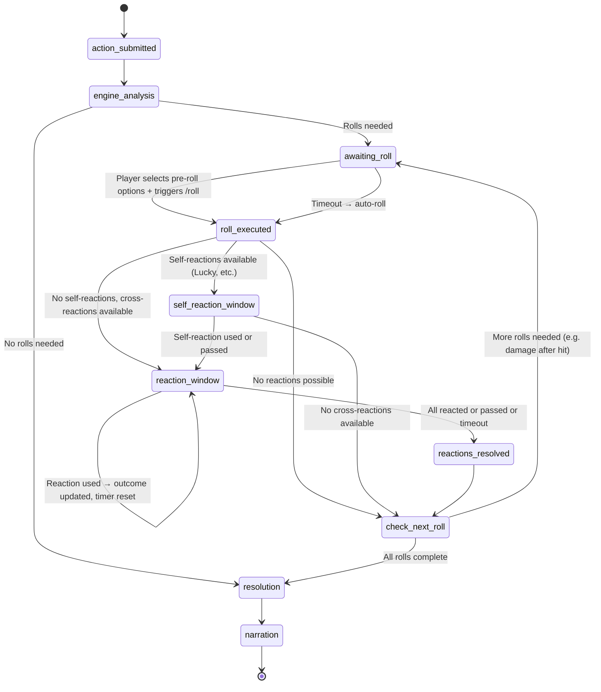
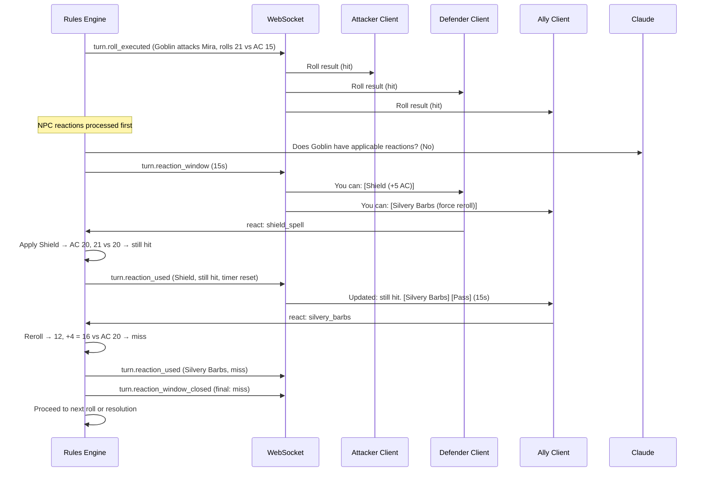
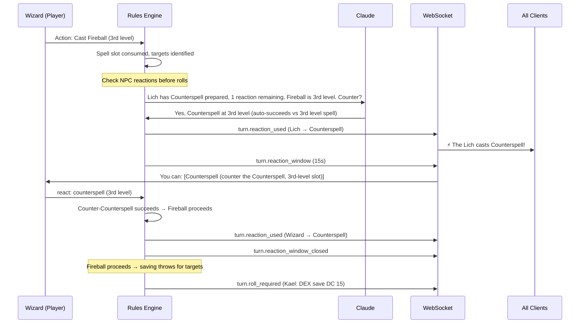
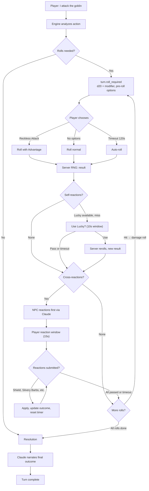

# ADR-0009: Interactive Dice Rolling and Reaction System

- **Status**: Accepted
- **Date**: 2026-04-03
- **Deciders**: [@t11z](https://github.com/t11z)
- **Scope**: `backend/tavern/core/` (Rules Engine — dice, combat, reactions), `backend/tavern/api/` (Turn lifecycle, WebSocket events), `backend/tavern/dm/` (NPC reaction decisions), client-server interaction contract

## Context

Tavern's Rules Engine (ADR-0001) resolves all mechanical outcomes deterministically. The current design treats turns as atomic operations: the player declares an action, the engine resolves everything internally — dice rolls, damage, saves — and returns a complete result. Claude then narrates the outcome. The player never touches a die.

This is mechanically correct but experientially wrong. Rolling dice is the most tactile, emotionally charged moment in tabletop D&D. The pause between "I attack" and the clatter of the d20 is where tension lives. The groan when you see a 3. The table erupting when someone rolls a natural 20. Tavern removes this moment entirely by resolving everything server-side in a single pass.

Worse, the atomic turn model eliminates an entire category of game mechanics: **reactions**. D&D 5e's reaction system allows players and NPCs to intervene in other creatures' turns — Shield to block an incoming hit, Counterspell to negate an enemy's spell, Bardic Inspiration to boost an ally's failing roll, Silvery Barbs to force a reroll, Cutting Words to reduce an attack roll, Legendary Resistance to override a failed save. These are not niche features. They are core combat mechanics that appear in nearly every session and define entire class identities (a Bard without Bardic Inspiration is half a Bard, a Wizard without Shield or Counterspell is significantly diminished).

The atomic turn model cannot support reactions because reactions require a **window of intervention** — a moment after a roll is visible but before its consequences are applied, during which other participants can choose to alter the outcome. This window does not exist in the current design.

Three problems must be solved simultaneously:

1. **Player-triggered rolls**: Players must feel like they are rolling dice, not watching an automated resolver. The emotional core of D&D depends on it.
2. **Pre-roll options**: Before rolling, a player may activate abilities that modify how the roll works (Reckless Attack grants Advantage, Great Weapon Master trades accuracy for damage, a Bardic Inspiration die may be added proactively).
3. **Post-roll reactions**: After a roll result is visible, other participants — the rolling player, their allies, and even their enemies — may spend resources to alter the outcome. These reactions must be solicited, collected within a time window, and resolved before the roll's consequences are applied.

All three require the turn to transition through intermediate states where it is waiting for player input. The turn is no longer atomic — it is a dialogue between the engine and the participants.

## Decision

### 1. The roll is player-triggered, server-resolved

When the Rules Engine determines that an action requires a dice roll, it does not roll automatically. It pauses and requests the roll from the active player. The player triggers the roll. The server generates the random result.

**The client sends a trigger, not a value.** The API endpoint for rolling accepts no dice result parameter. The player's command means "I roll now" — the server's RNG determines the outcome. This preserves ADR-0001's integrity guarantee (the Rules Engine is the sole authority on mechanical outcomes) while giving the player the experience of rolling.

```
POST /api/campaigns/{campaign_id}/turns/{turn_id}/rolls/{roll_id}/execute

Request body: {
  "pre_roll_options": ["reckless_attack"]   // optional, may be empty
}

Response: {
  "roll_id": "uuid",
  "dice": "1d20",
  "natural_result": 14,
  "modifier": 5,
  "total": 19,
  "target": {"type": "ac", "value": 15},
  "outcome": "hit",
  "advantage": true,                        // from Reckless Attack
  "rolls": [14, 8],                         // both dice shown, highest used
  "post_roll_reactions_available": true,
  "reaction_window_seconds": 15
}
```

The response includes the full breakdown — natural roll, modifier, total, target, outcome — so the client can display the dramatic sequence. The server also signals whether a reaction window will follow.

### 2. Extended turn lifecycle

The turn lifecycle from ADR-0004 is extended with intermediate states. A turn that requires rolls transitions through a state machine:



Key properties of this state machine:

- **A turn may require zero, one, or many rolls.** An attack requires an attack roll, then (on hit) a damage roll. Fireball requires multiple saving throws (one per target). A skill check requires one roll. Casting a non-attack, non-save spell requires zero.
- **Each roll independently opens a reaction window** if applicable reactions exist. The attack roll opens a window for Shield, Silvery Barbs, etc. The damage roll might open a window for damage-reducing reactions (though these are rare in the SRD).
- **The state machine is per-turn, managed server-side.** The server tracks where the turn is. Clients receive events that tell them what the server needs next.
- **Timeout applies at each waiting state.** If the player does not trigger `/roll` within the action timeout (default: 120s), the server auto-rolls. If reaction holders do not respond within the reaction window (default: 15s), the window closes and the roll is finalized.

### 3. Pre-roll options

When the engine requests a roll, it includes a list of **pre-roll options** — abilities or resources the active player can choose to activate before rolling. The player's `/roll` trigger may include selected options.

Pre-roll options are abilities that must be declared before the outcome is known:

| Option | Effect | Cost | Example trigger |
|---|---|---|---|
| Reckless Attack | Advantage on attack | Attacks against you have Advantage until next turn | Barbarian melee attack |
| Great Weapon Master -5/+10 | -5 to attack roll, +10 to damage | Accuracy trade-off | Heavy weapon attack |
| Sharpshooter -5/+10 | -5 to attack roll, +10 to damage | Accuracy trade-off | Ranged weapon attack |
| Bardic Inspiration (proactive) | Add Inspiration die to roll | Expends ally's Inspiration die | Any attack/check/save if Inspiration held |
| Guided Strike (War Cleric) | +10 to attack roll | Expends Channel Divinity | Own attack roll |
| Elven Accuracy | Roll three dice, keep highest | Replaces Advantage | Elf with Advantage on attack using DEX/WIS/INT/CHA |

The engine determines which options are available based on the character's state (class features, active buffs, remaining resources). The client renders them as interactive choices. The player selects zero or more options, then triggers the roll.

**WebSocket event for roll request:**

```json
{
  "event": "turn.roll_required",
  "payload": {
    "turn_id": "uuid",
    "roll_id": "uuid",
    "character_id": "uuid",
    "type": "attack",
    "dice": "1d20",
    "base_modifier": 5,
    "description": "Kael attacks Goblin A with longsword",
    "target": {"type": "ac", "value": 15, "target_name": "Goblin A"},
    "pre_roll_options": [
      {
        "id": "reckless_attack",
        "name": "Reckless Attack",
        "effect_description": "Advantage on this attack. Attacks against you have Advantage until your next turn.",
        "mechanical_effect": "advantage",
        "cost_description": "Enemies gain Advantage against you",
        "available": true
      }
    ]
  }
}
```

### 4. Post-roll reactions (same player)

After a roll is executed, the rolling player may have abilities that trigger on seeing the result — most notably, the Lucky feat (reroll and choose which result to use).

These are offered to the rolling player immediately after the roll result is displayed, before the reaction window opens for other players. The reason for this ordering: the rolling player's self-reactions (Lucky) change the roll result itself, which affects whether other players' reactions are useful. Shield is pointless if the attacker's Lucky reroll turned a hit into a miss.

**Self-reaction event:**

```json
{
  "event": "turn.roll_result",
  "payload": {
    "turn_id": "uuid",
    "roll_id": "uuid",
    "natural_result": 8,
    "modifier": 5,
    "total": 13,
    "target": {"type": "ac", "value": 15},
    "provisional_outcome": "miss",
    "self_reactions": [
      {
        "id": "lucky_feat",
        "name": "Lucky",
        "effect_description": "Reroll the d20 and choose which result to use.",
        "uses_remaining": 2,
        "trigger_condition": "any_d20"
      }
    ],
    "self_reaction_window_seconds": 10
  }
}
```

If the player uses Lucky, the server rerolls, the result updates, and **then** the cross-player reaction window opens with the new result.

### 5. Cross-player reactions

After the roll result is finalized (including any self-reactions by the roller), the engine determines whether any **other participants** — allies, enemies, or the rolling player in a different capacity — have applicable reactions. If so, a reaction window opens.



**Who can react, and to what:**

| Reaction | Who | Trigger | Effect |
|---|---|---|---|
| Shield | Target of attack (own turn or enemy's) | Attack roll hits, target has Shield prepared and a spell slot | +5 AC until next turn; may turn hit to miss |
| Silvery Barbs | Any ally who sees the roll | Any creature succeeds on attack/save/check | Force reroll, take lower; grant Advantage to an ally |
| Cutting Words | Bard who sees the roll | Creature makes attack/damage/check within 60ft | Subtract Inspiration die from the roll |
| Counterspell | Spellcaster within 60ft | Creature casts a spell | Negate the spell (check required for higher-level spells) |
| Bardic Inspiration (reactive) | Player who holds Inspiration | Own attack/check/save fails | Add Inspiration die to the roll |
| Legendary Resistance | NPC with Legendary Resistance | NPC fails a saving throw | Choose to succeed instead |
| Absorb Elements | Target of elemental damage | Hit by acid/cold/fire/lightning/thunder damage | Resistance to the damage type, bonus damage on next attack |

**Reaction window event:**

```json
{
  "event": "turn.reaction_window",
  "payload": {
    "turn_id": "uuid",
    "roll_id": "uuid",
    "roll_result": {
      "natural": 17,
      "total": 21,
      "target": {"type": "ac", "value": 15},
      "provisional_outcome": "hit",
      "attacker": "Goblin A",
      "defender": "Mira"
    },
    "available_reactions": [
      {
        "reactor_character_id": "uuid-mira",
        "reactor_name": "Mira",
        "reactions": [
          {
            "id": "shield_spell",
            "name": "Shield",
            "effect_description": "+5 AC until start of your next turn.",
            "cost": "1st-level spell slot (3 remaining)",
            "would_change_outcome": true,
            "new_outcome_if_used": "hit"
          }
        ]
      },
      {
        "reactor_character_id": "uuid-vex",
        "reactor_name": "Vex",
        "reactions": [
          {
            "id": "silvery_barbs",
            "name": "Silvery Barbs",
            "effect_description": "Force reroll, take lower result. Grant Advantage on next save/check/attack to one ally.",
            "cost": "1st-level spell slot (2 remaining)",
            "would_change_outcome": "unknown"
          }
        ]
      }
    ],
    "window_seconds": 15,
    "npc_reactions_pending": true
  }
}
```

**Key design decisions for cross-player reactions:**

**First-come-first-served within the window.** Reactions are processed in the order they are submitted. If Mira casts Shield and the attack now misses, Vex's Silvery Barbs is no longer useful (but Vex is not forced to use it — the updated outcome is broadcast, and Vex can let the window expire). This mirrors the tabletop convention where the first person to speak up gets to react.

**Reactions can chain.** Mira casts Shield → AC becomes 20 → Goblin's 21 still hits → Vex sees this and casts Silvery Barbs → Goblin rerolls → new result 12 → miss. Each reaction updates the provisional outcome and re-notifies remaining reactors. The window timer resets on each reaction (otherwise late reactors have no time to respond to changed circumstances). Maximum chain depth: 5 reactions per roll (a practical limit — deeper chains do not occur in real D&D).

**The engine pre-computes `would_change_outcome` where deterministic.** Shield adds exactly +5 AC — the engine knows whether that turns a hit into a miss. Silvery Barbs forces a reroll — the outcome is unknown, so the field is `"unknown"`. This helps players make informed decisions without requiring them to do mental math under time pressure.

**All players may pass explicitly.** A "Pass" button (or `/pass` command) lets a player signal they will not react. If all eligible reactors pass, the window closes immediately — no need to wait for the full 15 seconds. The `/pass` shortcut respects the table pace: if everyone is engaged and decides quickly, combat flows fast.

### 6. NPC reactions

NPCs have reactions too — Counterspell, Legendary Resistance, Parry, and others. These are resolved **automatically** during the reaction window, without player input.



**NPC reaction decisions are made by the Rules Engine and Claude together**, following the same pattern as NPC action choices (ADR-0002, ADR-0007 §3):

- **Deterministic reactions** are handled by the engine alone. Legendary Resistance is a binary choice (the NPC has uses remaining, the save matters → use it). Parry is straightforward (damage reduction, costs reaction). The engine applies these based on tactical rules: use Legendary Resistance on save-or-suck effects (Hold Person, Banishment), not on minor damage saves.
- **Judgment-call reactions** are delegated to Claude. Should the Lich Counterspell the Wizard's Fireball, or save its reaction for something bigger? This depends on the NPC's intelligence, knowledge, and tactical situation — exactly the kind of decision Claude handles for NPC turns (ADR-0007 §3). Claude receives the reaction context (what spell is being cast, NPC's remaining resources, battle state) and decides.

**NPC reactions are processed before player reactions in the window** for reactions that target the same roll. Reason: at the table, the DM typically reacts first ("The Lich raises a hand and Counterspells your Fireball"), and players respond to that ("I Counterspell his Counterspell!"). Processing NPC reactions first creates this natural sequence.

**NPC reactions are displayed to all players.** When the Lich uses Legendary Resistance, every player sees it: "⚡ The Lich shrugs off the effect (Legendary Resistance, 2 remaining)." This is critical information for tactical planning.

**Latency concern:** Claude calls for NPC reaction decisions add 1-3 seconds to the reaction window. This is acceptable — it simulates the DM thinking. The reaction window timer starts after NPC reactions are resolved, not before. Players get their full 15 seconds to respond to the NPC's reaction.

#### Full Combat Turn (Attack with Reactions)



### 7. Saving throws as rolls

Saving throws follow the same interactive model. When the engine requires a saving throw (e.g., Dexterity save against Fireball), the affected player triggers the roll:

```
Wizard casts Fireball
  → Engine determines targets: Goblin A, Goblin B, Player Kael
  → Goblin saves are auto-rolled (NPCs don't trigger interactively)
  → Kael receives: "Dexterity Saving Throw! DC 15. /roll"
  → Kael triggers /roll
  → Result: 11 (d20) + 2 = 13 — Fail
  → Reaction window: Kael has Bardic Inspiration from Vex
    → Kael: [🎵 Use Bardic Inspiration (+1d8)] [❌ Accept]
    → Kael uses Inspiration: +5 = 18 — Save!
  → Damage applied (half for Kael, full for goblins who failed)
```

**Multiple saving throws** (Fireball hitting 3 PCs) are rolled sequentially by player, each with its own reaction window. NPC saves are batch-resolved silently by the engine. This keeps the player-facing flow one roll at a time while not bogging down NPC resolution.

### 8. Ability checks outside combat

Not all rolls happen in combat. Skill checks (Perception, Stealth, Persuasion, etc.) also follow the interactive model in the default configuration:

```
Player: "I try to persuade the guard to let us through"
  → Claude determines: this requires a Charisma (Persuasion) check
  → Engine: "Charisma (Persuasion) check, DC 15. /roll"
  → Player: /roll
  → Result: 12 (d20) + 5 = 17 — Success
  → Claude narrates the outcome
```

For ability checks, pre-roll options include Guidance (if active), Bardic Inspiration, and class features like Reliable Talent (Rogue 11+, treat rolls below 10 as 10). Post-roll reactions are less common for checks but do exist (Flash of Genius for Artificers, Bardic Inspiration used reactively).

### 9. Automatic roll mode (configuration option)

Interactive rolling adds engagement but also adds time. Each roll requires a player action; each reaction window adds up to 15 seconds. In a combat with 6 participants and 4 rolls per round, a single round could take 5-8 minutes with interactive rolls vs. 1-2 minutes with automatic resolution.

To accommodate different play styles, rolling mode is configurable **per campaign**:

| Mode | Behaviour | Best for |
|---|---|---|
| `interactive` | Player triggers every roll. Full reaction windows. | Groups that want the tabletop feel. Default for Discord. |
| `automatic` | Engine rolls automatically. Reaction windows still open for applicable reactions. | Groups that want faster combat. Default for web client. |
| `hybrid` | Attack rolls and saving throws are interactive. Damage rolls, initiative, and minor checks are automatic. | Balanced — tension on the rolls that matter, speed on the rest. |

In `automatic` mode, the turn lifecycle is shorter: `action_submitted → resolution (with auto-rolls) → reaction_windows (if applicable) → narration`. The reaction system still functions — Shield, Counterspell, and Silvery Barbs still get their windows. Only the "player triggers the d20" step is skipped.

The campaign owner sets the mode at campaign creation or changes it mid-campaign with `/tavern config rolling_mode interactive|automatic|hybrid`.

### 10. WebSocket event summary

New events added to the WebSocket protocol (extending ADR-0005 §3):

| Event | Direction | Payload | Purpose |
|---|---|---|---|
| `turn.roll_required` | Server → Client | Roll details, pre-roll options | Prompt player to roll |
| `turn.roll_executed` | Server → Client | Roll result, breakdown | Display roll result |
| `turn.self_reaction_window` | Server → Client | Self-reaction options, timer | Offer Lucky / similar to roller |
| `turn.reaction_window` | Server → Client | All available reactions, timer | Open cross-player reaction window |
| `turn.reaction_used` | Server → Client | Who reacted, what they used, updated outcome | Broadcast reaction to all players |
| `turn.reaction_window_closed` | Server → Client | Final result after all reactions | Signal that result is final |
| `turn.roll_required` (next) | Server → Client | Next roll details (e.g., damage after hit) | Chain to the next roll |
| `roll.execute` | Client → Server | Roll ID, selected pre-roll options | Player triggers roll |
| `roll.react` | Client → Server | Reaction ID, or "pass" | Player submits reaction |

### 11. API changes

**New endpoints:**

```
POST /api/campaigns/{id}/turns/{turn_id}/rolls/{roll_id}/execute
  Body: { "pre_roll_options": ["reckless_attack"] }
  → Server rolls, returns result, may open reaction window

POST /api/campaigns/{id}/turns/{turn_id}/rolls/{roll_id}/react
  Body: { "character_id": "uuid", "reaction_id": "shield_spell" }
  → Server applies reaction, returns updated outcome

POST /api/campaigns/{id}/turns/{turn_id}/rolls/{roll_id}/pass
  Body: { "character_id": "uuid" }
  → Server records that this character passes on reactions
```

**Modified endpoints:**

```
POST /api/campaigns/{id}/turns
  Body: { "character_id": "uuid", "action": "I attack the goblin" }
  → Response changes from 202 + eventual narrative
     to 202 + eventual turn.roll_required OR eventual narrative
     (depending on whether the action requires rolls)
```

### 12. Standalone rolls (out-of-turn)

The `/roll <expression>` command retains its standalone function for out-of-turn rolls — loot distribution, ability check contests between players, or just messing around. These rolls are:

- Triggered with a dice expression: `/roll 2d6+3`, `/roll d100`
- Resolved server-side (RNG on the API, not client-side)
- Posted in the channel as an informational message
- Not connected to any turn or mechanical resolution
- Not subject to reaction windows

When a turn is in `awaiting_roll` state, a bare `/roll` (without expression) triggers the pending turn roll. `/roll 2d6+3` (with expression) triggers a standalone roll regardless of turn state. This disambiguation is unambiguous: turn rolls never need a dice expression (the engine knows which dice to roll), standalone rolls always need one.

## Rationale

**Player-triggered rolls over automatic rolls as default**: Dice rolling is the signature interaction of tabletop RPGs. Automating it away is mechanically equivalent but experientially diminished. The server-triggered RNG preserves integrity while the player trigger preserves agency. The cost is time — each roll adds 2-5 seconds of player interaction. This cost is the engagement; it is not overhead.

**Server-side RNG over client-submitted values**: If the client sent dice results, cheating would be trivial (modified client, API manipulation). Server-side RNG eliminates this category of cheating entirely. The player triggers timing, not outcome — analogous to the physical act of throwing dice, where the player initiates but physics determines.

**Reaction windows with timers over unlimited reaction time**: Without a timer, a single AFK player would block combat indefinitely. 15 seconds is generous by tabletop standards (where reactions are near-instantaneous) but necessary for digital interaction (read, process, decide, click). The timer resets on each chained reaction to prevent cascade timeouts.

**Cross-player reactions in V1 over deferral**: Bardic Inspiration, Shield, Counterspell, and Silvery Barbs are class-defining features. A Bard who cannot give Inspiration reactively is mechanically incomplete. A Wizard who cannot Shield or Counterspell is significantly weaker than the SRD intends. Deferring these to V2 would ship a game that D&D-experienced players would immediately recognize as incomplete. The implementation cost is high — the reaction window system is the most complex interactive component in the engine — but the mechanical fidelity is non-negotiable for the target audience.

**NPC reactions processed before player reactions**: This mirrors tabletop convention where the DM announces NPC reactions first, then players respond. It also creates tactical depth — players can Counterspell a Counterspell, which requires seeing the NPC's Counterspell first. Reversing the order would eliminate counter-Counterspell, one of D&D's most dramatic moments.

**Configurable roll mode over single mode**: Different groups have different tolerance for combat pacing. A group of experienced players who want tactical depth will love interactive rolls. A group of casual players who want to hear Claude's story will find them tedious. The configuration respects both playstyles without architectural compromise — the reaction system works regardless of whether rolls are player-triggered or auto-resolved.

**Hybrid mode as a middle ground**: Attack rolls and saving throws are the high-tension moments — will the dragon hit? Will you resist the spell? Damage rolls, initiative, and passive checks are procedural. Hybrid mode keeps the drama on the meaningful rolls and skips the mechanical ones.

## Alternatives Considered

**Client-side dice rolling with server validation**: The client generates a random number, sends it, and the server validates it falls within the expected range (1-20 for d20). Rejected — validation against range does not prevent cherry-picking. A modified client could roll repeatedly and send only favorable results. The only trustworthy RNG is one the player cannot influence.

**Dice rolling as purely cosmetic (automatic rolls with visual animation)**: The engine rolls automatically; the client shows a dice animation before revealing the pre-determined result. This is what many digital tabletop tools do (e.g., D&D Beyond). Rejected — this is theater, not interaction. Players quickly learn that the animation is meaningless and disengage. Tavern's player-triggered model creates real tension because the player does not know the result until they commit to rolling.

**Reaction system via text commands only ("I cast Shield")**: Instead of structured reaction windows, players type their reaction in chat and the bot interprets it. Rejected — natural language reaction parsing is unreliable ("shield" could mean the spell or the physical object), creates race conditions (who reacted first?), and does not provide players with clear information about their options. Structured options with buttons/menus are unambiguous and fair.

**Unlimited reaction window (no timer)**: Let the reaction window stay open until all eligible reactors respond. Rejected — a single AFK or distracted player blocks the entire combat. The 15-second default with explicit pass is the standard solution for turn-based digital games with reaction mechanics.

**Separate reaction phase per round (like Larian's BG3)**: Collect all potential reactions at the start of a round, then auto-apply them when triggered. Rejected — this eliminates the tactical choice of *when* to react. A Wizard with one reaction per round must decide: Shield against this attack, or save it for a potential Counterspell later? Pre-committing removes this decision, which is a core part of D&D's tactical depth.

**NPC reactions fully automated (no Claude involvement)**: All NPC reactions follow deterministic rules (always Counterspell, always use Legendary Resistance on the first failed save). Rejected — deterministic NPC reactions are predictable and exploitable. Players would learn "the Lich always Counterspells the first spell" and bait it with a cantrip. Claude's judgment-based decisions make NPCs behave more like a human DM's NPCs — sometimes saving Counterspell for the big spell, sometimes bluffing.

## Consequences

### What becomes easier

- D&D-experienced players will immediately recognize the combat flow. Dice rolling, reactions, counter-reactions — the mechanics work as expected. This eliminates the learning curve that would exist if Tavern invented its own resolution system.
- The reaction system enables the full tactical depth of SRD 5e combat. Class identity is preserved — Bards inspire, Wizards counter, Fighters recklessly attack. No class is mechanically diminished by the digital format.
- The configurable roll mode allows Tavern to serve both tactical players (interactive) and narrative players (automatic) without forking the codebase.
- The structured roll/reaction protocol is client-agnostic (per ADR-0005). Discord renders buttons, the web client renders UI components, a future CLI client uses text prompts. The server does not know or care which client is responding.

### What becomes harder

- **Combat is significantly slower** than the atomic model. Each roll adds 2-5 seconds (player trigger), each reaction window adds up to 15 seconds. A round with 4 PCs and 4 NPCs, each making one attack with one reaction opportunity, could take 3-5 minutes vs. 30 seconds with automatic resolution. Mitigated by hybrid mode and the "all pass" shortcut.
- **The turn lifecycle is more complex.** The state machine has 7 states instead of 3. The WebSocket event model has 8 new event types. Each client must handle the intermediate states correctly — showing roll prompts, rendering reaction options, respecting timers. This is significant implementation work in both the API and every client.
- **Testing the reaction system requires combinatorial coverage.** Shield + Counterspell + Counter-Counterspell + Silvery Barbs in a single roll creates a chain of 4 reactions with order-dependent outcomes. The test matrix grows multiplicatively with the number of supported reactions.
- **NPC reaction decisions via Claude add latency to the reaction window.** A Counterspell decision requires a Claude call (~1-3 seconds). For NPCs with multiple reaction options, this could delay the player reaction window. Mitigated by processing NPC reactions in parallel where they target different rolls, and by caching simple decisions (always use Legendary Resistance on Banishment).
- **Disconnect handling during rolls is complex.** If a player disconnects mid-reaction-window, their reactions are treated as "pass." If the rolling player disconnects during `awaiting_roll`, the server auto-rolls after timeout. Each intermediate state needs a timeout and a fallback.

### New constraints

- The Rules Engine must expose a **reaction catalog** — a structured list of all reactions each character can use, indexed by trigger condition. This catalog must be updated whenever a character gains/loses abilities, spell slots, or resources.
- Every roll must have a unique ID (`roll_id`) within the turn. The turn is no longer identifiable by a single action — it may contain multiple rolls, each with their own reaction chains.
- The reaction window timer (default: 15 seconds) must be server-authoritative. The client displays a countdown, but the server closes the window. Clock skew between client and server must not cause premature or late reactions.
- Claude must respond to NPC reaction queries within 3 seconds. If Claude exceeds this timeout, the NPC's reaction defaults to "no reaction." The system prompt for NPC reaction decisions must be tightly scoped to minimize latency.
- The `automatic` and `hybrid` roll modes must produce identical mechanical outcomes to `interactive` mode — same RNG, same reaction opportunities. The only difference is whether the player triggers the roll or the server auto-triggers it. Switching modes mid-campaign must not change game balance.
- The turn cannot proceed to narration until all rolls are resolved and all reaction windows are closed. Claude receives the final mechanical outcome — after all reactions — and narrates it as a single coherent result. Claude does not see the intermediate states (roll, reaction, counter-reaction); it sees the final outcome.

## Review Triggers

- If combat pacing complaints consistently cite interactive rolls as too slow, evaluate whether `hybrid` should be the default mode, or whether the reaction window timer should be reduced from 15 to 10 seconds.
- If reaction chains deeper than 3 (e.g., Counterspell → Counter-Counterspell → Counter-Counter-Counterspell) create confusion or frustration, evaluate capping chain depth at 2 reactions per roll.
- If NPC reaction latency from Claude calls consistently exceeds 3 seconds, evaluate pre-computing NPC reaction decisions at the start of each round (the engine asks Claude "for each possible trigger this round, would this NPC react?" once, then applies the cached decisions during the round).
- If the disconnect-during-reaction problem creates frequent gameplay disruptions, evaluate a "reaction stance" system where players pre-declare their reaction preferences at the start of combat ("always Shield if the attack hits," "Counterspell anything 3rd level or higher") and the engine auto-applies them.
- If the test matrix for reaction combinations becomes unmaintainable (>500 reaction interaction tests), evaluate a property-based testing approach that generates random reaction chains and verifies invariants (resource consumption is correct, HP cannot go below 0, used reactions are not available again).
- If the difference in combat pacing between `interactive` and `automatic` modes is so large that groups switching modes feel like they are playing a different game, evaluate whether `hybrid` should be the only option — removing `interactive` (too slow) and `automatic` (too fast) as extremes.