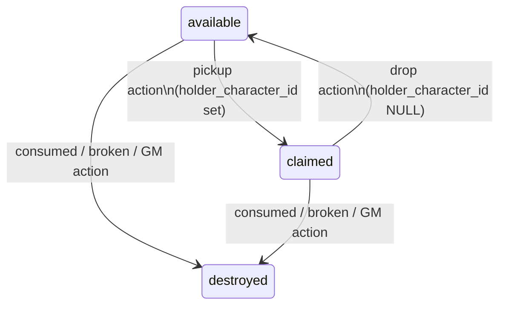
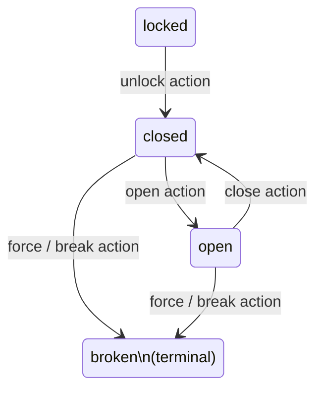
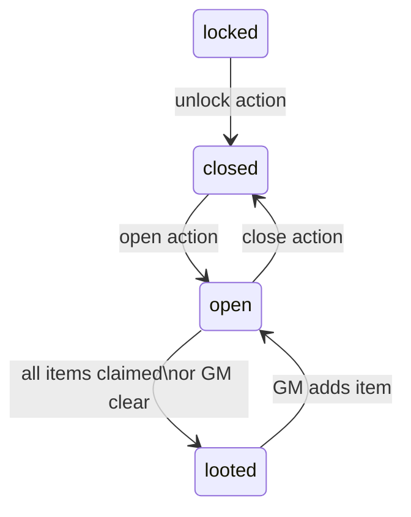

# ADR-0016: World Object Persistence

- **Status**: Proposed
- **Date**: 2026-04-05
- **Deciders**: [@t11z](https://github.com/t11z)
- **Scope**: `backend/tavern/core/` (Rules Engine), `backend/tavern/dm/` (Context Builder, GMSignals), `backend/tavern/api/` (REST endpoints), database schema (`world_objects` table), `frontend/` (Playercard), `backend/tavern/discord_bot/` (Playercard thread)
- **References**: ADR-0001 (SRD Rules Engine), ADR-0002 (Claude as Narrator), ADR-0013 (NPC Lifecycle — precedent for Narrator-spawned persistent entities)

## Context

Tavern's current data model has a structural gap: objects in the game world have no
persistent representation. A sword described by the Narrator on a table, a door that can
be broken down, a chest with loot — none of these exist as database records. Their
existence is ephemeral, confined to the Narrator's text output and the rolling summary.

This gap produces three concrete failure modes:

**1. Inventory duplication.** If the Narrator describes a dagger on a table and two
players both say "I pick up the dagger," both `InventoryItem` records are created.
The engine has no authoritative world state to validate against. The same physical object
now exists twice.

**2. Fixture state inconsistency.** Doors, levers, and containers have state that must
persist across turns and be consistent across players. If Player A kicks down a door in
Turn 3, the Narrator cannot reliably know in Turn 7 that the door is already open — the
rolling summary may have compressed or dropped the detail. Player B asking "is the door
locked?" gets a narrator-invented answer.

**3. Narrator hallucination of item availability.** Without a world state, the Narrator
has no data to suppress items that have already been claimed. It may reference items that
no longer exist in the scene, or re-describe containers as full after they have been
looted. The rolling summary is not a reliable substitute for structured state.

The NPC problem was structurally identical and was solved in ADR-0013: persistent
records, Narrator-spawned via GMSignals, scene-scoped snapshot inclusion, server-side
validation of all mutations. ADR-0016 applies the same pattern to all stateful objects
in the game world.

**What the SRD defines vs. what Tavern must decide:**

The SRD defines item properties (weight, cost, damage, the Ammunition and Thrown
properties), attunement slots (maximum 3, requires a short rest), and the equipped vs.
carried distinction (armour must be worn to grant AC). It does not define inventory
management as a data model, does not define interactable fixture state, and does not
define how a digital system should prevent item duplication. These are implementation
decisions.

**Scope boundary:** This ADR covers stateful world objects only — objects whose state
changes through interaction and where that change is mechanically or narratively relevant
to other players or future turns. Purely atmospheric objects (a painting on a wall, a
smell, a sound) are not covered and are never persisted.

## Decision

### 1. `WorldObject` as the unified persistence model

All stateful objects in the game world — whether items that can be picked up or fixtures
that can be interacted with but not carried — are stored as `world_objects` records in
PostgreSQL.

```sql
world_objects (
    id                  UUID PRIMARY KEY DEFAULT gen_random_uuid(),
    campaign_id         UUID NOT NULL REFERENCES campaigns(id) ON DELETE CASCADE,
    name                TEXT NOT NULL,
    object_type         TEXT NOT NULL CHECK (object_type IN ('item', 'fixture', 'container')),
    item_ref            TEXT,           -- SRD index or custom key (items only; NULL for fixtures)
    scene_location      TEXT NOT NULL,  -- matches NPC scene_location convention
    status              TEXT NOT NULL,  -- see §2 for valid values per object_type
    holder_character_id UUID REFERENCES characters(id) ON DELETE SET NULL,
    -- NULL = object is in the world; set = object is in a character's possession
    container_id        UUID REFERENCES world_objects(id) ON DELETE CASCADE,
    -- NULL = object is in the scene; set = object is inside a container
    plot_significant    BOOLEAN NOT NULL DEFAULT FALSE,
    spawned_turn_id     UUID REFERENCES turns(id) ON DELETE SET NULL,
    quantity            INTEGER NOT NULL DEFAULT 1 CHECK (quantity >= 0),
    custom_properties   JSONB,          -- GM-defined properties, passthrough to snapshot
    created_at          TIMESTAMPTZ NOT NULL DEFAULT now(),
    updated_at          TIMESTAMPTZ NOT NULL DEFAULT now()
)
```

`item_ref` follows the same resolution pattern as `stat_block_ref` in ADR-0013: resolved
through the three-tier lookup (Campaign Override → Instance Library → SRD Baseline via
`core/srd_data.py`). For fixtures with no SRD analogue, `item_ref` is NULL and
properties are carried in `custom_properties`.

### 2. State machines per object type

Each `object_type` has a defined set of valid statuses and valid transitions. The Rules
Engine enforces transitions; no direct status writes are permitted outside of
`core/world_objects.py`.

**`item`** — a portable object that can be carried by a character:



**`fixture`** — an object fixed in the world that changes state but cannot be carried:



`broken` is terminal for fixtures: a destroyed door does not regenerate. The record is
retained (not deleted) so the Narrator can reference "the door lies in splinters."

**`container`** — a `fixture` with an internal inventory of `item` records:

A `container` has the same status machine as a `fixture`, extended with a `looted`
status that is set when the container's last item is claimed or explicitly cleared by the
GM. `looted` is not terminal — the GM may add items to a looted container via the API.



Items inside a container have `container_id` set and `holder_character_id` NULL.
Claiming an item from a container clears `container_id` and sets `holder_character_id`.

### 3. Lazy instantiation — entities are created on first interaction

Objects described by the Narrator are **not** automatically persisted. A Narrator
description of "a rack of weapons along the south wall" creates no `world_objects`
records. Persistence is triggered by one of two events:

**A — Narrator proactive spawn (plot-significant objects):**
The Narrator emits a `world_object_spawn` signal in the GMSignals envelope for objects
it considers mechanically or narratively important — the cursed sword that is central to
the quest, the locked chest the players have been searching for, the lever that controls
the portcullis. These are spawned immediately when the Narrator first introduces them,
analogous to NPC spawn signals in ADR-0013.

**B — Player interaction triggers lazy instantiation:**
When a player names an object as the target of an action ("I pick up the dagger," "I
try to open the door"), the engine checks whether a `world_object` record exists for that
object in the current scene. If not, a one-shot classification call (Haiku) determines
whether the object is a plausible part of the scene given the current Narrator context,
and if so, instantiates it with a default status appropriate to its type. The
classification call is cheap and bounded — it resolves before the action is processed.

If the classification call determines the object is not plausible (a player claims to
pick up "the dragon's hoard" in an empty corridor), the action is rejected with a
Narrator-mediated response, not a system error.

**Why lazy over eager instantiation:**
A described scene may contain dozens of implied objects. Eager instantiation — persisting
every mentioned object — would produce large numbers of records that are never interacted
with and would require the Narrator to exhaustively enumerate scene contents in its spawn
signals. Lazy instantiation keeps the database proportional to actual player engagement.

### 4. Narrator spawn signal

The GMSignals envelope (established in ADR-0013) is extended with a
`world_object_spawn` event:

```json
{
  "world_object_spawn": {
    "name": "Iron Lever",
    "object_type": "fixture",
    "scene_location": "guard_room_b",
    "initial_status": "up",
    "plot_significant": true,
    "custom_properties": {
      "description": "A heavy iron lever set into the north wall. Pulling it likely operates something nearby.",
      "linked_to": "portcullis_main"
    }
  }
}
```

The server processes `world_object_spawn` before narration is forwarded to clients,
identically to `npc_spawn`. If an object with the same `name` and `scene_location`
already exists, the spawn signal is discarded — no duplicates.

For items with an SRD reference:

```json
{
  "world_object_spawn": {
    "name": "Longsword",
    "object_type": "item",
    "item_ref": "longsword",
    "scene_location": "armory",
    "initial_status": "available",
    "quantity": 1,
    "plot_significant": false
  }
}
```

The server resolves `item_ref` through the three-tier SRD lookup to populate mechanical
properties (weight, damage, properties). Narrator-provided fields in the spawn signal
override resolved values selectively, identically to the `stat_block_ref` pattern in
ADR-0013.

### 5. Engine-side validation — the duplication prevention mechanism

All pickup, drop, transfer, use, and destroy actions pass through `core/world_objects.py`
before any inventory mutation. The engine:

1. Resolves the target object by name within the current scene (same name-matching
   approach as NPC resolution in ADR-0013).
2. Checks `status` and `holder_character_id` against the requested action.
3. If the action is valid, executes the status transition atomically in PostgreSQL.
4. If the action is invalid (status is `claimed`, `destroyed`, etc.), rejects it and
   provides the Narrator with the current object state so it can narrate the failure
   coherently ("Kira already picked up the dagger").

The atomic write to `world_objects.status` and `world_objects.holder_character_id` in
the same transaction as the `InventoryItem` insert is the mechanism that prevents
duplication. There is no application-layer race condition — PostgreSQL row-level locking
ensures the first writer wins.

### 6. Starting equipment as `WorldObject` → `InventoryItem`

Character creation calls `core/characters.py:get_starting_equipment()`, which resolves
starting gear from the SRD via `core/srd_data.py`. Each item is written to
`inventory_items` directly — not routed through `world_objects` — because starting
equipment is never in the world: it begins in the character's possession. Starting
equipment records in `inventory_items` have no corresponding `world_objects` record.

Items that enter the world (dropped, placed, lost) are promoted to `world_objects` at
that point, with `status: available` and `holder_character_id: NULL`.

### 7. Narrator constraint: no inventory mutation via GMSignals

The Narrator does not emit signals that directly mutate character inventories. It may
spawn world objects and describe item availability; it may not claim items on a
character's behalf or remove items from a character's inventory. All inventory mutations
are either:

- Engine-side consequences of resolved player actions (a consumed potion, a thrown
  weapon retrieved).
- Explicit GM API calls (`PATCH /api/campaigns/{id}/characters/{id}/inventory`).

This constraint mirrors the core principle from ADR-0001: mechanical state is the
engine's domain, not the Narrator's.

### 8. World object snapshot inclusion

The Context Builder includes scene-scoped `world_objects` in the state snapshot, in a
compact format analogous to the NPC snapshot format from ADR-0013:

```
World objects in scene:
- Longsword [available] — "A standard steel longsword."
- Iron Lever [up] — "A heavy iron lever set into the north wall."
- Wooden Chest [locked] — "A banded chest with a padlock."
```

Inclusion rules:
- Only objects in the current `scene_location` are included.
- `destroyed` objects are excluded unless `plot_significant: true`.
- `claimed` items are excluded from the world object list — they appear in the claiming
  character's inventory snapshot instead.
- Items inside closed containers are not individually listed; the container is listed with
  its status.

The world object snapshot replaces the `key inventory` placeholder in the character
snapshot defined in ADR-0002. The character snapshot now carries:

```
Kira Ashveil — Rogue 3 — 24/32 HP — No active conditions
Inventory: Shortsword, Dagger ×2, Thieves' Tools, Healing Potion ×1, 45 GP
Spell slots: —
```

### 9. Client visibility

**Web client:** The Playercard displays the character's inventory — items where
`holder_character_id` matches the character and `status: claimed`. Updates are pushed via
the existing `character.updated` WebSocket event, extended to include inventory delta.

**Discord:** On session start, the Discord bot creates a private thread per character
named "📦 {CharacterName}'s Inventory." The bot holds the thread's opening message and
edits it after every turn in which the character's inventory changes. The thread is
accessible only to the player who owns the character and the GM. A `/inventory` slash
command provides a pull-model alternative, returning an ephemeral message with the
current inventory.

## Rationale

**Unified `WorldObject` model over separate `world_items` and `world_fixtures` tables:**
Items and fixtures share the same lifecycle concerns — lazy instantiation, scene-scoping,
snapshot inclusion, Narrator spawn signals, plot significance flags. Two tables would
duplicate this logic and complicate joins. A single table with `object_type` as
discriminator is simpler and consistent with how the NPC table handles diverse NPC roles
without subtyping.

**Lazy instantiation over eager instantiation:**
Eager instantiation would require the Narrator to exhaustively list all objects in a
scene on first description — a prompt constraint that would increase token cost and
produce unreliable output. Lazy instantiation keeps spawning proportional to player
engagement: objects that are never touched are never persisted.

**Name-based object resolution over UUID passing:**
Requiring players to reference objects by UUID in their natural-language actions is not
feasible. Name-based resolution within a scene is unambiguous for named objects. Collision
(two objects with the same name in the same scene) is prevented at spawn: if a name
already exists in the scene, no new record is created. This is identical to the NPC
name-collision resolution in ADR-0013.

**Narrator constraint (no inventory mutation via GMSignals) over narrator-driven inventory:**
At the tabletop, the GM describes; the player decides and records. A digital system that
allows the Narrator to directly claim items for characters inverts this relationship. It
also creates a trust problem: if Claude can write to inventory, a hallucinated item
reference can produce spurious inventory entries. Keeping mutation in the engine and GM
API means all inventory changes are either mechanically derived or explicitly authorised.

**PostgreSQL atomic transactions over application-layer deduplication:**
Any application-layer check ("does this item already have a holder?") followed by a write
is subject to a TOCTOU race in a multiplayer session. Wrapping the status check and the
inventory write in a single PostgreSQL transaction with row-level locking eliminates the
race without requiring a distributed lock.

## Alternatives Considered

**`world_state` JSONB blob for object tracking:**
Store world object state in `CampaignState.world_state` as an unstructured JSON
document. Rejected because JSONB blobs cannot enforce referential integrity, cannot be
atomically updated against concurrent reads and writes at the row level, and cannot be
queried efficiently when the snapshot builder needs scene-scoped objects. The NPC table
in ADR-0013 was explicitly chosen over this pattern for the same reasons.

**`InventoryItem` as the sole item model, no `WorldObject`:**
Track items only when they are in a character's inventory; let the Narrator manage world
availability via text. Rejected because this is exactly the failure mode that produced
the duplication problem: without a world-side record, there is no authoritative state to
validate pickup actions against. Two players can claim the same item because the engine
has nothing to check.

**Narrator-emitted inventory mutations via GMSignals:**
Allow the Narrator to emit signals like `item_claimed` or `item_consumed` directly,
bypassing the player action flow. Rejected because it violates the core boundary from
ADR-0001 (mechanical state is the engine's domain) and introduces a hallucination risk:
Claude may emit spurious item claims that were not the result of a player action. The
tabletop precedent is also clear — the GM does not update the player's character sheet.

**Equipment slot model (Head, Chest, Hands, etc.):**
Model inventory as a slot grid analogous to CRPGs. Rejected because the SRD does not
define equipment slots. The SRD defines equipped vs. carried as a binary distinction
(armour must be worn; weapons must be held). A slot model imposes CRPG conventions that
have no SRD basis and would require significant UI investment for marginal mechanical
benefit.

**Separate tables for `world_items` and `world_fixtures`:**
Split the model at the database level by object type. Rejected because the two types
share all lifecycle concerns and their separation would duplicate schema, snapshot logic,
and GMSignals handling without providing a compensating benefit. `object_type` as a
discriminator column achieves the same type distinction with less surface area.

## Consequences

### What becomes easier
- Inventory duplication is prevented at the database transaction level — no application
  logic required beyond routing pickup actions through `core/world_objects.py`.
- Fixture state (open doors, activated levers, looted chests) is persistent across turns
  and consistent across players. The Narrator receives accurate state and cannot
  contradict it.
- The Narrator snapshot now contains structured world object data, reducing hallucination
  of item availability.
- Character inventory is visible to players in real time via the Playercard (web) and
  the persistent inventory thread (Discord).
- Starting equipment from character creation is correctly persisted in `inventory_items`
  at character creation time.

### What becomes harder
- Every pickup, drop, and use action now requires a database read and a transactional
  write through `core/world_objects.py`. This adds latency to item interactions.
  At Tavern's expected load (turns per minute, not per second), this is acceptable.
- The lazy instantiation classification call (Haiku) adds a round-trip before the
  first interaction with any unspawned object. This call must complete before the turn
  is processed — it cannot be parallelised with engine resolution.
- Container contents require a join query (`world_objects WHERE container_id = ?`) in
  addition to the scene-level query. The snapshot builder must handle this efficiently.
- The Discord inventory thread must be created at session start, requiring the bot to
  have thread creation permissions in the campaign channel. This is a setup constraint
  that must be documented.

### New constraints
- All item pickup, drop, transfer, consume, and destroy actions must be routed through
  `core/world_objects.py`. Direct writes to `inventory_items` are only permitted at
  character creation (starting equipment) and GM API calls.
- The Narrator system prompt must be updated to: (a) instruct the Narrator to emit
  `world_object_spawn` signals for plot-significant objects on first introduction;
  (b) prohibit inventory mutation signals. These are breaking changes to the system
  prompt per ADR-0002 §3.
- The GMSignals schema (ADR-0013) is extended with `world_object_spawn`. Claude Code
  prompts that touch GMSignals parsing must be updated.
- `destroyed` and `looted` world object records are never hard-deleted. Retention is
  indefinite per campaign lifetime. Storage impact is negligible at expected campaign
  scale (hundreds of objects, not millions).
- Scene location values in `world_objects.scene_location` must use the same string
  convention as `npcs.scene_location`. A shared scene identifier convention must be
  enforced; mismatches silently exclude objects from the snapshot.

## Review Trigger

- If lazy instantiation classification calls account for more than 10% of total API
  latency in profiling across 10+ sessions, evaluate caching scene-object plausibility
  or replacing the Haiku call with a deterministic heuristic.
- If the `world_objects` table exceeds 10,000 rows per campaign due to high object
  churn, evaluate a retention policy (archiving `destroyed` and `looted` records older
  than N sessions).
- If name-based object resolution produces more than one collision per 20 sessions
  (two objects with the same name in the same scene), evaluate adding a GM-facing
  disambiguation API or enforcing unique names at spawn.
- If the Discord inventory thread approach is blocked by permission constraints in
  common Discord server configurations, evaluate falling back to ephemeral `/inventory`
  responses as the primary Discord mechanism.
- If the attunement slot constraint (SRD: maximum 3 attuned magic items) requires
  tracking which items are attuned, extend `inventory_items` with an `attuned` boolean
  and enforce the 3-slot limit in `core/world_objects.py`. This is deferred until magic
  item support is implemented per the SRD implementation roadmap.